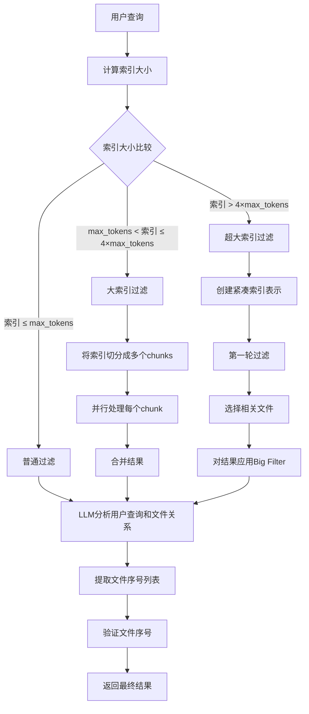

# 索引过滤策略指南

`QuickFilter` 类提供了多种索引过滤策略，根据索引大小和复杂度自动选择最合适的过滤方法，确保即使在超大型代码库中也能高效地找到相关文件。

## 核心过滤策略

索引过滤根据索引大小自动选择三种不同的策略：

1. **普通过滤策略（Normal Filter）**：
   - 适用于索引大小不超过最大token限制的情况
   - 直接将完整索引和用户查询一起发送给LLM处理
   - 最高效且准确度最好的过滤方式

2. **大索引过滤策略（Big Filter）**：
   - 适用于索引大小超过最大token限制但小于4倍限制的情况
   - 将索引切分成多个chunks分别处理
   - 并行处理多个chunks，最后合并结果

3. **超大索引过滤策略（Super Big Filter）**：
   - 适用于索引大小超过4倍token限制的大型代码库
   - 首先提取每个文件的核心信息（文件名和用途）创建紧凑表示
   - 先对紧凑表示执行第一轮过滤
   - 对第一轮结果再应用Big Filter进行第二轮精细过滤

## 过滤流程图



## 文件选择规则

在过滤过程中，LLM会按以下优先级选择相关文件：

1. 用户查询中被 `@` 或 `@@` 显式引用的文件（最高优先级）
2. 需要被编辑的文件（edited_files）
3. 作为参考的相关文件（reference_files）
4. 依赖被编辑文件的文件（dependent_files）

## 大型索引处理优化

当处理超大索引时，系统会采用以下优化：

1. **紧凑表示**：只保留文件名和用途描述，大幅减少token消耗
2. **滑动窗口分析**：对大文件使用滑动窗口技术，避免超出token限制
3. **并行处理**：使用ThreadPoolExecutor并行处理多个索引chunks
4. **批处理验证**：每批处理有限数量的项目，确保不超出token限制
5. **交织排序**：保持多个chunks处理结果的相对顺序，确保最相关文件排在前面

## 使用示例

自动过滤机制根据索引大小自动选择合适的策略：

```python
from autocoder.index.filter.quick_filter import QuickFilter

# 创建QuickFilter实例
quick_filter = QuickFilter(index_manager, stats, sources)

# 执行过滤，系统会自动选择合适的过滤策略
result = quick_filter.filter(index_manager.read_index(), user_query)

# 获取过滤后的文件
filtered_files = result.files
```

## 性能监控

过滤过程会记录以下性能指标：

1. 消耗的tokens数量（输入和输出）
2. 处理时间
3. 处理速度（tokens/秒）
4. API调用成本估算

这些信息可用于优化查询性能和控制API成本。 

## 参考源码

相关实现逻辑见:
- `src/autocoder/index/filter/quick_filter.py`
- `src/autocoder/index/filter/normal_filter.py`