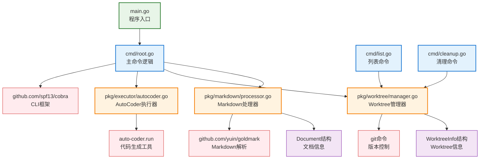

# Async Agent Runner

一个用于简化 git worktree 和 auto-coder 操作的 Go 语言异步代理运行器，支持智能 Markdown 解析和多任务并行处理。

## 目录结构

```
async_agent_runner/
├── main.go                     # 主程序入口，调用 cmd.Execute()
├── go.mod                      # Go 模块定义，依赖 Cobra 和 Goldmark
├── go.sum                      # Go 依赖校验和
├── Makefile                    # 构建脚本，提供 build、install 等命令
├── README.md                   # 项目详细说明文档
├── PROJECT_STATUS.md           # 项目状态文档
├── bin/                        # 编译后的二进制文件目录
│   └── ac                      # 编译后的可执行文件
├── cmd/                        # 命令行接口实现
│   ├── root.go                 # 主命令实现，包含核心业务逻辑
│   ├── list.go                 # 列出 worktree 的命令
│   └── cleanup.go              # 清理 worktree 的命令
├── pkg/                        # 核心功能包
│   ├── executor/               # Auto-coder 执行器
│   │   └── autocoder.go        # 管理 auto-coder.run 的执行
│   ├── markdown/               # Markdown 处理器
│   │   ├── processor.go        # 智能 Markdown 解析和分割
│   │   └── processor_test.go   # 处理器单元测试
│   └── worktree/               # Git worktree 管理器
│       └── manager.go          # Git worktree 创建、清理和管理
├── examples/                   # 示例文件
│   ├── test.md                 # 基本测试示例
│   └── structured_test.md      # 结构化测试示例
├── scripts/                    # 辅助脚本
│   ├── build.sh                # 构建脚本
│   ├── demo.sh                 # 演示脚本
│   ├── pr_demo.sh              # PR 功能完整演示脚本
│   ├── quick_demo.sh           # 快速演示脚本
│   └── test.sh                 # 测试脚本
└── .ac.mod.md                  # 本文档
```

## 快速开始

### 基本使用方式

```bash
# 1. 构建和安装
cd async_agent_runner
make build
make install-user  # 安装到 ~/bin

# 2. 确保路径设置
echo 'export PATH="$HOME/bin:$PATH"' >> ~/.zshrc
source ~/.zshrc

# 3. 基本使用 - 按 H1 标题分割（默认模式）
cat task.md | ac --model cus/anthropic/claude-sonnet-4 --pr

# 4. 按 H2 标题分割
cat task.md | ac --model your-model --split h2 --pr

# 5. 使用自定义分隔符（兼容模式）
cat task.md | ac --model your-model --split delimiter --delimiter "===" --pr

# 6. 按指定标题级别范围分割
cat task.md | ac --model your-model --split any --min-level 2 --max-level 3 --pr
```

### 管理 Worktree

```bash
# 列出所有 worktree
ac list

# 只显示由 ac 管理的 worktree
ac list --only-managed

# 清理所有管理的 worktree
ac cleanup

# 清理匹配模式的 worktree
ac cleanup --pattern test
```

### 演示脚本

```bash
# 快速演示 - 运行完整的 PR 流程演示
cd async_agent_runner
./scripts/quick_demo.sh

# 或者直接运行详细演示
./scripts/pr_demo.sh

# 查看功能演示（不实际执行）
./scripts/demo.sh
```

### 配置选项

- `--model`: 指定要使用的模型（必需）
- `--from`: 指定基础分支（默认: master）
- `--pr`: 是否创建 pull request
- `--workdir`: 工作目录（默认: ../ac_async_agent_workdir）
- `--split`: 分割模式（h1, h2, h3, any, delimiter）
- `--delimiter`: 自定义分隔符（当 split=delimiter 时使用）
- `--min-level`: 最小标题级别（当 split=any 时使用）
- `--max-level`: 最大标题级别（当 split=any 时使用）

## 核心组件详解

### 1. Processor 主类（markdown/processor.go）

**核心功能：**
- **智能 Markdown 解析**：使用 goldmark 解析 Markdown 结构
- **多种分割模式**：支持按标题层级和自定义分隔符分割
- **语义化文件命名**：基于标题内容生成友好的临时文件名
- **内容验证**：验证 Markdown 内容的有效性

**主要方法：**
- `ProcessContent(content, fileName string) []Document`: 处理 Markdown 内容，返回分割后的文档列表
- `SetSplitMode(mode SplitMode)`: 设置分割模式
- `SetDelimiter(delimiter string)`: 设置自定义分隔符
- `SetHeadingLevelRange(min, max int)`: 设置标题级别范围
- `ValidateContent(content string) error`: 验证内容有效性

### 2. Manager 类（worktree/manager.go）

**核心功能：**
- **Git Worktree 管理**：创建、删除和列出 git worktree
- **目录管理**：自动创建工作目录和清理
- **分支管理**：自动创建和删除分支
- **文件写入**：在 worktree 中写入临时文件

**主要方法：**
- `CreateWorktree(name string) (*WorktreeInfo, error)`: 创建新的 git worktree
- `CleanupWorktree(info *WorktreeInfo) error`: 清理指定的 worktree
- `ListWorktrees() ([]WorktreeInfo, error)`: 列出所有 worktree
- `CleanupAllWorktrees(pattern string) error`: 清理匹配模式的 worktree
- `WriteContentToWorktree(info *WorktreeInfo, filename, content string) error`: 在 worktree 中写入内容

### 3. AutoCoderExecutor 类（executor/autocoder.go）

**核心功能：**
- **Auto-coder 执行**：通过管道执行 auto-coder.run 命令
- **参数管理**：构建和管理命令行参数
- **状态检查**：验证 auto-coder.run 可用性和模型参数
- **执行日志**：记录执行信息和状态

**主要方法：**
- `Execute(workDir, tempFileName string) error`: 执行 auto-coder.run 命令
- `CheckAutoCoderAvailable() error`: 检查 auto-coder.run 是否可用
- `ValidateModel() error`: 验证模型参数
- `LogExecution(workDir, tempFileName string)`: 记录执行信息

## Mermaid 文件依赖图



### 依赖关系说明

**核心流程依赖：**
1. **main.go** 作为程序入口，调用 cmd 包的 Execute() 函数
2. **cmd/root.go** 包含主要业务逻辑，协调三个核心包的工作
3. **Processor** 负责解析和分割 Markdown 内容
4. **Manager** 负责创建和管理 git worktree
5. **Executor** 负责执行 auto-coder.run 命令

**外部系统依赖：**
- **Git 系统**：用于 worktree 管理，必须在系统中可用
- **auto-coder.run**：代码生成工具，必须在 PATH 中可用
- **Cobra 框架**：提供 CLI 功能和参数解析
- **Goldmark 库**：提供 Markdown 解析能力

**数据流向：**
1. 标准输入 → Processor 解析 → Document 列表
2. Document → Manager 创建 worktree → WorktreeInfo
3. WorktreeInfo + Document → Executor 执行 → auto-coder.run 结果

## 分割模式详解

### 支持的分割模式

| 模式 | 说明 | 分割标准 | 使用场景 |
|------|------|----------|----------|
| `h1` | 按一级标题分割（默认） | `# 标题` | 大任务分解 |
| `h2` | 按一、二级标题分割 | `# 标题` 和 `## 子标题` | 中等粒度任务 |
| `h3` | 按一、二、三级标题分割 | `# ## ###` 标题 | 细粒度任务 |
| `any` | 按指定级别范围分割 | 自定义 min-level 和 max-level | 灵活控制 |
| `delimiter` | 按自定义分隔符分割 | 如 `===` | 兼容旧格式 |

### 分割模式枚举值

```go
const (
    SplitByDelimiter  SplitMode = iota // 按分隔符分割（兼容模式）
    SplitByHeading1                    // 按 H1 标题分割
    SplitByHeading2                    // 按 H2 标题分割
    SplitByHeading3                    // 按 H3 标题分割
    SplitByAnyHeading                  // 按任何标题分割
)
```

## 事件和工具

### 命令行工具

**主命令 `ac`**：
- 功能：处理 Markdown 输入并执行 auto-coder
- 参数：model, from, pr, workdir, split, delimiter, min-level, max-level
- 输入：通过管道接收 Markdown 内容

**子命令 `ac list`**：
- 功能：列出所有或管理的 worktree
- 参数：--only-managed

**子命令 `ac cleanup`**：
- 功能：清理 worktree 和分支
- 参数：--pattern（可选的匹配模式）

### 核心事件流

1. **输入处理事件**：读取标准输入的 Markdown 内容
2. **解析事件**：按选定模式分割 Markdown 文档
3. **Worktree 创建事件**：为每个文档创建独立的工作树
4. **文件写入事件**：将分割后的内容写入临时文件
5. **执行事件**：调用 auto-coder.run 处理每个任务
6. **完成事件**：输出执行结果和状态信息

### 错误处理机制

- **输入验证**：检查标准输入是否为空
- **依赖检查**：验证 git 和 auto-coder.run 可用性
- **参数验证**：确保必需参数（如 model）已提供
- **资源清理**：在失败时自动清理创建的 worktree
- **错误恢复**：支持手动清理和重试机制

## 最佳实践建议

### 1. 使用建议

**选择合适的分割模式**：
- 对于大型任务，使用 `h1` 模式按主要功能模块分割
- 对于中等复杂度任务，使用 `h2` 模式获得更细粒度的控制
- 对于复杂任务，使用 `any` 模式自定义分割级别

**工作目录管理**：
- 定期使用 `ac cleanup` 清理不需要的 worktree
- 使用 `ac list --only-managed` 查看当前管理的工作树
- 为不同项目使用不同的 `--workdir` 参数

**Markdown 文件组织**：
- 确保标题层级清晰，避免跳级（如从 H1 直接跳到 H3）
- 在每个任务部分包含明确的需求描述和验收标准
- 使用有意义的标题名称，便于生成语义化的文件名

### 2. 性能优化

**并行处理**：
- 每个 worktree 独立运行，天然支持并行处理
- 合理分割任务以充分利用系统资源
- 避免创建过多小任务，增加管理开销

**资源管理**：
- 及时清理完成的 worktree 以节省磁盘空间
- 监控 auto-coder.run 的执行时间和资源使用
- 对于长时间运行的任务，考虑使用后台执行

### 3. 故障排除

**常见问题解决**：
1. **命令未找到**：确保 `ac` 在 PATH 中，运行 `which ac` 验证
2. **git worktree 失败**：确保在 git 仓库根目录运行，检查分支状态
3. **auto-coder.run 未找到**：验证 auto-coder 安装，运行 `which auto-coder.run`
4. **权限问题**：检查工作目录的读写权限

**调试技巧**：
- 使用 `ac list` 查看当前 worktree 状态
- 手动进入 worktree 目录检查生成的文件
- 查看 auto-coder.run 的输出日志定位问题

### 4. 安全考虑

**代码审查**：
- 在创建 PR 前仔细审查生成的代码
- 验证生成代码的安全性和正确性
- 测试关键功能的实现

**版本控制**：
- 每个 worktree 使用独立分支，避免冲突
- 保持主分支的稳定性
- 及时合并或清理不需要的分支

