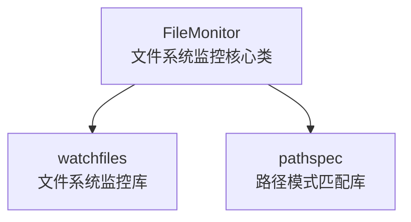

# AC Module: 和编程语言无关以AI为中心的自包含模块化组织


> 在AI驱动的软件开发时代，我们需要重新思考代码的组织方式。AC Module提出了一种全新的模块化理念，让代码不仅对人类友好，更对AI友好。

**关键词：** AI开发、模块化、软件架构、大语言模型、代码组织

**阅读时间：** 约15分钟

## 🤖 引言：AI时代的代码组织挑战

当ChatGPT、Claude等大语言模型开始深度参与软件开发时，我们发现了一个有趣的现象：**传统的代码组织方式并不适合AI理解和处理**。


想象一下这样的场景：你向AI助手描述一个需求，希望它帮你实现一个文件监控功能。在传统的开发模式下，AI需要：

1. 理解你的需求
2. 搜索相关的库和框架
3. 阅读大量的API文档
4. 理解复杂的依赖关系
5. 编写符合项目架构的代码

这个过程中，AI面临着几个核心挑战：

- **信息碎片化**：功能实现散布在多个文件中，缺乏整体视图
- **文档与代码分离**：API文档往往与实际代码不同步
- **依赖关系复杂**：需要理解复杂的模块间依赖
- **语言特定性**：不同编程语言有不同的模块化方式

更重要的是，**大语言模型有Token限制**。一个复杂的模块可能包含数万行代码，远超模型的上下文窗口，导致AI无法完整理解模块的全貌。

## 💡 AC模块的核心理念

AC Module（Auto Coder Module）是一种全新的模块化组织方式，专为AI时代设计。它的核心理念可以概括为：


### 1. 以AI为中心的设计思想

传统模块化主要考虑人类开发者的需求，而AC模块首先考虑的是：**如何让AI更好地理解和使用这个模块？**

- 每个模块都有完整的自描述文档
- 所有信息都集中在一个文件中
- 使用AI友好的Markdown格式
- 严格控制Token数量，确保在模型窗口内

### 2. 语言无关的模块定义

AC模块不依赖特定的编程语言或框架：

```
一个AC模块 = 功能实现 + 完整文档 + 使用示例 + 测试验证
```

无论是Python、JavaScript、Go还是Rust，AC模块的组织方式都是一致的。

### 3. 自包含的文档化模块

每个AC模块都是一个**自包含的知识单元**，包含：

- 功能描述和使用场景
- 完整的API文档
- 详细的使用示例
- 依赖关系说明
- 测试和验证方法

## ⭐ AC模块的关键特性

### 1. Token限制约束下的精简设计

这是AC模块最重要的约束条件。每个模块的总Token数必须小于大模型的上下文窗口，这迫使我们：

- **精简而完整**：只包含核心功能，但文档必须完整
- **高度内聚**：一个模块专注解决一个明确的问题
- **清晰表达**：用最少的文字表达最多的信息

### 2. 标准化的模块结构

每个AC模块都遵循统一的文档结构：

```markdown
# 模块名称
简洁的功能描述

## Directory Structure
目录结构和文件说明

## Quick Start
快速开始指南和基本用法

## Core Components
核心组件和主要方法

## Mermaid File Dependency Graph
依赖关系的可视化图表

## Dependency Relationships
与其他AC模块的依赖关系

## Commands to Verify Module Functionality
功能验证命令
```

### 3. 完整的功能文档化

与传统的README不同，AC模块的文档不仅仅是说明，而是**完整的功能规格书**：

```python
# 不仅告诉你怎么用
monitor = get_file_monitor("/path/to/project")
monitor.register("**/*.py", callback)
monitor.start()

# 还告诉你为什么这样设计
# 单例模式确保全局只有一个监控实例
# 支持glob模式匹配，提供灵活的文件过滤
# 异步监控不阻塞主线程
```

### 4. 依赖关系的清晰表达

AC模块通过Mermaid图和简洁的列表清晰表达依赖关系：



## 📋 AC模块的实际应用：文件监控模块案例

让我们通过一个真实的例子来看看AC模块是如何工作的。

### 传统方式 vs AC模块方式

**传统方式：**
```
src/
├── file_monitor/
│   ├── __init__.py          # 简单的导入
│   ├── monitor.py           # 2000行核心实现
│   ├── utils.py             # 500行工具函数
│   └── exceptions.py        # 200行异常定义
docs/
├── api.md                   # 可能过时的API文档
└── examples/                # 分散的示例代码
tests/
└── test_monitor.py          # 测试代码
```

当AI需要理解这个模块时，需要读取多个文件，理解复杂的代码结构，还要担心文档是否最新。

**AC模块方式：**
```
src/autocoder/common/file_monitor/
├── __init__.py              # 模块导出接口
├── monitor.py               # 核心监控实现
├── test_file_monitor.py     # 完整的功能测试
└── .ac.mod.md              # 自包含的完整文档
```

AI只需要读取`.ac.mod.md`文件，就能完全理解：
- 这个模块是做什么的
- 如何使用它
- 有哪些依赖
- 如何验证功能

### 实际使用体验

```python
# AI看到AC模块文档后，可以立即生成正确的代码：
from autocoder.common.file_monitor.monitor import get_file_monitor, Change

def handle_file_change(change_type: Change, changed_path: str):
    if change_type == Change.added:
        print(f"New file added: {changed_path}")

monitor = get_file_monitor("/path/to/project")
monitor.register("**/*.py", handle_file_change)
monitor.start()
```

这段代码是AI在理解AC模块文档后直接生成的，无需额外的上下文或解释。

## ⚖️ AC模块 vs 传统模块化

### 与传统包管理的对比

| 特性 | 传统包管理 | AC模块 |
|------|------------|---------|
| 文档位置 | 分离的文档站点 | 集成在模块内 |
| AI理解难度 | 需要多次查询 | 一次性理解 |
| 跨语言支持 | 语言特定 | 语言无关 |
| Token消耗 | 不可控 | 严格限制 |
| 依赖表达 | 复杂配置文件 | 可视化图表 |

### 与微服务架构的对比

微服务解决的是**运行时的模块化**，AC模块解决的是**开发时的模块化**：

- **微服务**：独立部署、独立扩展、网络通信
- **AC模块**：独立理解、独立开发、文档通信

### 与组件化开发的对比

传统组件化主要关注**代码复用**，AC模块更关注**知识复用**：

```javascript
// 传统组件
<FileUploader onUpload={handleUpload} />

// AC模块的思路
// 不仅提供组件，还提供完整的使用知识
// AI可以理解何时使用、如何配置、如何扩展
```

## 🔧 AC模块的技术实现

### .ac.mod.md文件格式

AC模块的核心是`.ac.mod.md`文件，它遵循严格的格式规范：

```markdown
# [模块名称]
[一句话功能描述]

## Directory Structure
[标准化的目录结构说明]

## Quick Start
### Basic Usage
[完整的使用示例代码]

### Helper Functions
[辅助函数说明]

### Configuration Management
[配置管理说明]

## Core Components
### 1. [主要类名] Main Class
**Core Features:**
- [特性1]: [详细描述]
- [特性2]: [详细描述]

**Main Methods:**
- `method1()`: [方法功能和参数描述]
- `method2()`: [方法功能和参数描述]

## Mermaid File Dependency Graph
[依赖关系的可视化图表]

## Dependency Relationships
[与其他AC模块的依赖关系列表]

## Commands to Verify Module Functionality
[可执行的验证命令]
```

### 模块发现和加载机制

AC模块通过简单的文件系统扫描即可发现：

```python
def find_ac_modules(root_path):
    """扫描目录树，找到所有AC模块"""
    ac_modules = []
    for root, dirs, files in os.walk(root_path):
        if '.ac.mod.md' in files:
            ac_modules.append(root)
    return ac_modules
```

### 依赖管理策略

AC模块的依赖管理非常简单：

1. **内部依赖**：通过相对路径引用其他AC模块
2. **外部依赖**：在文档中明确列出第三方库
3. **循环依赖检测**：通过静态分析防止循环依赖

## 🎯 AC模块的价值与意义

### 1. 提升AI理解代码的能力

传统代码组织方式下，AI需要"猜测"模块的功能和用法。AC模块让AI能够：

- **快速理解**：一个文件包含所有必要信息
- **准确使用**：详细的示例和说明减少错误
- **智能推荐**：基于依赖关系推荐相关模块

### 2. 降低跨语言开发复杂度

在多语言项目中，AC模块提供了统一的抽象层：

```python
# Python实现
from file_monitor import get_file_monitor

# JavaScript实现  
import { getFileMonitor } from './file_monitor'

# Go实现
import "github.com/project/file_monitor"
```

虽然语言不同，但AC模块的概念和使用方式是一致的。

### 3. 促进代码复用和标准化

AC模块天然促进了最佳实践的传播：

- **标准化接口**：相同功能的模块有相似的API
- **文档驱动**：强制开发者思考模块的设计
- **测试集成**：每个模块都包含验证方法

## 🏗️ 实际开发中的应用场景

### 场景1：AI辅助开发

```
开发者: "我需要一个文件监控功能"
AI: "我找到了file_monitor AC模块，它提供单例模式的文件系统监控..."
[AI直接基于AC模块文档生成完整的实现代码]
```

### 场景2：代码审查

```
审查者: "这个模块的设计合理吗？"
[直接查看.ac.mod.md文件，快速理解模块的设计思路和使用方式]
```

### 场景3：新人入职

```
新人: "这个项目的架构是怎样的？"
[通过扫描所有AC模块，快速了解项目的功能模块和依赖关系]
```

## ⚠️ 挑战与限制

### 1. Token限制的约束

严格的Token限制意味着：
- 不能包含过于复杂的功能
- 需要精心设计文档结构
- 可能需要拆分大型模块

### 2. 文档维护成本

高质量的AC模块文档需要：
- 持续更新和维护
- 与代码保持同步
- 定期验证示例代码

### 3. 生态系统建设

AC模块需要：
- 社区标准的建立
- 工具链的支持
- 最佳实践的积累

## 🚀 未来展望

### AC模块生态的发展方向

1. **标准化工具链**
   - AC模块的创建和验证工具
   - 依赖关系分析工具
   - 文档质量检查工具

2. **智能化集成**
   - AI驱动的模块推荐
   - 自动化的依赖管理
   - 智能的代码生成

3. **社区生态建设**
   - AC模块的共享平台
   - 最佳实践的收集
   - 跨语言标准的制定

### 与AI开发工具的集成

未来的AI开发工具可能会：

```python
# AI理解项目结构
ai.analyze_project_modules()

# AI推荐相关模块
recommended = ai.suggest_modules("file processing")

# AI生成模块间的集成代码
integration_code = ai.generate_integration(module_a, module_b)
```

### 社区标准化的可能性

AC模块有潜力成为一个跨语言、跨平台的标准：

- **RFC规范**：制定正式的AC模块规范
- **认证体系**：建立AC模块的质量认证
- **生态系统**：形成完整的工具和社区支持

## 🌟 结语：拥抱AI时代的模块化

AC Module不仅仅是一种新的代码组织方式，更是一种**面向AI时代的软件工程思维**。

在这个AI深度参与软件开发的时代，我们需要重新思考：
- 如何让代码更容易被AI理解？
- 如何在有限的上下文中传递完整的信息？
- 如何平衡人类和AI的需求？

AC模块提供了一个可能的答案。它告诉我们，好的模块化不仅要考虑代码的组织，更要考虑**知识的组织**。

当我们开始用AI的视角来设计软件时，我们会发现许多传统的做法需要重新审视。AC模块只是一个开始，未来还会有更多面向AI的软件工程实践出现。

**让我们一起拥抱这个AI驱动的软件开发新时代，用更智能的方式组织我们的代码和知识。**

---

## 📚 延伸阅读

如果你想深入了解AC模块，可以参考以下资源：

- **AutoCoder项目**：AC模块的实际应用案例
- **文件监控模块示例**：完整的AC模块实现
- **模块化设计模式**：软件架构的最佳实践

## 🔗 相关链接

- [AutoCoder GitHub仓库](https://github.com/allwefantasy/auto-coder)
- [大语言模型在软件开发中的应用](https://example.com)
- [AI驱动的代码生成工具对比](https://example.com)

## 💬 讨论话题

1. **你认为AC模块最大的价值是什么？**
   - 提升AI理解能力
   - 简化跨语言开发
   - 标准化模块组织
   - 其他想法

2. **在你的项目中，哪些模块最适合转换为AC模块？**
   - 工具类模块
   - 业务逻辑模块
   - 基础设施模块
   - 第三方集成模块

3. **你觉得AC模块还需要哪些改进？**
   - 更好的工具支持
   - 更详细的规范
   - 更丰富的示例
   - 社区生态建设

## 🏷️ 标签

`#AI开发` `#模块化` `#软件架构` `#大语言模型` `#代码组织` `#AutoCoder` `#软件工程` `#最佳实践`

---

**作者简介：** 专注于AI驱动的软件开发工具和方法论研究，致力于探索人工智能与软件工程的深度融合。

**版权声明：** 本文为原创内容，转载请注明出处。

*如果你对AC模块感兴趣，欢迎在评论区分享你的想法。你认为在AI时代，软件开发还需要哪些新的实践和工具？*

**点赞👍 + 转发🔄 + 关注➕，获取更多AI开发干货！**

