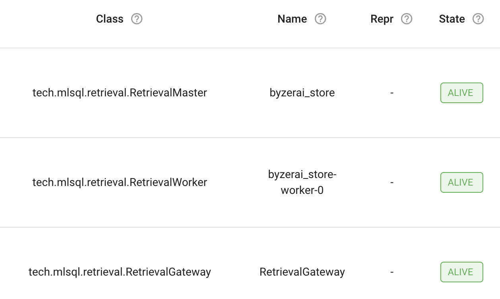
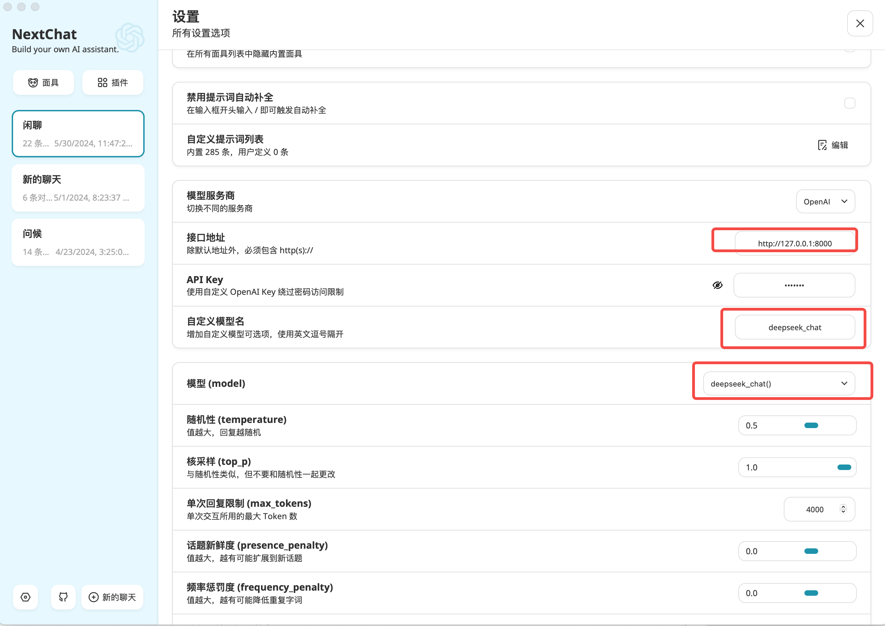
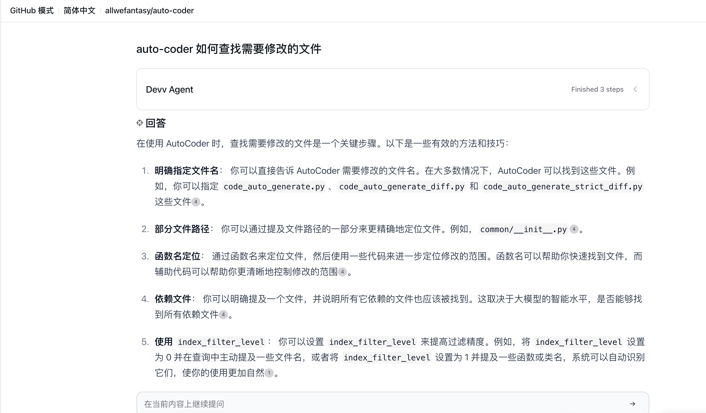

# 000-AutoCoder_Preparation_Journey

This section will introduce how to quickly set up auto-coder for your existing project using SaaS API.

> auto-coder is a command-line development assistant tool based on YAML configuration, which can automatically iterate the development of existing projects according to your needs.

## Install auto-coder

```shell
conda create --name auto-coder python=3.10.11
conda activate auto-coder
pip install -U auto-coder
ray start --head
```

## Start the recommended model proxy

For the large language model (you need to apply for a token on the deepseek website), execute the following command after obtaining the token.

> Make sure to replace `${MODEL_DEEPSEEK_TOKEN}` and `${MODEL_QIANWEN_TOKEN}` with your actual tokens.

```shell
byzerllm deploy --pretrained_model_type saas/openai \
--cpus_per_worker 0.001 \
--gpus_per_worker 0 \
--worker_concurrency 30 \
--num_workers 1 \
--infer_params saas.base_url="https://api.deepseek.com/v1" saas.api_key=${MODEL_DEEPSEEK_TOKEN} saas.model=deepseek-chat \
--model deepseek_chat
```

For the vector model (optional, you need to apply for a token on the qwen website, you can skip this step if it's troublesome), execute the following command after obtaining the token.

```shell
byzerllm deploy --pretrained_model_type saas/qianwen \
--cpus_per_worker 0.001 \
--gpus_per_worker 0 \
--num_workers 2 \
--infer_params saas.api_key=${MODEL_QIANWEN_TOKEN}  saas.model=text-embedding-v2 \
--model qianwen_emb
```

## Initialize the existing project

Navigate to the root directory of your project and execute the following command.

```shell
auto-coder init --source_dir .
```

The system will automatically generate two directories, `.auto-coder` and `actions`, in the current directory. A `101_current_work.yaml` file will be generated in the actions directory, which you can use as a template.

Remember to modify your `project_type` in the `actions/base/base.yml` or your independent YAML file, supporting:

1. py
2. ts
3. Any combination of file extensions, separated by commas, e.g., .java, .scala

## Let auto-coder start coding for you

Open the `actions/000_example.yml` file, which looks like this:

```yaml
include_file:
  - ./base/base.yml
  - ./base/enable_index.yml
  - ./base/enable_wholefile.yml    

query: |
  YOUR QUERY HERE
```

You can fill in your functionality or business requirements in the `query` field and temporarily disable the `human_as_model` mode to allow the deepseek model to generate code directly. It will look like this in the end:

```yaml
include_file:
  - ./base/base.yml
  - ./base/enable_index.yml
  - ./base/enable_wholefile.yml    

human_as_model: false  

query: |  
  Help me create a src/server.py in the project root directory, use fastapi, create a /hello endpoint, and return world.
```

Run auto-coder:

```shell
auto-coder --file actions/000_example.yml
```

Finally, you will see a file like this in your project.

```python
# src/server.py
from fastapi import FastAPI

app = FastAPI()

@app.get("/hello")
async def hello():  
``````python
return "world"
```


## Build a local auto-coder assistant for yourself

Since auto-coder itself is a command line tool with YAML configuration files, it involves some configurations and usage. If you don't want to search through each document one by one, you have two options:

1. Build a small assistant using auto-coder's knowledge base feature.
2. Use devv.ai's GitHub knowledge base feature to ask questions related to auto-coder.


### Using auto-coder's knowledge base feature

This step depends on the vector model started earlier.

Start the knowledge base:

```shell
byzerllm storage start
```

Access the Ray Dashboard at http://127.0.0.1:8265/#/actors. If you see three actors, it indicates that the retrieval service has started successfully.



Import auto-coder documents:

```shell
git clone https://github.com/allwefantasy/auto-coder
cd auto-coder 
auto-coder doc build --model deepseek_chat --emb_model qianwen_emb --source_dir ./docs/zh --collection auto-coder --description "AutoCoder Documentation"
```

Wait for a few minutes, and it will be done.

Note: If doc build fails, please check in the previous step whether the Actor has started successfully. If the Actor has started successfully, the build failure here may be related to the emb_model. You can try using a different embedding model.

Now you can chat with the assistant:

```shell
auto-coder doc query --model deepseek_chat --emb_model qianwen_emb --query "How to enable search engine" --collection auto-coder
```

You can also start a service for easier use with chat software:

```shell
auto-coder doc serve --model deepseek_chat --emb_model qianwen_emb  --collection auto-coder
```

Here are some examples:


Taking [NextChat](https://github.com/ChatGPTNextWeb/ChatGPT-Next-Web/releases) software as an example, configure as follows:



You can fill in any password.

### Using devv.ai's GitHub knowledge base feature

Click the link: https://devv.ai/search?threadId=dn913itmjchs to use directly.



## Continue your journey

[002- Adding and Modifying Code with AutoCoder](./002-%20%E7%94%A8%20AutoCoder%20%E6%B7%BB%E5%8A%A0%E5%92%8C%E4%BF%AE%E6%94%B9%E4%BB%A3%E7%A0%81.md)
```