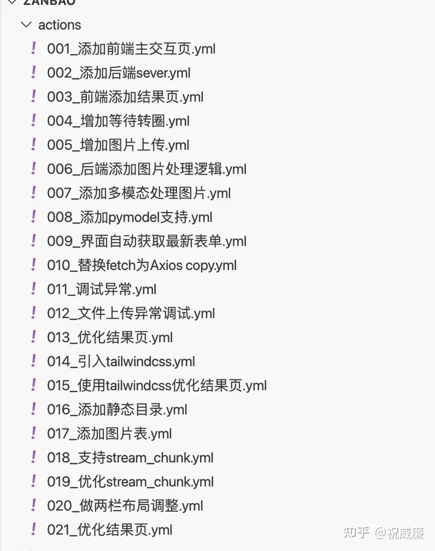

# 015 - Techniques for Breaking Down Iteration Granularity in AutoCoder

Below is the iterative process I used recently for developing an actual front-end and back-end application:

After about more than 20 iterations plus some manual modifications, I completed the project. It took a little more than one day.

Moreover, from my experience, a great aspect for front-end and back-end projects is the ability to "fight with both hands," so to speak. For example, once the front-end requests are written, the back-end APIs (parameters, database tables, etc.) can basically be generated automatically. Conversely, when the back-end APIs are ready, the front-end can almost automatically generate the corresponding interfaces. This is because AutoCoder can provide rather complete context information.

Why is it necessary to break down to such fine granularity instead of saying, "Hey, big model, give me a perfect web site that supports upload and download, and displays backend information in real time"? Hmmm, that's Devin's goal, not AutoCoder's.

Currently, AutoCoder requires programmers to do Planning and Review/Revert to continuously push forward towards the final goal. If the breakdown is too detailed, it might be a bit of a waste of tokens and time. However, if the granularity is too coarse, there will be many problems.

Completely Unmet Expectations
If your granularity is too coarse, the final output is likely to be completely different from what you expected. Moreover, a large amount of newly generated code also makes review difficult. Most likely, you will need to revert and start over, incurring more retry costs.

Excessive Input and Output
The input and output of big models are limited. If your requirement is too coarse, it may involve modifying many files, referring to more documents, and eventually, even with indexing enabled, it involves too many files, exceeding what the big model can accept as input.

And if there are too many modifications to make, then the output will be large, leading to incomplete output due to exceeding the maximum length limit, necessitating manual intervention.

Difficulties in Manual Fine-tuning Afterwards
If the granularity is too coarse, generating a lot of code at once makes it difficult for developers to see at a glance whether the modifications meet expectations or quickly make some manual adjustments based on the newly modified code.

Of course, controlling the granularity of each requirement is a real test of developers' architectural thinking and intuition. It takes several iterations to gradually find the balance point.

Let me show you a few examples I wrote:

This is the project start, where I built a page.

Then I had AutoCoder generate a Python backend based on the previous page. The big model can understand very well how to coordinate the front and back ends.

For instance, I wanted to add a spinning waiting animation after submission. This was done in just one sentence. If you want to adjust your content, you can always revert your recent operations, as seen in this article: 
Moreover, the project's code was generated using the human_as_model mode, referenced in this article: 

Lastly, this article actually introduces non-technical stuff, but it is also the core requirement of AutoCoder for users, which is actually very important.