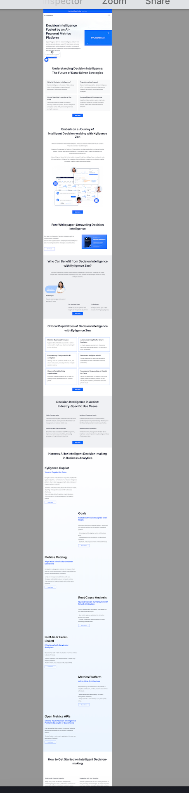

# 033-AutoCoder_The Best Tool to Convert Webpages to Images.md

I found that there are not many good Chrome extensions that can truly convert a complete webpage into an image. Most of them cannot achieve a complete conversion. Since Auto-Coder can convert images into any frontend technology stack, why don't we provide a small tool beforehand to help everyone convert webpages into images.

Usage:

```bash
auto-coder screenshot --urls https://www.baidu.com  --output /tmp/jack3/
```

Below is an example of a very long webpage image:

