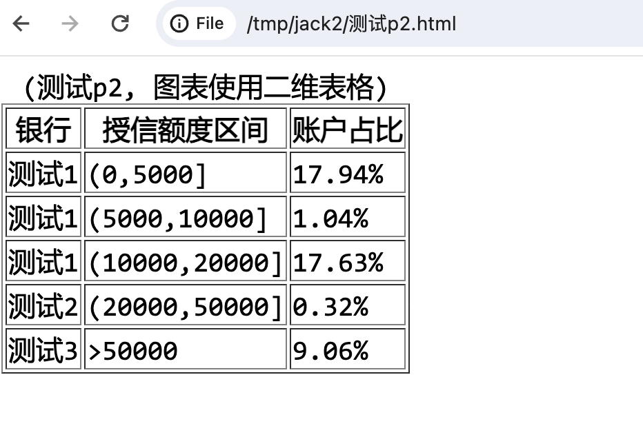

# 034-AutoCoder_word_pdf conversion to html

Currently, Word and PDF conversion tools will lose some layout information, such as tables. AutoCoder provides a tool that uses a multimodal large model to convert Word and PDF to HTML, so that it can retain relatively complete layout information and easily convert to any other text format, such as markdown.

> Note that this tool is based on a multimodal large model, so there may be accuracy issues in recognition.

Usage:

```bash
auto-coder doc2html --model deepseek_chat \
--vl_model gpt4o_chat \
--urls /Users/allwefantasy/Downloads/xxxxx.docx \
--output /tmp/jack2
```
Here is a Word document with a table:


Here is the HTML output after conversion:



You can also put all the parameters in a configuration file and then execute directly:

```bash
auto-coder doc2html --file xxx.yml
```