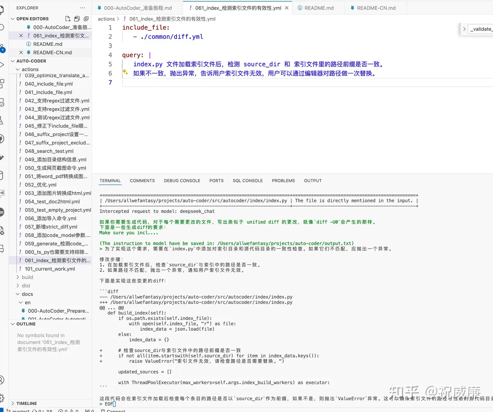
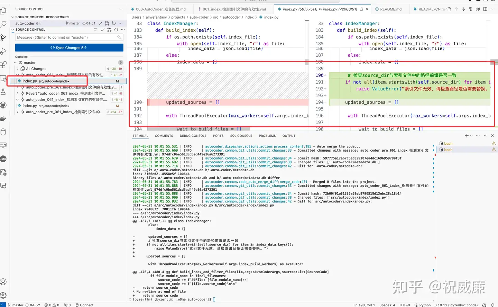
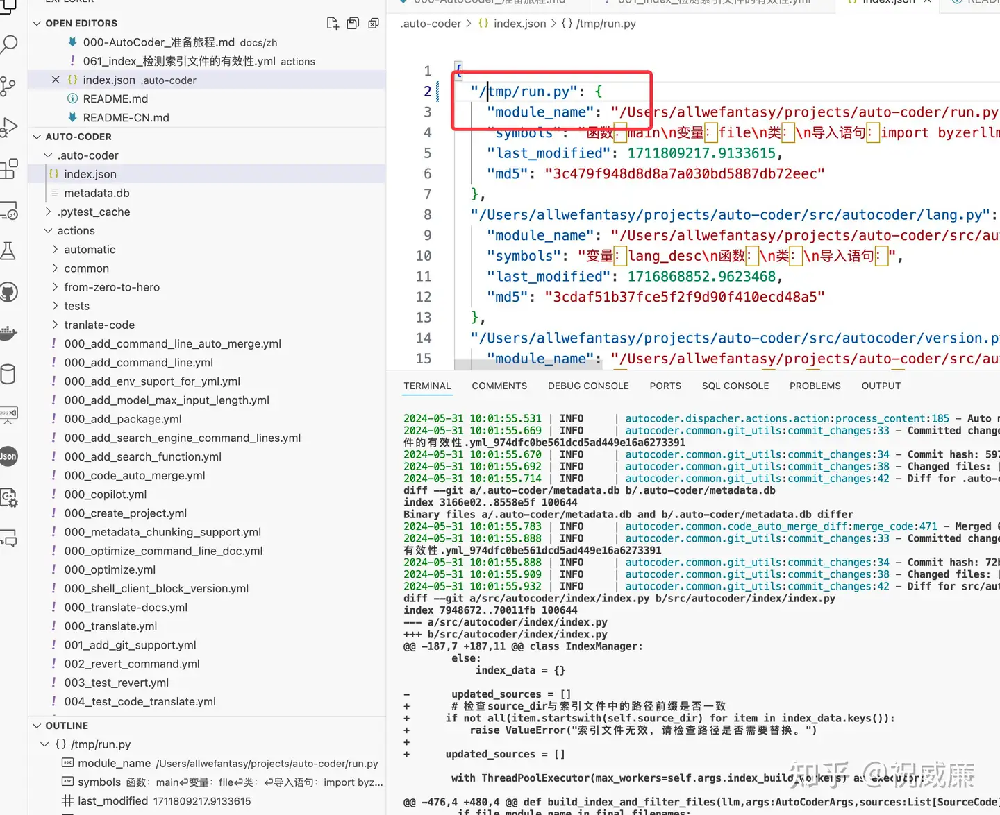
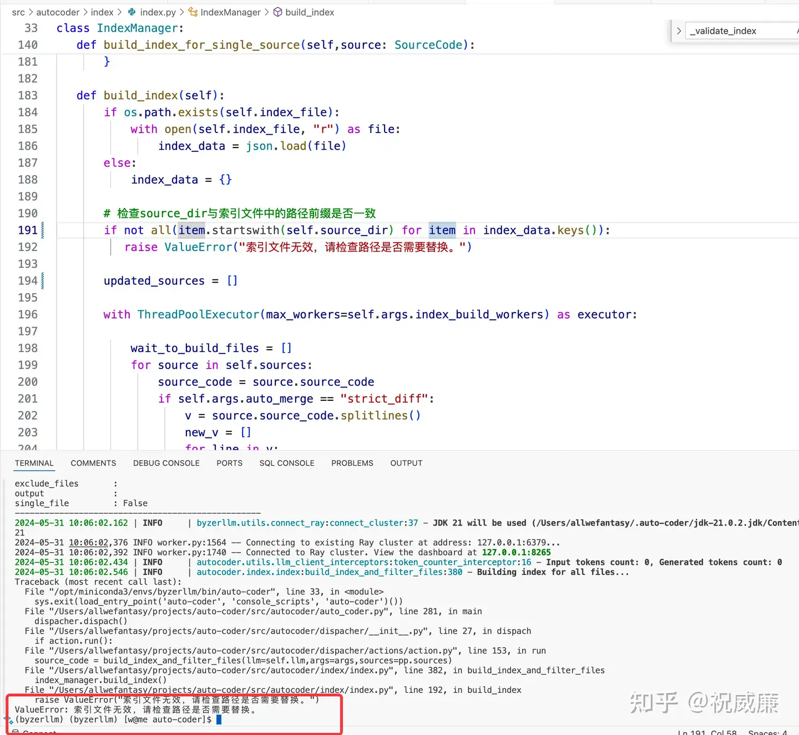

# 037-AutoCoder_项目快速修bug实战

## auto-coder 项目开发流程

使用 auto-coder 的开发流程如下：

1. 编写一个YAML文件来描述您的需求，Auto-Coder将生成代码并将代码合并到您的项目中。
2. 检查Auto-Coder的提交，并在vscode或其他IDE中审查代码。
3. 如果提交是基本满足需求，您可能仍需要使用github copilot或其他工具手动修改代码。
4. 如果auto-coder提交的代码不满足你需求，您需要撤销提交并修改YAML文件，并 1 步骤重新开始。
5. 重复上述步骤，直到您对auto-coder生成的代码满意。

今天这个实例会展示如何使用上述流程快速修复一个bug。

## Bug描述

今天我们种子用户群给我提了个 Bug:


最后发现是因为我们使用了绝对路径，所以导致过滤不出文件：


我打算修正这个问题，并且实时直播给一个同学看我如何在三分钟内修正这个问题。

## 修正流程（多图预警）

在项目里新建一个 auto-coder yaml文件描述我的需求：


根据用户反馈的信息，我大概知道可以在加载索引的时候做个校验判断。所以我按图中进行描述，描述我想让 auto-coder 做的事情。

接着通过让 auto-coder 自动完成bug修正了：

```bash
auto-coder --file actions/061_index_检测索引文件的有效性.yml 
```

执行期间会弹出一个绿框，问我这些文件是不是能满足后续的修改需求。我点击 OK。

因为我喜欢用 human_as_model 模式，所以 auto-coder 会给我一个文件，我把文件贴到大模型里：


然后整个大模型的回复(不单单是代码部分，而是完整的回复)我完整贴回给auto-coder:




这个时候auto-coder 会以diff模式提交代码（推荐 editblock, 也支持wholefile, wholefile 模式更稳定，但消耗的token也非常巨大）。auto-coder 运行完成后，
你可以打开 vscode 的侧边栏看提交记录：




整个bug修复就改了两行代码，加的位置也非常准确，判断逻辑也非常准确。我review 后表示 LGTM。

接着我们校验下（其实也可以顺带让他生成一个测试代码啦，可惜我做的时候搞的太急，忘了提这事了），我手工修改出一个错误出来：




然后再运行下：




可以看到正常的报错了，到此算是收工。当然，你可以再新建一个 yaml 然后添加测试用例。


PS: 实际上我试了两次，一次用的 Opus,一次用的GPT4来做代码生成的部分, 前者需要人工做下编辑（合并过程中换行没搞对），后者一次过。如果你觉得不好，可以随时 `auto-coder revert --file actions/061_index_检测索引文件的有效性.yml` 撤销该次修改，然后修改，再次执行重复前面的流程。

## 总结

Auto-Coder 可以让你基本做到不用打开代码编辑器就能完成修改代码的需求，而且速度也足够快，具备生产落地的可能性，也可能会变革人们的开发流程和发生智能变化。比如自身工程师不断地写用auto-coder 通过文字来进行项目迭代，普通研发做review 和 测试开发（也用 auto-coder）等。可能还会有一些其他新的工种诞生。