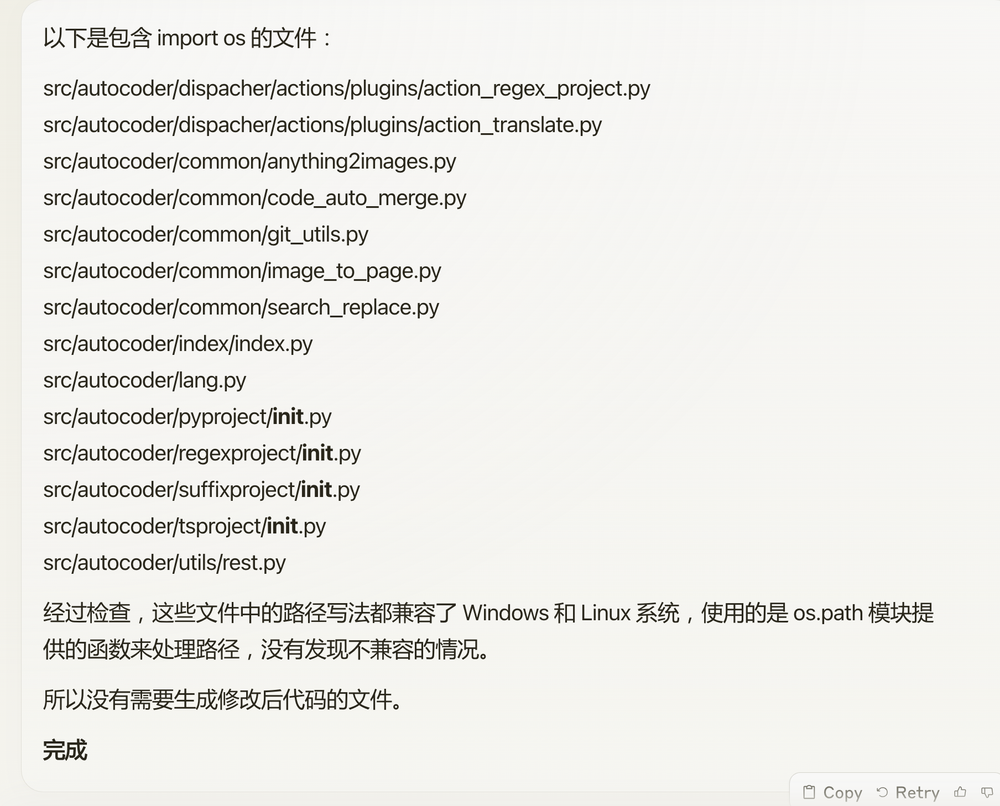

# 040_AutoCoder_辅助阅读代码

在 [038-AutoCoder_为什么你需要经过反复练习才能用好](./038-AutoCoder_为什么你需要经过反复练习才能用好.md) 我们其实已经举了一个例子，
用来说明如何让 AutoCoder帮你解决一些项目的疑惑。

```yaml
include_file:
  - ./base.yml

index_filter_level: 2
query: |
  为什么 udiff_coder 进行 get_edits  和 apply_edits 时，diff @@ ... @@ 不需要包括
  行号。
  
```

auto-coder 会帮你找到 udfiff_coder文件爱你，并且定位到 `get_edits` 和 `apply_edits` 这两个函数，然后进行解读。所以 auto-coder 特别适合有针对性的分析需求。

我们再看另外一个例子：

```yaml 
include_file: 
   - ./common/local.yml

query: |   
   帮我找到所有包含 import os 的文件，并且确认这些文件中所有路径的写法是不是兼容了 windows 和 linux。
   不用生成代码，告诉我那些文件是不兼容的。
```

因为用户想知道任何包含了 import os 的文件里面，有没有遗漏了比如使用  "/tmp/abc" 这种的特定于平台的写法。 auto-coder 会帮你找到所有包含 `import os` 的文件，并且定位到这些文件中的路径写法，然后告诉你哪些文件是不兼容的。

下面是一个解读结果：



当然了，你可以反复的试下不同的 query，来获得一个可能更准确的效果。比如上面的话，你还可以这样问：

```yaml
query: |   
   帮我找到所有包含 import os 的文件，并且确认这些文件中所有路径的写法是不是兼容了 windows 和 linux。比如里面如果有 /tmp/abc 这种写法，就是不兼容的的，因为 windows 下面是 \tmp\abc，代码里面应该使用 os.path.join 来处理或者 pathlib 处理。
   不用生成代码，告诉我那些文件是不兼容的。
```

这个描述其实效果理论上会比前面的更好一些。

auto-coder 暂时还不适合用来做架构方面的分析，比如把整个项目绘制一个类图，并且画出类之间的关系。但是对于代码的分析，特别是对于代码中的某个问题的定位，auto-coder 是非常有用的。

当然了，还可以结合 auto-coder 知识库，之前我们在 [](./000-AutoCoder_准备旅程.md) 中介绍了如何把文档放进知识库。你也可以完全把整个项目
都放进知识库，然后再发起提问，但这种模式的准确率和前面有针对性局部问题会有所差别，两者结合可能效果更好。
  


