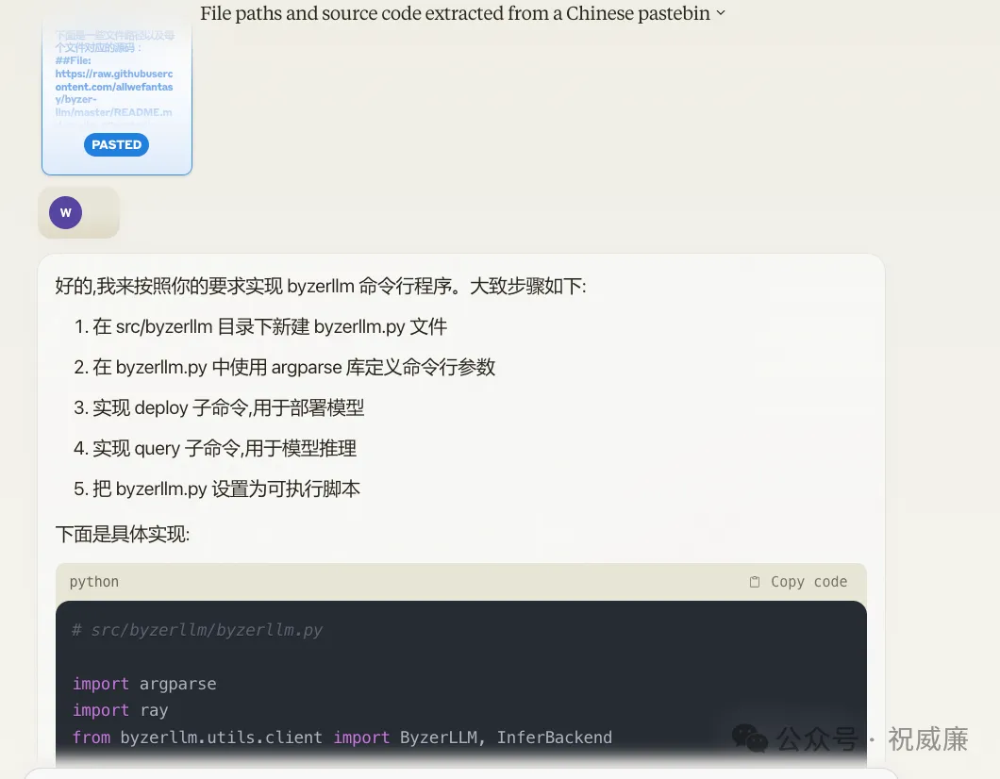

# AutoCoder 快速使用指南

昨天发了 命令行版Devin 来了: Auto-Coder 后有不少人私信我讨论。那么能让大家快捷的用起来是第一要务。所以从昨天晚上到今天，我光速给 Byzer-LLM/AutoCoder 发了两个新版本，来支持今天这篇文章。

## 安装

安装部分其实比较简单，安装如下 python 库：

```bash
conda create --name autocoder python==3.10.11
conda activate autocoder
pip install -U auto-coder
ray start --head
```

现在，就可以开始使用 AutoCoder了。

## 基于Web版本模型

比如你手头有 Claude3, ChatGPT, Kimi等产品的Web端的订阅或者免费使用权限，而没有这些模型的 API 订阅， 那么这个时候 AutoCoder 等价于一个 Code Pack 工具，帮你把代码和问题一起打包成一个文本文件，方便你拖拽到这些产品的界面里，然后帮你进行代码生成。

可以用 auto-coder 查看一些常见命令选项。

```bash
auto-coder -h
```

我来说一个实际案例，我想给 byzer-llm 项目增加一个命令行支持。下面是我写的yaml配置文件：

```yml
source_dir: /home/winubuntu/projects/byzer-llm/saas
target_file: /home/winubuntu/projects/byzer-llm/output.txt

urls: https://raw.githubusercontent.com/allwefantasy/byzer-llm/master/README.md

search_engine: bing
search_engine_token: ENV {{BING_SEARCH_TOKEN}}

query: |
  在 src/byzerllm 目录下新增一个 byzerllm.py 文件。在该文件中使用args 实现命令行支持。参考 README.md 中的使用方法来增加命令行参数。
  主要支持：
  1. 部署模型相关参数
  2. 运行推理相关阐述

  比如部署模型，一般代码是这样的：
  
  ```python
  ray.init(address="auto",namespace="default",ignore_reinit_error=True)
  llm = ByzerLLM()

  llm.setup_gpus_per_worker(4).setup_num_workers(1)
  llm.setup_infer_backend(InferBackend.transformers)

  llm.deploy(model_path="/home/byzerllm/models/openbuddy-llama2-13b64k-v15",
            pretrained_model_type="custom/llama2",
            udf_name="llama2_chat",infer_params={})
  ```
  此时你需要有 address, num_workers, gpus_per_worker, model_path, pretrained_model_type, udf_name, infer_params 这些参数可以通过命令行传递。

  最终形态是：

  byzerllm deploy --model_path /home/byzerllm/models/openbuddy-llama2-13b64k-v15 --pretrained_model_type custom/llama2 --udf_name llama2_chat --infer_params {}

  同理推理是也是。比如一般推理代码是：

  ```python
  llm_client = ByzerLLM()
  llm_client.setup_template("llama2_chat","auto")

  v = llm.chat_oai(model="llama2_chat",conversations=[{
      "role":"user",
      "content":"hello",
  }])

  print(v[0].output)
  ```
  此时你需要有 model, conversations 这些参数可以通过命令行传递。

  此时你的命令行形态是：
  
  byzerllm query --model llama2_chat --query "hello" --template "auto"
```

urls 指定了大模型需要参考的文档，source_dir 自定了大模型需要阅读的代码，而 target_file 则指定了生成的prompt的位置。query则是我具体要大模型帮我做的事情。现在执行这个配置文件

```bash
auto-coder --file test.yml
```

然后将 output.txt 拖拽到大模型web界面，点击执行，大模型就开始干活了。



可以看到，他做的很细致，会告诉你新的文件路径是什么，以及对应的代码。你只需要拷贝黏贴到你的项目里即可。

## 基于大模型 API

我们推荐你申请 Qwen https://dashscope.console.aliyun.com/model 免费token量大，效果也还不错。你申请了 Token之后，使用如下命令在你本机部署它：

```bash

byzerllm deploy  --pretrained_model_type saas/qianwen \
--infer_params saas.api_key=xxxxxxx saas.model=qwen-max \
--model qianwen_chat
```

运行完成后，你相当于有个叫做 qianwen_chat 的模型实例了。可以通过下面命令来验证是否部署成功：

```bash

byzerllm query --model qianwen_chat --query "你好"
```

如果能正常输出，就表示成功。如果失败，你需要先卸载，再重新部署。卸载的方式：

```bash
byzerllm undeploy --model qianwen_chat
```

准备好了模型你可以做两件事：

1. 让大模型直接执行，然后把结果写到 target_file 里。
2. 解锁一些新功能，比如索引等，urls 内容整理和抽取等

我们一个一个来看。

首先第一个例子是，我希望使用刚才部署的模型实例 qianwen_chat 帮优化一个程序问题。但是因为这个项目非常大，而 qianwen_chat的最大输入是 6000个字符，所以我不能把项目所有文件都给到大模型，需要智能减少大模型的输入。下面是一个比较合理的配置：

```yml

project_type: py
source_dir: /home/winubuntu/projects/byzer-llm
target_file: /home/winubuntu/projects/byzer-llm/output.txt

model: qianwen_chat
model_max_length: 2000
model_max_input_length: 6000
anti_quota_limit: 5

skip_build_index: false

search_engine: bing
search_engine_token: ENV {{BING_SEARCH_TOKEN}}

query: |
  优化byzerllm.py 中StoreNestedDict，使其能解析标准的 KEY="VALUE" 或者 KEY=VALUE 的字符串
```

在这里，我们设置了我们要用的模型，以及最大的输出和输入。此外，我们还通过 skip_build_index 开启了索引功能。

这样，当我们第一次运行这个文件的时候，他会对你的项目文件构建索引，然后过滤出和你当前问题相关的代码进行prompt的生成。

```bash

auto-coder --file optimize_command_line.yml
```

在这个命令里，我们仅仅是利用 qwen_chat 模型生成合适大小的prompt（构建索引，过滤合适的代码，如果配置了urls,会对urls内容进行格式化抽取等等）。如果你希望 qwen_chat 也能直接生成代码，可以加一个参数：

```bash

auto-coder --file optimize_command_line.yml --execute
```

这个时候 target_file 里的内容就是已经给你生成好的代码而不是prompt了。

所以可以看到，我们可以通过我们配置的模型来让 auto-coder更加只能得生成prompt，然后真正写代码的，还是让 web 版本的模型。我们当然也可以直接让你配置的模型直接完成代码书写，这个可以通过 --execute 参数控制。

## 让大模型同时阅读你的代码，第三方包的代码，以及API文档，然后回答你的问题和编写代码

```yml
source_dir: /home/winubuntu/projects/byzer-llm/src/byzerllm/saas
target_file: /home/winubuntu/projects/byzer-llm/output.txt
py_packages: openai
urls: https://raw.githubusercontent.com/allwefantasy/byzer-llm/master/README.md

query: |
  参考 src/byzerllm/saas/qianwen 中的实现，重新实现 offical_openai。注意 offical_openai 中
  使用的是openai 这个模块，你需要学习这个模块的使用方法，保证正确的使用其功能。
```

这里，你的源码是通过 source_dir 配置的，你的第三方包是通过 py_packages 配置的，你的文档是通过 urls 配置的。最后你让大模型基于这些信息，回答你的问题(query)。模型能力强的，生成效果很惊艳。如果项目太大，你可以像前面一样配置一个模型，实现只能过滤代码：

```yml
source_dir: /home/winubuntu/projects/byzer-llm/src/byzerllm/saas
target_file: /home/winubuntu/projects/byzer-llm/output.txt
py_packages: openai
urls: https://raw.githubusercontent.com/allwefantasy/byzer-llm/master/README.md

model: qianwen_chat
model_max_length: 2000
model_max_input_length: 6000
anti_quota_limit: 5

skip_build_index: false

query: |
  参考 src/byzerllm/saas/qianwen 中的实现，重新实现 offical_openai。注意 offical_openai 中
  使用的是openai 这个模块，你需要学习这个模块的使用方法，保证正确的使用其功能。
```

其实，我们还支持对搜索引擎的集成，可以让大模型为了完成你的目标，具备下面的能力：

1. 阅读你的项目源码

2. 阅读第三方库

3. 阅读你提供的文档链接

4. 找搜索要更多的一些参考文档

这个我们后续会单独一篇来介绍。

## 结束语

还等什么，赶快动手吧。遇到任何问题可以在github留言。