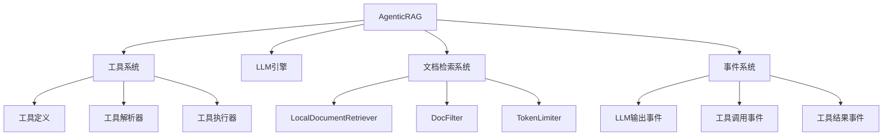
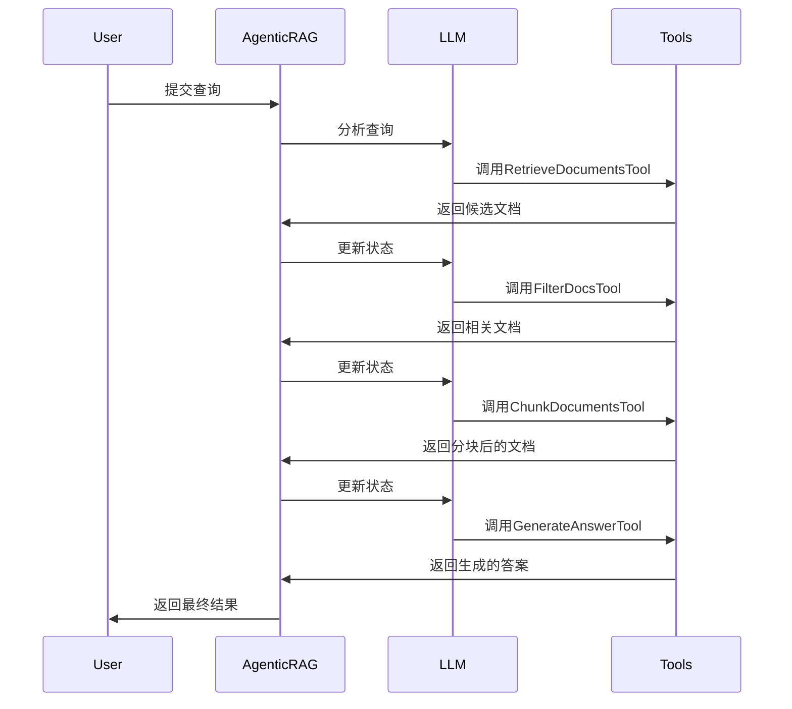

# Agentic RAG设计文档

## 1. 概述与目标

我们将实现一个基于代理工具的RAG（Retrieval-Augmented Generation）系统，称为`AgenticRAG`。该系统将结合`long_context_rag.py`的检索增强生成功能与`agentic_edit.py`的代理模式，创建一个更加灵活、可扩展且交互性更强的RAG系统。

主要目标：
- 将RAG的核心步骤（检索、过滤、分块、生成）转化为明确的工具操作
- 提供更透明的工作流程，使用户能够理解并控制RAG的每个步骤
- 支持中间结果的可视化和干预
- 实现更具交互性的RAG体验

## 2. 整体架构

### 2.1 核心组件



### 2.2 关键类定义

1. **AgenticRAG**：主类，整合所有组件
2. **工具模型**：使用Pydantic定义的各种工具
3. **工具解析器**：处理各种工具调用的类
4. **事件类型**：表示系统中不同事件的类

## 3. RAG工具设计

通过分析`long_context_rag.py`，我们可以识别出RAG流程中的关键步骤，并将其转化为工具：

### 3.1 基本工具集

```python
# 工具模型定义
class RetrieveDocumentsTool(BaseTool):
    query: str
    max_docs: Optional[int] = None
    
class FilterDocsTool(BaseTool):
    query: str
    documents: List[str]
    relevance_threshold: Optional[int] = 5
    
class ChunkDocumentsTool(BaseTool):
    documents: List[str]
    token_limit: Optional[int] = None
    
class GenerateAnswerTool(BaseTool):
    query: str
    documents: List[str]
    model: Optional[str] = None
    
class SearchSourcesTool(BaseTool):
    query: str
    path: Optional[str] = None
    recursive: Optional[bool] = True
    
class VisualizeDocRelevanceTool(BaseTool):
    documents: List[Dict[str, Any]]
```

### 3.2 工具解析器映射

```python
TOOL_RESOLVER_MAP: Dict[Type[BaseTool], Type[BaseToolResolver]] = {
    RetrieveDocumentsTool: RetrieveDocumentsToolResolver,
    FilterDocsTool: FilterDocsToolResolver,
    ChunkDocumentsTool: ChunkDocumentsToolResolver,
    GenerateAnswerTool: GenerateAnswerToolResolver,
    SearchSourcesTool: SearchSourcesToolResolver,
    VisualizeDocRelevanceTool: VisualizeDocRelevanceToolResolver,
}
```

## 4. 工作流程

### 4.1 基本工作流



### 4.2 事件驱动模型

AgenticRAG将采用与AgenticEdit相同的事件驱动模型：

1. **LLMOutputEvent**：LLM生成的文本输出
2. **LLMThinkingEvent**：LLM的思考过程
3. **ToolCallEvent**：工具调用请求
4. **ToolResultEvent**：工具执行结果
5. **CompletionEvent**：任务完成事件
6. **ErrorEvent**：错误事件

每个事件都将被流式处理并可视化，使用户能够实时了解RAG的工作过程。

## 5. 工具解析器实现

以RetrieveDocumentsToolResolver为例：

```python
class RetrieveDocumentsToolResolver(BaseToolResolver):
    def __init__(self, agent: 'AgenticRAG', tool: RetrieveDocumentsTool, args: AutoCoderArgs):
        super().__init__(agent, tool, args)
        self.tool: RetrieveDocumentsTool = tool
        
    def resolve(self) -> ToolResult:
        query = self.tool.query
        max_docs = self.tool.max_docs or self.args.rag_max_docs or 10
        
        try:
            documents = self.agent.document_retriever.retrieve_documents(
                options={"queries": [query]}
            )
            
            # 将文档转换为列表形式
            doc_list = []
            count = 0
            
            for doc in documents:
                if count >= max_docs:
                    break
                doc_list.append({
                    "module_name": doc.module_name,
                    "source_code": doc.source_code,
                    "tokens": doc.tokens
                })
                count += 1
                
            return ToolResult(
                success=True,
                message=f"Successfully retrieved {len(doc_list)} documents",
                content=doc_list
            )
        except Exception as e:
            logger.error(f"Error retrieving documents: {str(e)}")
            return ToolResult(
                success=False,
                message=f"Error retrieving documents: {str(e)}",
                content=None
            )
```

## 6. 关键实现细节

### 6.1 流式处理与交互模式

与AgenticEdit类似，AgenticRAG将使用生成器函数处理流式输出：

```python
def analyze(self, request: AgenticRAGRequest) -> Generator[Union[LLMOutputEvent, ...], None, None]:
    # 初始化系统提示词
    system_prompt = self._analyze.prompt(request)
    conversations = [
        {"role": "system", "content": system_prompt},
        {"role": "user", "content": request.user_input}
    ]
    
    # 迭代处理LLM响应
    iteration_count = 0
    while True:
        iteration_count += 1
        # LLM推理与响应解析
        llm_response_gen = stream_chat_with_continue(
            llm=self.llm,
            conversations=conversations,
            args=self.args
        )
        
        # 解析LLM响应，执行工具，返回事件
        parsed_events = self.stream_and_parse_llm_response(llm_response_gen)
        
        for event in parsed_events:
            # 处理不同类型的事件
            yield event
            
            # 工具执行逻辑
            if isinstance(event, ToolCallEvent):
                # ...处理工具调用...
                
        # 检查是否继续迭代
        if self._should_stop():
            break
```

### 6.2 与LongContextRAG的集成

AgenticRAG将重用LongContextRAG的核心组件：

```python
def __init__(self, llm, args, path, tokenizer_path=None):
    # 初始化基本配置
    self.llm = llm
    self.args = args
    self.path = path
    
    # 重用LongContextRAG的组件
    self.document_retriever = LocalDocumentRetriever(
        self.args, self.llm, self.path, 
        ignore_spec=self._load_ignore_file(),
        required_exts=self._get_required_exts()
    )
    
    self.doc_filter = DocFilter(self.llm, self.args)
    self.tokenizer = self._setup_tokenizer(tokenizer_path)
    
    # 初始化工具解析器映射
    self.tool_resolver_map = TOOL_RESOLVER_MAP
```

### 6.3 状态管理

AgenticRAG将维护RAG过程中的状态信息：

```python
class RAGState:
    query: str
    retrieved_docs: List[SourceCode] = []
    filtered_docs: List[FilterDoc] = []
    chunked_docs: List[SourceCode] = []
    answer: str = ""
    context_urls: List[str] = []
    
    # 令牌使用统计
    recall_tokens: Dict[str, int] = {}
    chunk_tokens: Dict[str, int] = {}
    qa_tokens: Dict[str, int] = {}
    
    # 时间统计
    timings: Dict[str, float] = {}
```

## 7. 用户交互与可视化

AgenticRAG将提供两种主要的交互模式：

1. **终端模式**：通过`run_in_terminal`方法，在终端中可视化RAG过程
2. **事件驱动模式**：通过`run_with_events`方法，生成标准的事件流以供外部系统处理

每个工具调用和结果都将以合适的方式可视化，让用户能够理解RAG过程中的每个步骤。

## 8. 扩展性考虑

1. **支持多种检索器**：设计可扩展的检索器接口
2. **支持多种LLM**：与LongContextRAG一样支持多种LLM配置
3. **自定义RAG流程**：允许用户自定义RAG流程中的各个步骤
4. **集成外部知识源**：支持从多种来源检索信息

## 9. 后续开发路线图

1. 实现基本的AgenticRAG类和工具解析器
2. 开发终端可视化界面
3. 实现与事件系统的集成
4. 增加高级特性（如用户反馈、迭代式检索等）
5. 添加度量和评估功能
6. 进行性能优化

## 10. 总结

AgenticRAG将RAG从传统的流水线模式转变为可交互的代理模式，使用户能够更好地理解和控制RAG的各个步骤。通过重用LongContextRAG的核心组件和AgenticEdit的代理架构，我们可以构建一个功能强大且易于扩展的RAG系统。
