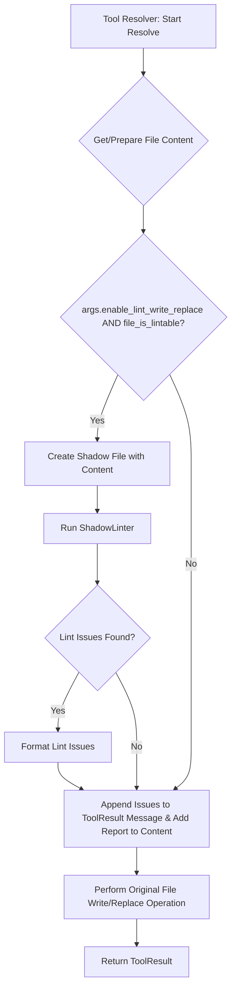

# Lint 集成方案：WriteToFileToolResolver 和 ReplaceInFileToolResolver

## 1. 引言与目标

本文档旨在设计一个方案，将 Lint 校验功能集成到 `WriteToFileToolResolver` 和 `ReplaceInFileToolResolver` 中。目标是确保通过这些工具写入或修改的文件能够经过 Lint 检查，并向用户报告或尝试自动修复发现的问题，从而提高代码质量。

## 2. 现有相关组件分析

项目中的 `CodeEditBlockManager` 类已经实现了一套完整的代码生成、Linting（使用 `ShadowLinter`）、编译（使用 `ShadowCompiler`）和自动修复流程。关键组件包括：

*   **`ShadowManager`**: 管理一个与主项目平行的 "影子" 文件系统，用于安全地进行修改和测试。
*   **`ShadowLinter`**: 在影子文件上执行 Lint 操作。它可能封装了一个或多个底层的 Lint 工具（如 Ruff, Flake8, Pylint）。
*   **`_create_shadow_files_from_edits`**: 从编辑块创建影子文件。
*   **`_format_lint_issues`**: 将 Lint 结果格式化，以便 LLM 理解并尝试修复。
*   **`_fix_lint_errors`**: 尝试使用 LLM 自动修复 Lint 错误。

我们将尽可能重用这些现有组件和模式，以保持一致性。

## 3. Lint 工具选择

我们将继续使用项目中已有的 **`ShadowLinter`** 和 **`ShadowManager`** 基础设施。这确保了与项目其他部分 Lint 行为的一致性，并利用了现有的影子文件系统机制，避免直接修改工作区文件进行临时检查。

## 4. 集成方案

核心思想是在文件内容准备好但尚未最终写入磁盘之前，在影子文件上执行 Lint 检查。

### 4.1. 通用 Lint 执行流程

对于两个 Resolver，通用的 Lint 执行流程如下：

1.  **准备内容**:
    *   `WriteToFileToolResolver`: 获取用户提供的完整文件内容。
    *   `ReplaceInFileToolResolver`: 应用所有 diff 后，获取最终的文件内容。
2.  **创建影子文件**:
    *   使用 `ShadowManager` 为目标文件路径创建一个对应的影子文件。
    *   将准备好的内容写入该影子文件。
3.  **执行 Lint**:
    *   实例化或获取一个 `ShadowLinter` 实例。
    *   调用 `shadow_linter.lint_specific_shadow_file(shadow_file_path)` (假设有这样的方法，或 `lint_all_shadow_files` 后筛选特定文件结果) 对该影子文件进行 Lint。
4.  **处理 Lint 结果**:
    *   获取 Lint 结果 (例如 `ProjectLintResult` 或特定文件的 `FileLintResult`)。
    *   根据结果判断是否存在需要关注的问题 (例如，错误或警告，具体级别可配置)。
5.  **清理影子文件**: Lint 操作完成后，应清理相关的影子文件，除非需要用于后续的自动修复步骤。

### 4.2. `WriteToFileToolResolver` 集成

修改 `WriteToFileToolResolver.resolve()` 方法：

```python
# In src/autocoder/agent/base_agentic/tools/write_to_file_tool_resolver.py
# ... imports ...
from autocoder.shadows.shadow_manager import ShadowManager # New
from autocoder.linters.shadow_linter import ShadowLinter   # New
from autocoder.linters.models import IssueSeverity        # New
from loguru import logger # Ensure logger is imported
import os # Ensure os is imported

class WriteToFileToolResolver(BaseToolResolver):
    # ... existing code ...

    def resolve(self) -> ToolResult:
        # ... existing code to get self.tool.path and self.tool.content ...
        
        lint_issues_str = None
        lint_report = None # Store more structured lint report if needed
        
        full_path = os.path.join(self.agent.args.source_dir, self.tool.path)
        if not self.agent.is_path_safe(full_path):
            return ToolResult(success=False, message=f"Error: Path {self.tool.path} is not safe to write to.")

        # --- LINTING STEP ---
        # Assume a new arg self.agent.args.enable_lint_write_replace to control this feature
        if hasattr(self.agent.args, 'enable_lint_write_replace') and self.agent.args.enable_lint_write_replace and self.tool.path.endswith((".py", ".python")): # Example: only lint Python files
            try:
                # Ensure ShadowManager and ShadowLinter can be initialized or retrieved correctly
                # They might need args.source_dir and args.event_file
                shadow_manager = ShadowManager(self.agent.args.source_dir, getattr(self.agent.args, 'event_file', None), getattr(self.agent.args, 'ignore_clean_shadows', False))
                shadow_linter = ShadowLinter(shadow_manager, verbose=False) 

                # 1. Create and write to shadow file
                # Use a unique name for the shadow file related to this operation if needed, or rely on ShadowManager's path mapping
                shadow_file_path_in_shadow_system = shadow_manager.update_file(self.tool.path, self.tool.content)
                
                # 2. Perform linting
                # ShadowLinter.lint_all_shadow_files() lints everything in the shadow_manager's scope.
                # We need to ensure it's focused or filter results.
                # A more direct `lint_file(shadow_path)` would be ideal.
                # For now, let's assume we lint all and then filter.
                project_lint_result = shadow_linter.lint_all_shadow_files() 
                
                # Extract results for the current file
                # The key in project_lint_result.file_results is the real path
                file_lint_result = project_lint_result.file_results.get(self.tool.path)

                if file_lint_result and (file_lint_result.error_count > 0 or file_lint_result.warning_count > 0): # Configurable levels
                    lint_issues_str = self._format_lint_issues_for_file(file_lint_result, [IssueSeverity.ERROR, IssueSeverity.WARNING])
                    lint_report = file_lint_result.to_dict() # Or a serializable version
                
                # Clean up the specific shadow file if not proceeding to auto-fix
                shadow_manager.delete_file(self.tool.path) # Deletes the shadow version

            except Exception as e:
                logger.error(f"Linting failed for {self.tool.path}: {e}")
                lint_issues_str = f"Linting process encountered an error: {str(e)}"
        # --- END LINTING STEP ---

        try:
            # Ensure directories exist
            os.makedirs(os.path.dirname(full_path), exist_ok=True)
            with open(full_path, "w", encoding="utf-8") as f:
                f.write(self.tool.content)
            
            message = f"File {self.tool.path} written successfully."
            if lint_issues_str:
                message += f"\nLinting issues found:\n{lint_issues_str}"
            
            # Ensure content in ToolResult is appropriate
            tool_result_content = {"path": self.tool.path, "content_length": len(self.tool.content)}
            if lint_report:
                tool_result_content["lint_report"] = lint_report
            
            return ToolResult(
                success=True,
                message=message,
                content=tool_result_content
            )
        except Exception as e:
            return ToolResult(success=False, message=f"Failed to write file {self.tool.path}: {str(e)}")

    def _format_lint_issues_for_file(self, file_lint_result, levels: List[IssueSeverity]) -> str:
        if not file_lint_result:
            return ""
        
        formatted = []
        has_issues = False
        for issue in file_lint_result.issues:
            # Ensure issue.severity is an IssueSeverity enum member before comparing
            if not isinstance(issue.severity, IssueSeverity) or issue.severity not in levels:
                continue
            if not has_issues:
                formatted.append(f"Issues in {file_lint_result.file_path}:") # file_lint_result.file_path is already the real path
                has_issues = True
            
            severity_str = issue.severity.name.capitalize() if isinstance(issue.severity, IssueSeverity) else str(issue.severity)
            line_info = f"L{issue.position.line}"
            if issue.position.column:
                line_info += f":C{issue.position.column}"
            
            formatted.append(f"  - [{severity_str}] {line_info}: {issue.message} (Rule: {issue.code})")
        
        return "\n".join(formatted) if has_issues else ""

```

### 4.3. `ReplaceInFileToolResolver` 集成

修改 `ReplaceInFileToolResolver.resolve()` 方法，在成功应用所有 diff 之后，但在将最终内容写回原始文件之前执行 Lint。

```python
# In src/autocoder/agent/base_agentic/tools/replace_in_file_tool_resolver.py
# ... imports ...
from autocoder.common.v2.code_auto_merge_editblock import CodeAutoMergeEditBlock 
from autocoder.shadows.shadow_manager import ShadowManager 
from autocoder.linters.shadow_linter import ShadowLinter   
from autocoder.linters.models import IssueSeverity        
from loguru import logger 
import os # Ensure os is imported

class ReplaceInFileToolResolver(BaseToolResolver):
    # ... existing code ...

    def resolve(self) -> ToolResult:
        full_path = os.path.join(self.agent.args.source_dir, self.tool.path)
        if not self.agent.is_path_safe(full_path):
            return ToolResult(success=False, message=f"Error: Path {self.tool.path} is not safe to write to.")

        if not os.path.exists(full_path):
            return ToolResult(success=False, message=f"Error: File {self.tool.path} does not exist.")

        try:
            with open(full_path, "r", encoding="utf-8") as f:
                original_content = f.read()
        except Exception as e:
            return ToolResult(success=False, message=f"Error reading file {self.tool.path}: {str(e)}")
        
        try:
            final_content_str = self._apply_replacements_for_linting(original_content, self.tool.diff, self.tool.path)
        except Exception as e:
            return ToolResult(success=False, message=f"Failed to apply replacements for linting on {self.tool.path}: {str(e)}")

        # --- LINTING STEP ---
        lint_issues_str = None
        lint_report = None
        if hasattr(self.agent.args, 'enable_lint_write_replace') and self.agent.args.enable_lint_write_replace and self.tool.path.endswith((".py", ".python")):
            try:
                shadow_manager = ShadowManager(self.agent.args.source_dir, getattr(self.agent.args, 'event_file', None), getattr(self.agent.args, 'ignore_clean_shadows', False))
                shadow_linter = ShadowLinter(shadow_manager, verbose=False)

                shadow_file_path_for_lint = shadow_manager.update_file(self.tool.path, final_content_str)
                
                project_lint_result = shadow_linter.lint_all_shadow_files()
                file_lint_result = project_lint_result.file_results.get(self.tool.path) # Key is real path

                if file_lint_result and (file_lint_result.error_count > 0 or file_lint_result.warning_count > 0):
                    lint_issues_str = self._format_lint_issues_for_file(file_lint_result, [IssueSeverity.ERROR, IssueSeverity.WARNING])
                    lint_report = file_lint_result.to_dict()
                
                shadow_manager.delete_file(self.tool.path) 

            except Exception as e:
                logger.error(f"Linting failed for {self.tool.path} after replacements: {e}")
                lint_issues_str = f"Linting process encountered an error: {str(e)}"
        # --- END LINTING STEP ---

        try:
            with open(full_path, "w", encoding="utf-8") as f:
                 f.write(final_content_str) 

            message = f"File {self.tool.path} updated successfully."
            if lint_issues_str:
                message += f"\nLinting issues found after applying replacements:\n{lint_issues_str}"
            
            tool_result_content = {"path": self.tool.path, "content_length": len(final_content_str)}
            if lint_report:
                tool_result_content["lint_report"] = lint_report
            
            return ToolResult(
                success=True,
                message=message,
                content=tool_result_content
            )
        except Exception as e:
            return ToolResult(success=False, message=f"Failed to update file {self.tool.path}: {str(e)}")

    def _apply_replacements_for_linting(self, original_content: str, diff_str: str, file_path_for_diff: str) -> str:
        # This helper applies SEARCH/REPLACE blocks to a string.
        # It's a simplified version. A robust production version should handle edge cases
        # like line endings, ensuring exact matches, and the order of blocks.
        current_content = original_content
        try:
            # CodeAutoMergeEditBlock.get_edits is a static method
            parsed_blocks = CodeAutoMergeEditBlock.get_edits(diff_str)
            
            for block_file_path, search_block, replace_block in parsed_blocks:
                if block_file_path == file_path_for_diff: # Process only blocks for the current file
                    # Normalize line endings for search_block to improve matching robustness
                    # This is a common pitfall: diffs might have LF, file might have CRLF.
                    # For simplicity, we assume consistent line endings or that get_edits handles this.
                    # A more robust way: try replacing with \n, then with \r\n if original_content has \r\n
                    
                    # Handle the "first match only" behavior of string.replace
                    # If search_block can appear multiple times, this simple replace might not be what's intended
                    # by the tool's design, which usually implies targeted, unique replacements.
                    
                    # Critical: The SEARCH block must match *exactly*.
                    # Whitespace, indentation, and line endings are significant.
                    
                    # A simple string replace is used here. If blocks overlap or order matters
                    # in a way that simple sequential replace doesn't handle, this needs more care.
                    # The `replace(search, replace, 1)` ensures only the first occurrence is replaced,
                    # which aligns with the typical behavior of diff/patch tools for specific blocks.
                    if search_block in current_content:
                         current_content = current_content.replace(search_block, replace_block, 1)
                    else:
                         # Log or handle cases where a SEARCH block doesn't match.
                         # This could indicate an issue with the diff or the original content.
                         logger.warning(f"Search block not found in {file_path_for_diff} for linting simulation. Search block:\n{search_block}")

        except Exception as e:
            logger.error(f"Error applying diffs to content for {file_path_for_diff} for linting: {e}")
            raise # Re-raise to be caught by the caller
        return current_content

    def _format_lint_issues_for_file(self, file_lint_result, levels: List[IssueSeverity]) -> str:
        # Same helper as in WriteToFileToolResolver
        if not file_lint_result:
            return ""
        
        formatted = []
        has_issues = False
        for issue in file_lint_result.issues:
            if not isinstance(issue.severity, IssueSeverity) or issue.severity not in levels:
                continue
            if not has_issues:
                formatted.append(f"Issues in {file_lint_result.file_path}:")
                has_issues = True
            
            severity_str = issue.severity.name.capitalize() if isinstance(issue.severity, IssueSeverity) else str(issue.severity)
            line_info = f"L{issue.position.line}"
            if issue.position.column:
                line_info += f":C{issue.position.column}"
            
            formatted.append(f"  - [{severity_str}] {line_info}: {issue.message} (Rule: {issue.code})")
        
        return "\n".join(formatted) if has_issues else ""
```

**Note on `_apply_replacements_for_linting`**: This helper in `ReplaceInFileToolResolver` is crucial. It needs to accurately simulate the application of diffs to get the content that *would* be written. The `CodeAutoMergeEditBlock.get_edits` method parses the diff string into searchable blocks. The actual replacement logic here is simplified; a production version must be robust, considering exact matching requirements (whitespace, line endings) and the "first match only" rule for each block.

### 4.4. Configuration

A new boolean argument, e.g., `args.enable_lint_write_replace` (or separate args for write and replace), should be added to `AutoCoderArgs` to control whether this Linting step is performed. This allows users to enable/disable the feature.
The severity levels for issues to report (e.g., ERROR, WARNING) could also be made configurable.
It's also recommended to make the file extensions to be linted configurable (e.g., `args.lintable_extensions = [".py", ".js"]`).

### 4.5. `ToolResult` Adjustments

The `content` field in `ToolResult` should be a dictionary for these tools to consistently include `path` and optionally `lint_report`.

For `WriteToFileToolResolver` and `ReplaceInFileToolResolver`, the `content` could be a dictionary:
```json
{
  "path": "path/to/file.py",
  "content_length": 12345, // Length of the written content
  "lint_report": { /* structure of FileLintResult (serialized) */ } // Optional
}
```
The `message` field in `ToolResult` will also include a summary of Lint issues if any were found.

## 5. Auto-Fixing (Optional Advanced Feature)

Similar to `CodeEditBlockManager._fix_lint_errors`, an auto-fixing loop could be introduced:
1.  If Lint issues are found.
2.  Format them using a prompt similar to `fix_linter_errors`.
3.  Pass this to an LLM to get corrected code (as diffs or full content).
4.  Re-apply/replace the content in the shadow file.
5.  Re-lint.
6.  Repeat for a configured number of attempts.

This would make the tools more powerful but also significantly more complex and potentially slower. For an initial implementation, reporting Lint issues might be sufficient. If auto-fixing is desired, it should leverage the existing prompts and logic from `CodeEditBlockManager`.

## 6. Error Handling

*   Errors during the Linting process itself (e.g., Linter tool crashes) should be caught.
*   The system should decide if a Linting error prevents the file operation or is just a warning. Initially, it's safer to treat Linting process errors as non-blocking for the file operation but report them.
*   Lint issues found in the code (e.g., syntax errors reported by Linter) should be reported. The user or an auto-fix step would then address them.

## 7. Flowchart (Simplified)



## 8. Summary of Changes

1.  **`AutoCoderArgs`**:
    *   Add `enable_lint_write_replace: bool` (default `False`).
    *   Consider `lint_issue_level: str` (e.g., "WARNING", "ERROR", default "ERROR").
    *   Consider `lintable_extensions: List[str]` (e.g., `[".py", ".python", ".js"]`).
2.  **`WriteToFileToolResolver`**:
    *   Modify `resolve()` to include the Linting step using `ShadowManager` and `ShadowLinter`.
    *   Add helper `_format_lint_issues_for_file`.
    *   Update `ToolResult` to include Lint information.
3.  **`ReplaceInFileToolResolver`**:
    *   Modify `resolve()` to include the Linting step after simulating diff application and before actual write.
    *   Implement a robust `_apply_replacements_for_linting` helper.
    *   Add helper `_format_lint_issues_for_file`.
    *   Update `ToolResult` to include Lint information.
4.  **`ShadowLinter` (Potentially)**: Ensure it can efficiently lint a single specified shadow file or that its results can be easily filtered. The current `lint_all_shadow_files()` might be acceptable if `ShadowManager`'s scope is temporarily limited or results are filtered.
5.  **`BaseToolResolver` (Potentially)**: The `agent` property (which holds `AutoCoderArgs`) needs to be consistently available.

This design provides a clear path to integrate Linting into the specified tool resolvers, enhancing code quality checks within the automated workflow.
