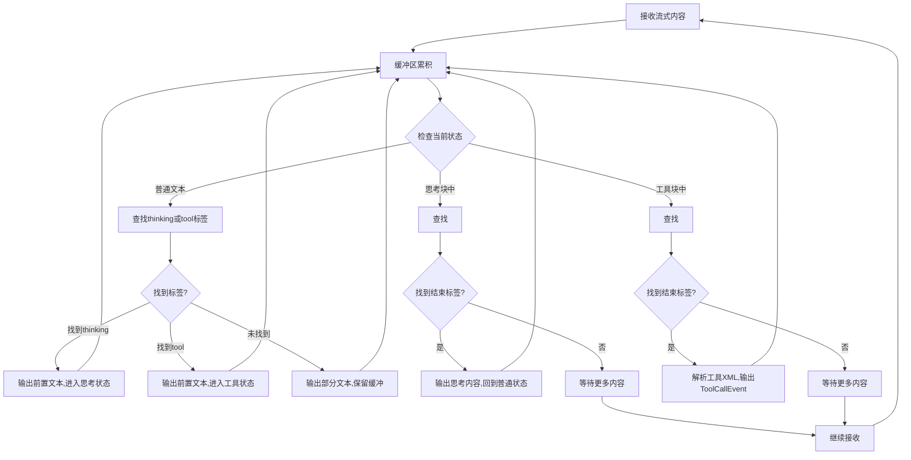

# 流式Tool解析器独立抽取设计

## 1. 概述

基于对 `agentic_edit.py` 中 `stream_and_parse_llm_response` 方法的分析，该功能实现了对LLM流式响应的实时解析，能够识别和提取其中的工具调用、思考块和普通文本。本设计旨在将此功能独立抽取为一个可重用的组件。

## 2. 核心功能分析

### 2.1 当前实现分析

在 `agentic_edit.py` 中的 `stream_and_parse_llm_response` 方法具备以下核心能力：

1. **流式解析**: 实时解析LLM的流式响应，无需等待完整响应
2. **多种内容识别**: 
   - 普通文本输出 (`LLMOutputEvent`)
   - 思考块 (`<thinking>...</thinking>`) -> `LLMThinkingEvent`
   - 工具调用块 (`<tool_name>...</tool_name>`) -> `ToolCallEvent`
   - 错误处理 (`ErrorEvent`)
3. **XML解析**: 解析工具调用的XML格式并转换为Pydantic模型
4. **状态管理**: 维护解析状态（普通文本/思考块/工具块）
5. **容错处理**: 处理不完整的标签和解析错误

### 2.2 解析流程



## 3. 独立抽取设计

### 3.1 目标架构

```
src/autocoder/common/stream_parser/
├── __init__.py
├── parser.py              # 核心解析器
├── events.py              # 事件定义
├── xml_parser.py          # XML工具解析
├── state_manager.py       # 状态管理
└── exceptions.py          # 异常定义
```

### 3.2 核心组件设计

#### 3.2.1 StreamToolParser (parser.py)

```python
from typing import Generator, Tuple, Any, Union, Dict, Type, Optional
from abc import ABC, abstractmethod

class StreamToolParser:
    """
    流式工具解析器核心类
    负责解析LLM流式响应中的工具调用、思考块和普通文本
    """
    
    def __init__(self, tool_registry: Dict[str, Type], xml_parser=None):
        """
        初始化解析器
        
        Args:
            tool_registry: 工具名称到Pydantic模型的映射
            xml_parser: 自定义XML解析器，默认使用内置解析器
        """
        self.tool_registry = tool_registry
        self.xml_parser = xml_parser or XMLToolParser(tool_registry)
        self.state_manager = ParseStateManager()
        
    def parse_stream(
        self, 
        stream: Generator[Tuple[str, Any], None, None]
    ) -> Generator[Union[ParseEvent], None, None]:
        """
        解析流式响应
        
        Args:
            stream: LLM流式响应生成器，产生(content, metadata)元组
            
        Yields:
            ParseEvent: 解析出的事件(文本、思考、工具调用、错误等)
        """
        
    def _process_buffer(self) -> Generator[ParseEvent, None, None]:
        """处理缓冲区内容，识别和提取不同类型的内容块"""
        
    def _handle_text_state(self) -> Generator[ParseEvent, None, None]:
        """处理普通文本状态"""
        
    def _handle_thinking_state(self) -> Generator[ParseEvent, None, None]:
        """处理思考块状态"""
        
    def _handle_tool_state(self) -> Generator[ParseEvent, None, None]:
        """处理工具调用状态"""
```

#### 3.2.2 事件系统 (events.py)

```python
from abc import ABC
from typing import Any, Optional
from pydantic import BaseModel

class ParseEvent(BaseModel, ABC):
    """解析事件基类"""
    pass

class TextOutputEvent(ParseEvent):
    """普通文本输出事件"""
    text: str

class ThinkingEvent(ParseEvent):
    """思考块事件"""
    content: str

class ToolCallEvent(ParseEvent):
    """工具调用事件"""
    tool_name: str
    tool_instance: Any
    raw_xml: str

class ParseErrorEvent(ParseEvent):
    """解析错误事件"""
    error_type: str
    message: str
    context: Optional[str] = None

class TokenUsageEvent(ParseEvent):
    """Token使用统计事件"""
    usage_info: Any
```

#### 3.2.3 XML解析器 (xml_parser.py)

```python
import re
import xml.sax.saxutils
from typing import Optional, Dict, Type, Any

class XMLToolParser:
    """XML工具解析器，负责解析工具调用的XML格式"""
    
    def __init__(self, tool_registry: Dict[str, Type]):
        self.tool_registry = tool_registry
        
    def parse_tool_xml(self, xml_content: str, tool_name: str) -> Optional[Any]:
        """
        解析工具XML并创建工具实例
        
        Args:
            xml_content: 完整的工具XML内容
            tool_name: 工具名称
            
        Returns:
            解析成功则返回工具实例，失败返回None
        """
        
    def _extract_parameters(self, inner_xml: str) -> Dict[str, Any]:
        """从XML内容中提取参数"""
        
    def _convert_parameter_types(self, params: Dict[str, Any], tool_name: str) -> Dict[str, Any]:
        """根据工具类型转换参数类型（如布尔值、JSON等）"""
        
    def reconstruct_tool_xml(self, tool_instance: Any) -> str:
        """重构工具实例为XML格式"""
```

#### 3.2.4 状态管理器 (state_manager.py)

```python
from enum import Enum
from typing import Optional

class ParseState(Enum):
    """解析状态枚举"""
    TEXT = "text"           # 普通文本状态
    THINKING = "thinking"   # 思考块状态
    TOOL = "tool"          # 工具调用状态

class ParseStateManager:
    """解析状态管理器"""
    
    def __init__(self):
        self.current_state = ParseState.TEXT
        self.buffer = ""
        self.current_tool_name: Optional[str] = None
        
    def reset(self):
        """重置状态"""
        self.current_state = ParseState.TEXT
        self.buffer = ""
        self.current_tool_name = None
        
    def append_to_buffer(self, content: str):
        """向缓冲区添加内容"""
        self.buffer += content
        
    def clear_buffer(self):
        """清空缓冲区"""
        self.buffer = ""
        
    def set_state(self, state: ParseState, tool_name: Optional[str] = None):
        """设置当前状态"""
        self.current_state = state
        if state == ParseState.TOOL:
            self.current_tool_name = tool_name
        else:
            self.current_tool_name = None
```

### 3.3 配置和扩展性

#### 3.3.1 解析器配置

```python
from dataclasses import dataclass
from typing import Dict, Pattern

@dataclass
class ParserConfig:
    """解析器配置"""
    thinking_start_tag: str = "<thinking>"
    thinking_end_tag: str = "</thinking>"
    tool_tag_pattern: Pattern = re.compile(r"<([a-zA-Z0-9_]+)>")
    buffer_keep_size: int = 100  # 保留的缓冲区大小，用于处理跨块的标签
    enable_xml_validation: bool = True
    max_tool_size: int = 10000  # 最大工具XML大小限制
```

#### 3.3.2 插件系统

```python
from abc import ABC, abstractmethod

class ParsePlugin(ABC):
    """解析插件基类，用于扩展解析能力"""
    
    @abstractmethod
    def can_handle(self, content: str, state: ParseState) -> bool:
        """判断是否可以处理当前内容"""
        
    @abstractmethod
    def process(self, content: str) -> Generator[ParseEvent, None, None]:
        """处理内容并生成事件"""

class CustomTagPlugin(ParsePlugin):
    """自定义标签处理插件示例"""
    pass
```

## 4. 使用示例

### 4.1 基本使用

```python
from autocoder.common.stream_parser import StreamToolParser
from autocoder.common.v2.agent.agentic_edit_types import TOOL_MODEL_MAP

# 创建解析器
parser = StreamToolParser(tool_registry=TOOL_MODEL_MAP)

# 解析流式响应
def handle_llm_stream(llm_stream):
    for event in parser.parse_stream(llm_stream):
        if isinstance(event, TextOutputEvent):
            print(f"Text: {event.text}")
        elif isinstance(event, ThinkingEvent):
            print(f"Thinking: {event.content}")
        elif isinstance(event, ToolCallEvent):
            print(f"Tool Call: {event.tool_name}")
            # 执行工具...
        elif isinstance(event, ParseErrorEvent):
            print(f"Parse Error: {event.message}")
```

### 4.2 自定义配置

```python
from autocoder.common.stream_parser import StreamToolParser, ParserConfig

config = ParserConfig(
    thinking_start_tag="<思考>",
    thinking_end_tag="</思考>",
    buffer_keep_size=200
)

parser = StreamToolParser(
    tool_registry=TOOL_MODEL_MAP,
    config=config
)
```

### 4.3 添加自定义插件

```python
class CustomMarkdownPlugin(ParsePlugin):
    def can_handle(self, content: str, state: ParseState) -> bool:
        return "```" in content and state == ParseState.TEXT
        
    def process(self, content: str) -> Generator[ParseEvent, None, None]:
        # 处理代码块...
        yield CodeBlockEvent(language="python", code="...")

parser.add_plugin(CustomMarkdownPlugin())
```

## 5. 集成方案

### 5.1 与现有系统集成

1. **向后兼容**: 保持现有的事件接口不变
2. **渐进迁移**: 可以逐步将现有代码迁移到新的解析器
3. **配置化**: 通过配置开关控制是否使用新解析器

### 5.2 性能优化

1. **缓冲区管理**: 智能的缓冲区大小管理，避免内存泄漏
2. **正则表达式优化**: 预编译正则表达式，提高匹配效率
3. **状态缓存**: 缓存解析状态，减少重复计算

### 5.3 错误处理和容错

1. **优雅降级**: 解析失败时回退到文本模式
2. **错误恢复**: 能够从解析错误中恢复并继续处理
3. **详细日志**: 提供详细的解析日志用于调试

## 6. 测试策略

### 6.1 单元测试

- 各个组件的独立测试
- 边界条件测试
- 错误场景测试

### 6.2 集成测试

- 与实际LLM流的集成测试
- 性能压力测试
- 并发安全性测试

### 6.3 兼容性测试

- 与现有agentic_edit系统的兼容性
- 不同工具类型的兼容性
- 不同LLM输出格式的兼容性

## 7. 实施计划

### Phase 1: 核心组件开发
- [ ] 实现StreamToolParser核心类
- [ ] 实现事件系统
- [ ] 实现XML解析器
- [ ] 实现状态管理器

### Phase 2: 功能完善
- [ ] 添加配置系统
- [ ] 实现插件系统
- [ ] 添加错误处理和容错机制
- [ ] 性能优化

### Phase 3: 集成和测试
- [ ] 与agentic_edit系统集成
- [ ] 编写完整的测试套件
- [ ] 性能测试和优化
- [ ] 文档编写

### Phase 4: 部署和维护
- [ ] 向后兼容性验证
- [ ] 渐进式迁移
- [ ] 监控和维护

## 8. 优势和价值

### 8.1 模块化设计
- 职责单一，易于维护和扩展
- 可以独立测试和优化
- 支持插件化扩展

### 8.2 重用性
- 可以在其他需要解析LLM响应的场景中重用
- 标准化的接口，易于集成

### 8.3 可扩展性
- 支持新的工具类型
- 支持自定义标签和格式
- 支持不同的解析策略

### 8.4 性能优化
- 专门优化的解析算法
- 内存使用优化
- 并发安全

## 9. 风险和挑战

### 9.1 兼容性风险
- 现有系统的兼容性
- 不同LLM输出格式的变化

### 9.2 性能风险
- 流式解析的性能开销
- 内存使用的优化

### 9.3 维护复杂性
- 解析逻辑的复杂性
- 错误处理的完整性

## 10. 总结

将流式Tool解析功能独立抽取为可重用组件是一个有价值的架构改进。通过模块化设计、标准化接口和插件系统，可以提高代码的重用性、可维护性和扩展性。建议采用渐进式的实施方案，确保向后兼容性的同时逐步迁移到新的架构。
