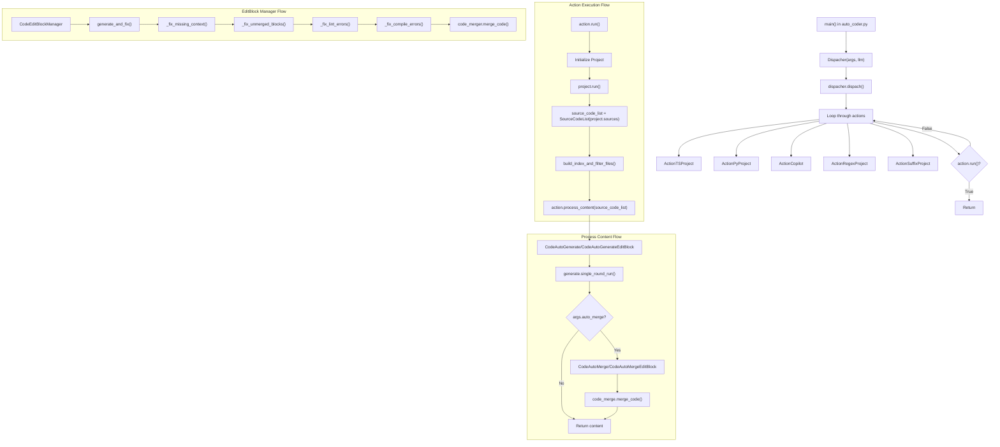

# Manual 模式代码入口

## 调用流程概述

原始流程：auto-coder.py -> dispacher.py -> action.py/action_regex_project.py

## 详细调用流程图

## 关键组件说明

1. **main()** - 入口函数，位于 auto_coder.py，当执行 /coding 指令的时候会解析命令行参数并初始化 Dispatcher

2. **Dispatcher** - 负责根据项目类型选择合适的 Action 执行
   - 尝试多种 Action 类型，直到找到一个返回 True 的 Action

3. **Action 类型**
   - ActionTSProject: 处理 TypeScript 项目
   - ActionPyProject: 处理 Python 项目
   - ActionCopilot: 处理 Copilot 模式
   - ActionRegexProject: 处理正则表达式项目
   - ActionSuffixProject: 处理后缀项目

4. **代码生成与合并**
   - CodeAutoGenerate/CodeAutoGenerateEditBlock: 生成代码
   - CodeAutoMerge/CodeAutoMergeEditBlock: 合并生成的代码

5. **高级编辑模式**
   - CodeEditBlockManager: 管理代码编辑块，提供自动修复功能
   - 可以修复缺失上下文、未合并代码块、Lint 错误和编译错误