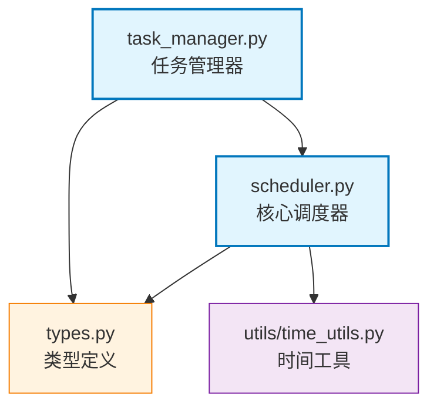

# 使用示例：为新模块生成文档

本示例演示如何使用 AutoCoder 模块文档规范为一个新模块创建标准化文档。

## 场景描述

假设我们有一个新的模块 `src/autocoder/scheduler`，包含任务调度功能，我们需要为它创建完整的文档。

## 步骤1：查看模块结构

```bash
# 查看模块目录结构
tree src/autocoder/scheduler
```

假设结构如下：
```
src/autocoder/scheduler/
├── __init__.py
├── scheduler.py
├── task_manager.py
├── types.py
├── utils/
│   ├── __init__.py
│   └── time_utils.py
└── tests/
    ├── test_scheduler.py
    └── test_task_manager.py
```

## 步骤2：使用自动生成器

```bash
# 生成基础文档模板
python docs/rules/generate_module_doc.py src/autocoder/scheduler -n "任务调度系统"
```

生成的文档模板：

```markdown
# 任务调度系统

这是 AutoCoder 项目中的[模块功能描述]，提供[主要功能说明]。

## 目录结构

```
src/autocoder/scheduler/
├── __init__.py                    # 模块初始化文件
├── scheduler.py                   # [功能描述]
├── task_manager.py               # [功能描述]
├── types.py                      # 类型定义
├── utils/                        # [子模块功能描述]
│   ├── __init__.py               # [子模块初始化]
│   └── time_utils.py             # [子文件功能描述]
└── .meta.mod.md                  # 本文档
```

## 快速开始（对外API使用指南）

### 基本使用方式

参考相关文件中的使用方式：

```python
from autocoder.scheduler import Scheduler, TaskManager

# 1. 初始化配置
# [配置步骤和代码示例]

# 2. 创建实例
# [实例创建代码示例]

# 3. 基本使用
# [基本使用代码示例]
```

# ... 其他模板内容
```

## 步骤3：完善文档内容

根据实际模块功能，完善生成的模板：

### 3.1 更新模块描述

```markdown
# 任务调度系统

这是 AutoCoder 项目中的任务调度模块，提供异步任务执行、定时任务管理和任务状态监控功能。
```

### 3.2 完善目录结构描述

```markdown
## 目录结构

```
src/autocoder/scheduler/
├── __init__.py                    # 模块初始化文件
├── scheduler.py                   # 核心调度器，负责任务调度和执行
├── task_manager.py               # 任务管理器，处理任务生命周期
├── types.py                      # 类型定义，包含任务模型和状态枚举
├── utils/                        # 工具函数目录
│   ├── __init__.py               # 工具模块初始化
│   └── time_utils.py             # 时间处理工具函数
└── .meta.mod.md                  # 本文档
```
```

### 3.3 添加完整的使用示例

```markdown
### 基本使用方式

```python
from autocoder.scheduler import Scheduler, TaskManager
from autocoder.scheduler.types import Task, TaskStatus

# 1. 初始化调度器
scheduler = Scheduler(
    max_workers=4,
    task_timeout=300
)

# 2. 创建任务管理器
task_manager = TaskManager(scheduler)

# 3. 创建和提交任务
task = Task(
    name="example_task",
    func=my_function,
    args=(arg1, arg2),
    schedule_time="2024-01-01 10:00:00"
)

task_id = task_manager.submit_task(task)

# 4. 监控任务状态
status = task_manager.get_task_status(task_id)
print(f"任务状态: {status}")

# 5. 启动调度器
scheduler.start()
```
```

### 3.4 详细说明核心组件

```markdown
## 核心组件详解

### 1. Scheduler 主类

**核心功能：**
- 任务调度：根据时间和优先级调度任务执行
- 并发控制：管理工作线程池，控制并发执行数量
- 状态监控：实时监控任务执行状态和系统负载

**主要方法：**
- `start()`: 启动调度器
- `stop()`: 停止调度器
- `submit_task(task)`: 提交新任务
- `get_status()`: 获取调度器状态

### 2. TaskManager 任务管理器

**核心功能：**
- 任务生命周期管理：创建、执行、完成、失败处理
- 任务持久化：任务状态的保存和恢复
- 错误处理：任务失败重试和错误报告

**主要方法：**
- `submit_task(task)`: 提交任务到调度器
- `get_task_status(task_id)`: 查询任务状态
- `cancel_task(task_id)`: 取消任务
- `retry_task(task_id)`: 重试失败的任务
```

### 3.5 添加Mermaid依赖图

```markdown
## Mermaid 文件依赖图



### 依赖关系说明

1. **核心依赖流**：
   - `TaskManager` 依赖 `Scheduler` 进行任务调度
   - 两者都依赖 `Types` 中的数据模型

2. **工具依赖**：
   - `Scheduler` 使用 `TimeUtils` 处理时间相关逻辑
```

## 步骤4：质量检查

使用检查清单验证文档质量：

### 内容完整性检查
- [x] 模块概述清晰准确
- [x] 目录结构完整
- [x] API 使用示例可运行
- [x] 核心组件说明详细
- [x] 依赖关系图准确

### 代码质量检查
- [x] 代码示例语法正确
- [x] 导入语句完整
- [x] 变量名符合规范
- [x] 注释清晰有用

### 文档结构检查
- [x] 标题层级正确
- [x] 章节逻辑清晰
- [x] 格式统一规范
- [x] 链接和引用正确

## 步骤5：最终文档

经过完善后的最终文档应该包含：

1. **清晰的模块描述** - 一句话说明核心价值
2. **完整的目录结构** - 每个文件都有功能说明
3. **可运行的代码示例** - 新手能直接使用
4. **详细的组件说明** - 核心类和方法的完整描述
5. **准确的依赖图** - 反映真实的模块关系

## 维护建议

### 定期更新
- 代码变更时同步更新文档
- 新增API时补充使用示例
- 架构调整时更新依赖图

### 用户反馈
- 收集用户使用反馈
- 改进难理解的部分
- 补充常见问题解答

通过这个完整的流程，我们可以为任何新模块创建高质量、标准化的文档，确保项目文档的一致性和可用性。


