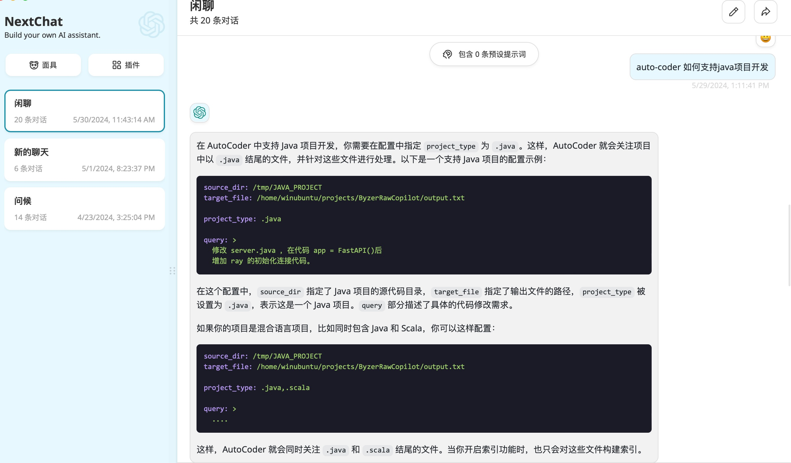
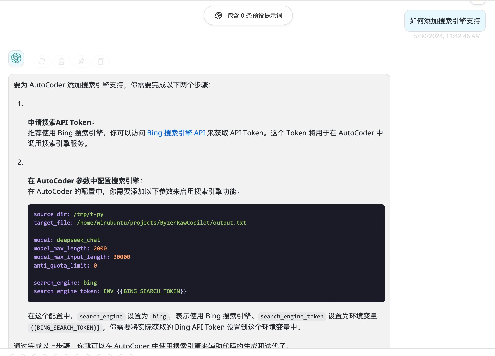

# 000-AutoCoder_准备旅程

本篇内容会介绍使用 SaaS API 快速为你的已有项目设置auto-coder。

> auto-coder 是一个基于YAML配置的命令行开发辅助工具，可以根据您的需求自动迭代开发已有项目。

## 安装 auto-coder

```shell
conda create --name auto-coder python=3.10.11
conda activate auto-coder
pip install -U auto-coder
ray start --head
```

## 启动推荐的模型代理

大语言模型(你需要去deepseek官网申请token),然后执行下面的命令。

> 注意要替换 ${MODEL_DEEPSEEK_TOKEN} 和 ${MODEL_QIANWEN_TOKEN} 为你的实际token。

```shell
byzerllm deploy --pretrained_model_type saas/openai \
--cpus_per_worker 0.001 \
--gpus_per_worker 0 \
--worker_concurrency 30 \
--num_workers 1 \
--infer_params saas.base_url="https://api.deepseek.com/v1" saas.api_key=${MODEL_DEEPSEEK_TOKEN} saas.model=deepseek-chat \
--model deepseek_chat
```

向量模型(可选，你需要去qwen官网申请token，如果麻烦，可以跳过先),然后执行下面的命令。

```shell
byzerllm deploy --pretrained_model_type saas/qianwen \
--cpus_per_worker 0.001 \
--gpus_per_worker 0 \
--num_workers 2 \
--infer_params saas.api_key=${MODEL_QIANWEN_TOKEN}  saas.model=text-embedding-v2 \
--model qianwen_emb
```

## 初始化已有项目

进入你的项目根目录，执行下面的命令。

```shell
auto-coder init --source_dir .
```
系统会自动在当前目录下生成 `.auto-coder`,`actions` 两个目录。
在 actions 目录下会生成一个 `101_current_work.yaml` 文件，你可以以这个作为模板。

记得在 actions/base/base.yml 或者你独立的yaml文件中修改你的 project_type，支持：

1. py
2. ts
3. 任何文件后缀名组合，使用逗号分隔，比如：.java,.scala

## 让 auto-coder 开始为你编程

打开 actions/000_example.yml 文件,内容打开是这这样的：

```yaml
include_file:
  - ./base/base.yml
  - ./base/enable_index.yml
  - ./base/enable_wholefile.yml    

query: |
  YOUR QUERY HERE
```

你可以在 `query` 字段中填写你的功能或者业务需求，并且临时关闭 human_as_model模式,可以让deepseek 模型直接生成代码。
最后看起来是这样的：

```yaml
include_file:
  - ./base/base.yml
  - ./base/enable_index.yml
  - ./base/enable_wholefile.yml    

human_as_model: false  

query: |  
  帮我在项目根目录下创建一个 src/server.py, 使用 fastapi ，创建一个 /hello 接口，返回 world.
```

运行 auto-coder:

```shell
auto-coder --file actions/000_example.yml
```

最后在自己的项目里就可以看到这么一个文件了。

```python
# src/server.py
from fastapi import FastAPI

app = FastAPI()

@app.get("/hello")
async def hello():
    return "world"
```


## 给自己构建一个本地 auto-coder 小助手

因为 auto-coder 本身是一个命令行+YAML配置文件的编程辅助工具，所以就会涉及到一些配置和用法，然后又不愿意自己去一个文档一个文档查。
这个时候你有两个选择：

1. 使用 auto-coder 的知识库功能，自己构建一个小助手。
2. 使用 devv.ai 的 github 知识库功能，问询 auto-coder 相关的问题。


### 使用 auto-coder 的知识库功能

这一步依赖前面启动的向量模型。

启动知识库：

```shell
byzerllm storage start
```

导入 auto-coder 文档：

```shell
git clone https://github.com/allwefantasy/auto-coder
cd auto-coder 
auto-coder doc build --model deepseek_chat --emb_model qianwen_emb --source_dir ./docs/zh --collection auto-coder --description "AutoCoder文档"
```

大概等个几分钟，完工。

现在可以和小助手聊天了：

```shell
auto-coder doc query --model deepseek_chat --emb_model qianwen_emb --query "如何开启搜索引擎" --collection auto-coder
```

你也可以启动一个服务，方便使用一些聊天软件：

```shell
auto-coder doc serve --model deepseek_chat --emb_model qianwen_emb  --collection auto-coder
```

下面是一些效果：




以 NextChat 软件为例，配置如下：


密码随意填写。

### 使用 devv.ai 的 github 知识库功能

点击链接： https://devv.ai/search?threadId=dn913itmjchs 直接使用。


## 继续你的旅程

[002- 用 AutoCoder 添加和修改代码](./002-%20%E7%94%A8%20AutoCoder%20%E6%B7%BB%E5%8A%A0%E5%92%8C%E4%BF%AE%E6%94%B9%E4%BB%A3%E7%A0%81.md)


