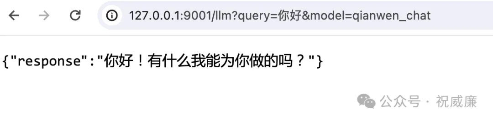

# 004-AutoCoder 边看代码 边看文档 写代码

程序员单纯编程部分，无非是

1.  理解需求

2. 搜索看别人怎么解决类似问题，理清思路

3. 看已有项目的代码

4. 看要用到的第三方库的源码或者文档


AutoCoder 会模拟程序的这种行为来完成代码的编写。我们来看看具体如何让 AutoCoder 去完成这件事。

```yml
source_dir: /tmp/t-py
target_file: /home/winubuntu/projects/ByzerRawCopilot/output.txt 

model: qianwen_chat
model_max_length: 2000
model_max_input_length: 100000
anti_quota_limit: 5

execute: true
auto_merge: true

project_type: py

human_as_model: true

urls: >
  https://raw.githubusercontent.com/allwefantasy/byzer-llm/master/README.md

query: >
  在 read_root 方法前新添加一个方法，
  对应的rest 路径为 /llm, 该接口接受连个参数：query 和 model。
  调用 llm.chat_oai 方法，然后返回结果。
  你需要参考前面 byzer-llm 的文档来完成 llm.chat_oai 方法的调用。
  注意， ByzerLLM 的初始化要放到新方法里。

```

这里，相比之前，我们新增了一个 urls 参数，你可以指定一份多份文档。因为我准备给我们的web server 添加一个大模型服务的功能，所以我把 byzerllm 的文档提供给了他。

这里因为文档比较长，我使用了 human_as_model 功能，从而可以使用一些具有超长窗口的 web 模型。

现在，我们打开 server.py 文件，可以看到新增了一个/llm 接口。

```yml


import os
import ray
from fastapi import FastAPI
from byzerllm.utils.client import ByzerLLM

# 创建FastAPI应用实例
app = FastAPI()


@app.get("/hello")
def hello():
    return {"message": "world"}

@app.get("/llm")
def llm_chat(query: str, model: str):
    llm = ByzerLLM()
    llm.setup_default_model_name(model)

    result = llm.chat_oai(conversations=[{
        "role": "user",
        "content": query
    }])

    return {"response": result[0].output}

# 定义根路径的GET请求处理函数，返回 "Hello, World!"
@app.get("/")
def read_root():
    return {"message": "Hello, World!"}
    
if __name__ == "__main__":
    # 启动web服务，端口改为9001
    import uvicorn
    uvicorn.run(app, host="127.0.0.1", port=9001)
```

代码很完美，但其实漏掉了一个连接 ByzerLLM 集群的语句，就一行代码，你其实可以手动修改下的。

不过考虑到你可能更喜欢指挥大模型干活，所以你修改下query,再执行一把：

```yml
...
query: >
  修改 server.py ，在代码 app = FastAPI()后
  增加 ray 的初始化连接代码。
```

这个时候他就会修改代码了，你可以看到他在第10行正确的添加了代码。

```python
import os
import ray
from fastapi import FastAPI
from byzerllm.utils.client import ByzerLLM

# 创建FastAPI应用实例
app = FastAPI()

# 初始化ray连接
ray.init(address="auto", namespace="default", ignore_reinit_error=True)

@app.get("/hello")
def hello():
    return {"message": "world"}

@app.get("/llm")
def llm_chat(query: str, model: str):
    llm = ByzerLLM()
    llm.setup_default_model_name(model)

    result = llm.chat_oai(conversations=[{
        "role": "user",
        "content": query
```

好，轮到我们检验成果的时候了。启动这个web服务：

```shell
python /tmp/t-py/server/server.py
```

访问我们/llm 接口：

http://127.0.0.1:9001/llm?query=你好&model=qianwen_chat

返回：



恭喜，你成功完成了一个大模型的服务！

考虑到今天这篇文章不断，所以如何使用搜索引擎我们放在下一篇。
