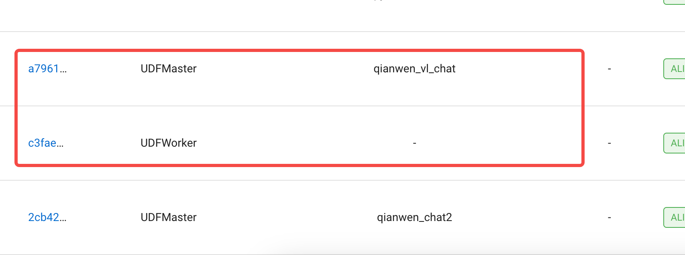

# 010-AutoCoder 如何在公司级别使用

AutoCoder 如果是程序员用的话，一般 AutoCoder + SaaS 大模型，都会运行在程序员自己的电脑上。程序员还可以通过 human as model 模式，使用 Web 版本的模型。

但是这种方式存在一定泄露源码的风险。

如果公司想给自家的程序员统一使用 AutoCoder，并且对代码隐私有较高的要求，那么我们可以考虑私有化部署 AutoCoder 使用的大模型。


## 私有化部署大模型

Byzer-LLM 可以快速的帮助企业部署生产可用的大模型集群，支持主流的SaaS，开源大模型，并且支持多模态类的大模型。具体参考 https://github.com/allwefantasy/byzer-llm。

第一步是把公司的服务器，使用 Ray 组成一个集群,可以参考 https://docs.ray.io/en/latest/。 Ray 可以运行在裸机上，也可以
运行云上，还可以运行在 k8s 上。这个具体看公司的IT基础设施要求。

接着就可以执行下面命令在 Ray 上启动一个大模型：

```
byzerllm deploy --model_path /home/byzerllm/models/openbuddy-llama2-13b64k-v15 \
--pretrained_model_type custom/auto \
--gpu_gpus_per_worker 4 \
--num_workers 1 \
--model llama2_chat 
```

然后在 Ray 的dashboard上，可以看到启动的大模型:



上面的命令表示，我们使用了一个自定义的模型，模型的路径是 `/home/byzerllm/models/openbuddy-llama2-13b64k-v15`，这个模型是一个 13B 的模型，使用了 4 个 GPU，启动了一个 worker。如果你设置了两个worker,那就相当于使用8块卡。

注意，如果想让AutoCoder 效果好，开源的，推荐至少 72B Qwen 模型，并且需要长窗口版本。

值得一提的事，我们提供了快速在连显卡驱动都没有的服务器上进行环境配置的工具： https://github.com/allwefantasy/byzer-llm?tab=readme-ov-file#raw-machine

实际上，Byzer-LLM 对私有大模型和SaaS模型都一视同仁，都会在Ray 集群启动Worker,区别是 SaaS模型不消耗GPU， 而在连接 SaaS模型也通过 Byzer-LLM的一个重要原因是可以具有更好的可控性，比如审计，同时也可以更好的控制模型的版本，比如需要切换一个模型，只需要服务器做修改即可，而不需要客户端做修改。

## AutoCoder 客户端配置

一旦服务器部署完成后，程序在自己电脑上安装好AutoCoder 客户端后，就可以连接 Byzer-LLM 集群，具体有两种方式：

第一种方式，是按如下方式启动一个客户端代理：

```shell
ray start --address='公司Byzer-LLM集群地址'
```                    
然后你就可以正常使用 AutoCoder 了,比如：

```yml
source_dir: /home/winubuntu/projects/ByzerRawCopilot 
target_file: /home/winubuntu/projects/ByzerRawCopilot/output.txt 

model: qianwen_short_chat
model_max_length: 2000
anti_quota_limit: 5
skip_build_index: true

project_type: "copilot/.py"
query: |
  优化 copilot 里的 get_suffix_from_project_type 函数并更新原文件

```

这个时候，AutoCoder 会自动连接 Byzer-LLM 集群中部署好的 `qianwen_short_chat` 来进行驱动。

第二种方式，是通过配置文件的方式来指定公司的 Byzer-LLM 集群地址：

```yml
source_dir: /home/winubuntu/projects/ByzerRawCopilot 
target_file: /home/winubuntu/projects/ByzerRawCopilot/output.txt 

ray_address: 公司Byzer-LLM集群地址

model: qianwen_short_chat
model_max_length: 2000
anti_quota_limit: 5
skip_build_index: true

project_type: "copilot/.py"
query: |
  优化 copilot 里的 get_suffix_from_project_type 函数并更新原文件
```       

用户可以根据自己的需求选择其中一种方式。

## 总结

AutoCoder 通过私有化部署大模型，可以满足公司对代码隐私的要求，同时也可以让程序员使用到最新的大模型。