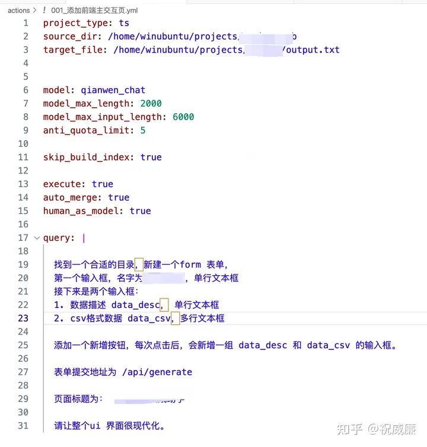
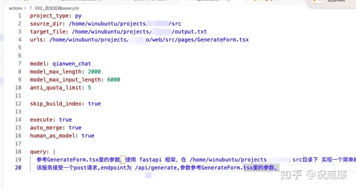

# 015 - AutoCoder 迭代粒度拆解技巧

下面是我最近开发一个实际前后端应用的一个迭代流程：

经过大概20多轮迭代加上一定的人工修改，完成了这个项目。大概花了一天多一点。

而且实际我用下来，对于前后端项目非常好的一点，是可以左右互搏，比如先写好前端请求，基本就可以自动生成后端的API 接口（入参，数据库表等）。同理反过来，对接已经写好的后端API， 前端也是基本可以自动生成对应的 interface的。因为AutoCoder可以给到比较完整的上下文信息。

为什么需要拆解到这么细，而不是“Hey, 大模型，给我一个完美的Web网站，支持上传下载，支持实时显示后端信息” 这么一句话？ Hmmm, 那是 Devin的目标，不是 AutoCoder的目标。

AutoCoder 目前阶段是需要程序员来做Planing， Review/Revert 来持续推进的，最终达到最后目标。如果拆解的过细，可能就有点浪费token和时间。但是如果拆解粒度太粗，就会有很多问题。

产出完全不符合预期
如果你的粒度太粗，那么最终产出很可能和你想的完全不一样，而且大量新生成的代码也导致review 困难。大概率你需要revert重来，并且花费更多的重试成本。

输入输出过大
大模型的输入输出都是有限制的。如果你一个需求太粗了，可能会导致需要修改的文件特别多，需要参考的文件也更多，最终哪怕是开启了索引，也会涉及到很多文件，超出了大模型可以接受的输入。

而如果修改的问题特别多，那么输出就会很大，就会导致超出最长限制而输出不完整，导致需要手工介入。

后续难以人工微调
如果粒度太初，一次性生成代码较多，研发很难一眼看出修改是不是符合预期，或者快速的根据新修改的代码做一些人工调整。

当然，如何控制好每次需求的粒度，其实非常考验研发同学的架构思维和手感。需要实际迭代几次，才能慢慢找到其中的平衡点。

下面让大家看看我写的几个示例：

这个是项目起手，我构建了一个页面。

接着我让AutoCoder 根据前面的页面，生成一个 python 后端。大模型能够很好的理解前后端的进行配合。

还有比如这个，我想添加一个提交后，转圈圈的等待动画。这个就一句话搞定了。如果你你想调整自己的内容，可以随时revert 自己刚刚的操作，可以看这篇：

此外项目的代码使用 human_as_model 模式生成的，参考这篇：

最后，这篇文章其实介绍的非技术的东西，但是也是 AutoCoder 中对使用者最核心的要求，实际上很重要。

