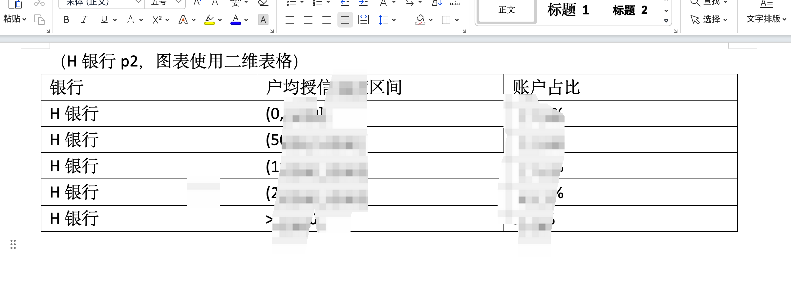
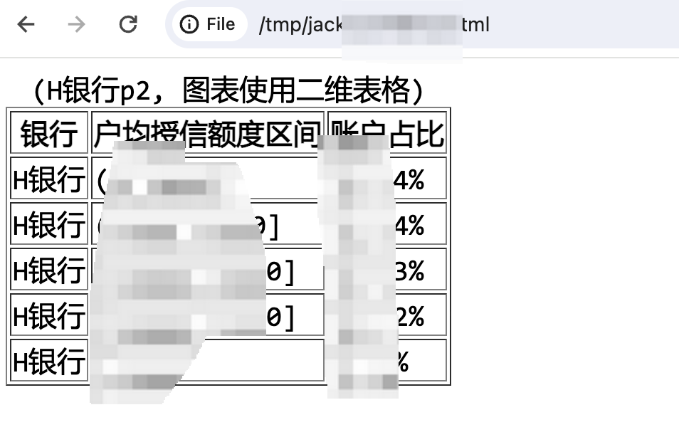

# 034-AutoCoder_word_pdf转换成html

目前Word,PDF 转换工具都会把一些布局信息丢失，比如表格等。AutoCoder 提供了一个工具，可以利用多模态大模型，把Word,PDF 转换成HTML，这样就可以保留较为完整的布局信息，并且可以轻松转换成任意其他文本格式，比如markdown 等。

> 注意，该工具基于多模态大模型，所以会有识别准确率问题。

使用：

```bash
auto-coder doc2html --model deepseek_chat \
--vl_model gpt4o_chat \
--urls /Users/allwefantasy/Downloads/xxxxx.docx \
--output /tmp/jack2
```
下面是一个带表格的 Word:


下面是转换后的HTML效果：



你也可以把参数都放到配置文件中，然后直接执行：

```bash
auto-coder doc2html --file xxx.yml
```


