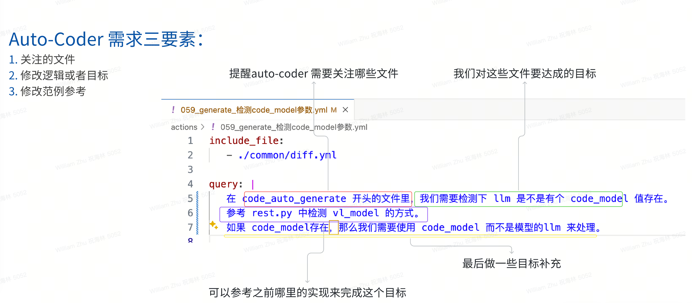

# 038-AutoCoder_为什么你需要经过反复练习才能用好

auto-coder 自身的使用并不复杂，基本有一两天的概念学习后就能上手。但是真正要获得好的工作效率提升，需要经过反复的练习，为什么呢？
应该 auto-coder 的真正门槛在于如何合理的向它表述你的需求。

注意，专业的表述需求并不是一件容易的事情，你和auto-coder 之间需要反复磨合，慢慢找到感觉，你说的话auto-coder 一听就懂，精准的帮你
完成项目的开发。

这里我们提供一些练习的方向，帮助您尽快的找到感觉。

## 需求三要素

在你的需求里，需要能够提现下面三件事：

1. 关注的文件
2. 修改逻辑或者目标
3. 修改范例参考



在上面的范例中，我提及了两个关于文件的信息：

1. 你需要修改的文件是以 code_generate开头的。
2. 你的参考范例文件是 rest.py, 这里面有我以前写的和这次需求类似的代码。

此外，我两次提及了修改逻辑：
1. 检测 llm 是否有 code_model 这个值存在（目标1）
2. 如果有，使用 code_model 而不是 llm 来处理（目标2）

你实际上可以合并成一句话，但是因为我实际在写的时候，并没有仔细去考量，所以我顺手就写成这样了。

最后，我通过给出了参考范例，这样就无需我描述详细的修改，实现描述的简洁明了。

只有拥有了这些信息，auto-coder 最后提交的代码才会是你想要的。

## 对于一个项目新手该怎么办

你可能第一次接触一个项目，所以你不知道怎么入手。实际上你也可以完全使用auto-coder 当做一个阅读工具来用。比如你可以这么用：

```yaml
include_file:
  - ./base.yml

index_filter_level: 2
query: |
  为什么 udiff_coder 进行 get_edits  和 apply_edits 时，diff @@ ... @@ 不需要包括
  行号。

```

把生成的output.txt 文件拖拽到 web 版本的大模型里，就可以看到对于该问题的详细回答。不过阅读代码依然要遵循三要素描述

1. 关注的文件/函数/变量 比如这里我们提及 udiff_coder 是一个文件名。然后我的问的问题也比较具体，就是针对两个方法的行为。

你如果只是希望对这个项目有个概览，你可以使用 auto-coder 知识库的能力。这个我们在  000 篇告诉过你如何使用。

## 比较新的功能，没有参考范例怎么办？

有时候，你可能会遇到一些新的功能，这个时候你可能没有参考范例，不过我们依然可以让他基本一到两次就能提交给你一个满意的commit，

我们来看一个实际的例子：
```yaml
query: |      
   你可以参考 byzerllm.utils.connect_ray import connect_cluster 中的相关代码，修改下面的代码，添加JDK环境的，来实现环境检测：
   def detect_env() -> EnvInfo:
        os_name = sys.platform
        os_version = ""
        if os_name == "win32":
            os_version = sys.getwindowsversion().major
        elif os_name == "darwin":
            os_version = subprocess.check_output(["sw_vers", "-productVersion"]).decode('utf-8').strip()
        elif os_name == "linux":
            os_version = subprocess.check_output(["uname", "-r"]).decode('utf-8').strip()
         
        python_version = f"{sys.version_info.major}.{sys.version_info.minor}.{sys.version_info.micro}"
        
        conda_env = os.environ.get("CONDA_DEFAULT_ENV")
        
        virtualenv = os.environ.get("VIRTUAL_ENV")
        
        has_bash = True
        try:
            subprocess.check_output(["bash", "--version"])
        except:
            has_bash = False
            
        return EnvInfo(
            os_name=os_name,
            os_version=os_version,
            python_version=python_version,
            conda_env=conda_env,
            virtualenv=virtualenv,
            has_bash=has_bash
        )

   然后在 byzerllm/apps/command.py 中的install方法中，通过环境检测，发现如果用户没有 JDK21,我们需要根据系统环境自动下载如下JDK。
   下面是不同的平台JDK21的下载地址：

   1. https://download.java.net/java/GA/jdk21.0.2/f2283984656d49d69e91c558476027ac/13/GPL/openjdk-21.0.2_linux-x64_bin.tar.gz
   2. https://download.java.net/java/GA/jdk21.0.2/f2283984656d49d69e91c558476027ac/13/GPL/openjdk-21.0.2_macos-x64_bin.tar.gz
   3. https://download.java.net/java/GA/jdk21.0.2/f2283984656d49d69e91c558476027ac/13/GPL/openjdk-21.0.2_windows-x64_bin.zip
   
   下载要求能展示进度以及下载完成后自动解压。
```

这个需求是 byzer-llm 项目中一个实际需求，我想添加一个环境检测的功能，然后根据环境检测，自动下载JDK21。

根据前面的三要素，我们可以看到：

1. 相关文件： “你可以参考 byzerllm.utils.connect_ray import connect_cluster 中的相关代码”然后在 byzerllm/apps/command.py 中的install方法中"
2. 修改逻辑：添加环境检测，然后根据环境检测，自动下载JDK21
3. 参考范例：connect_ray.py 中的相关代码

因为环境检测的代码我以前已经写过，所以直接贴给它。如果你没结果，你可以这么描述，让auto-coder自己发挥：

```yaml
你可以参考 byzerllm.utils.connect_ray import connect_cluster 中的相关代码，实现下面的方法来完成对当前操作系统的环境检测：
   
   def detect_env() -> EnvInfo:

   其中 EnvInfo 对象是一个数据类，包含了当前操作系统的信息，python版本，conda环境，virtualenv环境，是否有bash等信息。           

   然后在 byzerllm/apps/command.py 中的install方法中，通过环境检测，发现如果用户没有 JDK21,我们需要根据系统环境自动下载如下JDK。
   下面是不同的平台JDK21的下载地址：

   1. https://download.java.net/java/GA/jdk21.0.2/f2283984656d49d69e91c558476027ac/13/GPL/openjdk-21.0.2_linux-x64_bin.tar.gz
   2. https://download.java.net/java/GA/jdk21.0.2/f2283984656d49d69e91c558476027ac/13/GPL/openjdk-21.0.2_macos-x64_bin.tar.gz
   3. https://download.java.net/java/GA/jdk21.0.2/f2283984656d49d69e91c558476027ac/13/GPL/openjdk-21.0.2_windows-x64_bin.zip
   
   下载要求能展示进度以及下载完成后自动解压。
```

auto-coeder 也能顺利完成最终需求。

## 你的需求似乎都比较细节，不能提一个笼统的需求么？

我们在做实际的项目迭代，你会发现，我们是要能够比较精准控制我们最后的代码的，因为你的代码要能够满足你已有项目的一些风格以及一些规范，包括你需要较为准确的控制你的代码的逻辑，所以正常你应该尽可能提供详细的需求和实现逻辑。通过参考范例，可以极大的简化你的业务逻辑描述。

你当然也可以提一个笼统的需求，但最后auto-coder 可能实现了你最后的目标，但是当你review commit 的时候，你可能会需要较多的修改满足项目自身的一些规范和需求。

对于笼统的需求，我们倒也有一个例子：

```yaml
source_dir: /home/winubuntu/projects/byzer-llm/saas
target_file: /home/winubuntu/projects/byzer-llm/output.txt

model: deepseek_chat
model_input_max_length: 30000

urls: https://raw.githubusercontent.com/allwefantasy/byzer-llm/master/README.md

search_engine: bing
search_engine_token: ENV {{BING_SEARCH_TOKEN}}

query: |
  在 src/byzerllm 目录下新增一个 byzerllm.py 文件。在该文件中使用args 实现命令行支持。 参考 README.md 中的使用方法来增加命令行参数。
  主要支持：
  1. 部署模型相关参数
  2. 运行推理相关阐述

  比如部署模型，一般代码是这样的：
  
  
  ray.init(address="auto",namespace="default",ignore_reinit_error=True)
  llm = ByzerLLM()

  llm.setup_gpus_per_worker(4).setup_num_workers(1)
  llm.setup_infer_backend(InferBackend.transformers)

  llm.deploy(model_path="/home/byzerllm/models/openbuddy-llama2-13b64k-v15",
            pretrained_model_type="custom/llama2",
            udf_name="llama2_chat",infer_params={})
  
  此时你需要有 address, num_workers, gpus_per_worker, model_path, pretrained_model_type, udf_name, infer_params 这些参数可以通过命令行传递。

  最终形态是： 

  byzerllm deploy --model_path /home/byzerllm/models/openbuddy-llama2-13b64k-v15 --pretrained_model_type custom/llama2 --udf_name llama2_chat --infer_params {}

  同理推理是也是。比如一般推理代码是：

  
  llm_client = ByzerLLM()
  llm_client.setup_template("llama2_chat","auto")

  v = llm.chat_oai(model="llama2_chat",conversations=[{
      "role":"user",
      "content":"hello",
  }])

  print(v[0].output)
  
  此时你需要有 model, conversations 这些参数可以通过命令行传递。

  此时你的命令行形态是：
  
  byzerllm query --model llama2_chat --query "hello" --template "auto"
```  

我们要实现byzer-llm 一个命令行，可以看到，我只是把我最终想要的样子给到auto-coder看，然后还给了一些命令行对应的python API 的样子，希望他能举一反三。基本执行后效果就已经非常好了，你只需要对commit 再做一次小修改能满足整个功能需求。

## 那能不能走到另外一个极端，比如我想控制一个变量的使用

当然也是有的，这个有点相当于详细的实现设计：

```yaml
query: | 
   我们要在 audio.py 中实现一个新的类叫 PlayStreamAudioFromText，
   该类有一个方法 run,
   该方法输入是一个字符串generator，在方法内部会将文本转换为语音，并且播放出来。
   
   具体逻辑是：
   1. PlayStreamAudioFromText 维护一个queue，一个线程池
   1. 运行时，从generator中读取文本，然后将文本放入queue中
   2. 从queue中取出文本，按中英文句号或者换行符对语句进行切割调用，
      并行调用 openai_tts 模型将文本转换为语音，保存在 /tmp/wavs 目录下。
      音频文件用 001.wav, 002.wav, 003.wav...的命名规则保存在一个目录下.
   3. 使用一个独立的线程播放音频文件，播放完一个音频文件后，再播放下一个音频文件，直到播放完毕。
```

我们把 PlayStreamAudioFromText 的详细实现逻辑都一一进行了描述。基本上auto-coder 就能很好的完成这个类。这个类相对来说也比较独立，所以我们没有提及范例以及其他文件。单纯让auto-coder 在一个已经有的空audio.py文件中实现这个类。

控制粒度其实很细了，我明确要求他必须有个queue队列，然后描述如何操作这个队列。


