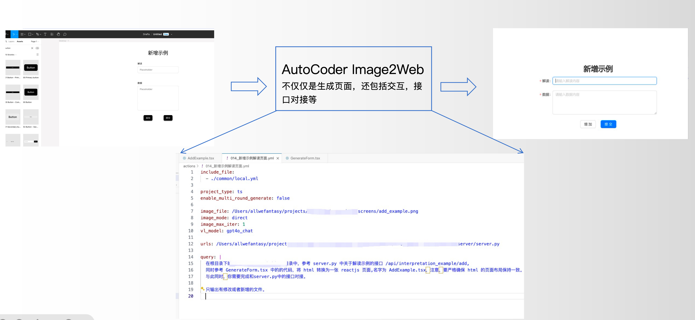
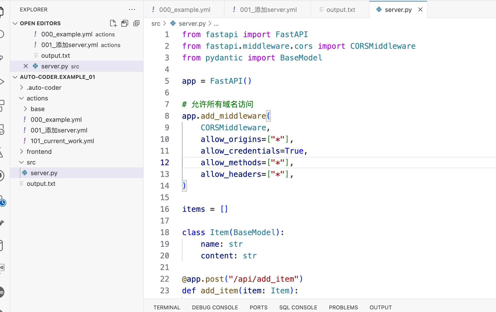
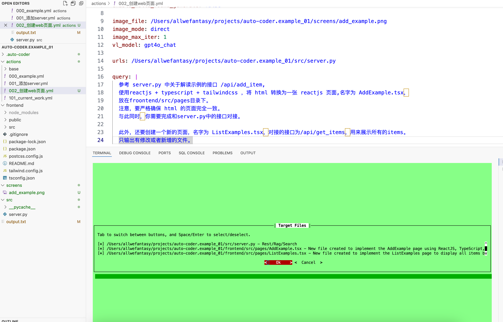
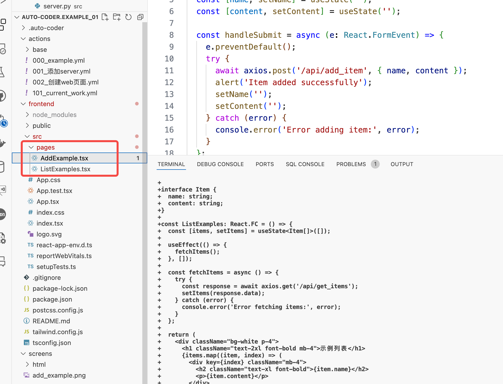
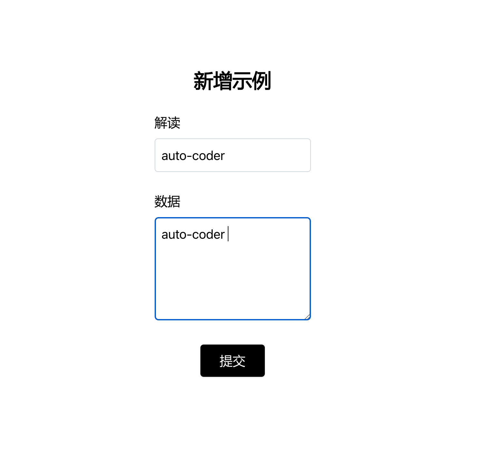

# 039-AutoCoder_前端开发实战_1

> 本篇承诺，
> 1. 除了环境准备部分，所有代码全部由 auto-coder 生成,没有做任何人工修改。
> 2. 所有步骤都是通过 auto-coder 一次性完成的，没有任何反复调整描述语句。(所以大家要勤学苦练。。。。)

当然，因为示例比较简单，所以很容易达成上面的目标，实际项目中，我们还是鼓励大家多练习，多调整描述语句，多尝试不同模型。

本实践提供了完整源码：

> https://github.com/allwefantasy/auto-coder.example_01

在你的笔记本上准备 auto-coder,可以参考[这里](./000-AutoCoder_准备旅程.md)

本实践展示 auto-coder 的前后端协同开发，支持：

1. Figma设计或者网页截图 到前端代码的转换
2. 前端代码和后端代码的对接



## 准备一个项目/环境

```bash
mkdir auto-coder.example_01
cd auto-coder.example_01

npx create-react-app frontend --template typescript
cd frontend
rm -rf .git
npm install -D tailwindcss postcss autoprefixer
npx tailwindcss init -p
npm install axios
npm install react-router-dom@5
npm install --save-dev @types/react-router-dom@5

cd ..
auto-coder init --source_dir .
```

tailwindcss 需要配置一下，修改 `frontend/src/index.css`,在最前面添加:

```css
@import 'tailwindcss/base';
@import 'tailwindcss/components';
@import 'tailwindcss/utilities';
```

然后修改`tailwind.config.js`:

```javascript
/** @type {import('tailwindcss').Config} */
module.exports = {  
  content: ['./src/**/*.{js,jsx,ts,tsx}', './public/index.html'],
  theme: {
    extend: {},
  },
  plugins: [],
}
```

我也没搞明白为啥tailwindcss不直接在命令里就做掉。


现在可以用你喜欢的IDE打开，推荐 vscode.

## 先开发一个 fastapi 后端

复制 `000_examle.yml` 改名为 `001_添加server.yml`，内容如下；


```yaml
include_file:
  - ./base/base.yml
  - ./base/enable_index.yml
  - ./base/enable_wholefile.yml    

query: |  
    使用fastapi 在 src/server.py 提供
    1. 一个 /api/add_item 接口。 该接口接受一个json对象，包含一个name字段一个content字段。
    2. 一个 /api/get_items 接口。 该接口返回一个json对象，包含所有的name字段和content字段。
    使用一个全局变量来存储这些数据。
    
    注意要移除 fastapi CORS 限制。
```

执行命令:

```bash
auto-coder --file actions/001_添加server.yml 
```

默认开启了 human_as_model, 这样你就可以复制这个文件里的内容（注意是完整的文本内容，不是代码）到你的命令行里去：

[code_model为Opus模型的输出](./039_code_model_output.txt)

现在，你已经可以得到一个满足你需求的完整的后端代码了：




按如下方式启动你的服务：

```bash
uvicorn src.server:app --reload
```

## 使用 Figma 设计图或者 网页截图 生成前端代码以及交互

下面是我在figma中设计的一个图片：


这个环节我们需要额外新增一个多模态模型，这里用 GPT4o 模型，启动方式为：

```bash
byzerllm deploy --pretrained_model_type saas/official_openai \
--cpus_per_worker 0.001 \
--gpus_per_worker 0 \
--num_workers 1 \
--infer_params saas.api_key=${MODEL_OPENAI_TOKEN} saas.model=gpt-4o \
--model gpt4o_chat
```

`gpt4o_chat` 这个名字我们待会会配置到YAML文件中。

搞好了上面这一步之后，就可以在 actions 目录下创建一个 `002_创建web页面.yml`了：

```yaml
include_file:
  - ./base/base.yml
  - ./base/enable_index.yml
  - ./base/enable_wholefile.yml    

project_type: ts
enable_multi_round_generate: false

image_file: /Users/allwefantasy/projects/auto-coder.example_01/screens/add_example.png
image_mode: direct
image_max_iter: 1
vl_model: gpt4o_chat

urls: /Users/allwefantasy/projects/auto-coder.example_01/src/server.py

query: |
  参考 server.py 中关于解读示例的接口 /api/add_item,
  使用reactjs + typescript + tailwindcss ，将 html 转换为一张 reactjs 页面,名字为 AddExample.tsx，  
  放在froontend/src/pages目录下。
  注意，要严格确保 html 的页面完全一致。
  与此同时，你需要完成和server.py中的接口对接。

  此外，还要创建一个新的页面，名字为 ListExamples.tsx，对接的接口为/api/get_items，用来展示所有的items。
  只输出有修改或者新增的文件。
```  

有几个地方值得注意：

1. `image_file` 指定了我们的设计图，这个设计图是我们在 figma 中设计的。
2. `vl_model` 指定了我们的多模态模型。
3. `urls` 指定了我们的后端代码的接口部分实现
4. project_type 指定了我们的项目类型,因为是前端，所以是 ts

运行yaml文件：

```bash
auto-coder --file actions/002_创建web页面.yml
```

中间会有确认环节：



你直接点选 OK 就行。

然后你就可以看到生成的结果了：



你可以在 [这里](./039_code_model_output_002.txt) 查看我使用Opus生成的代码。

现在我们看不到页面，因为我们还没把新的页面加到`frontend/src/App.tsx`。

我们新增一个 `003_设置首页.yml` 文件：

```yaml
include_file:
  - ./base/base.yml
  - ./base/enable_index.yml
  - ./base/enable_wholefile.yml    

project_type: ts
enable_multi_round_generate: false

query: |
  AddExample.tsx,ListExamples.tsx 添加到 App.tsx 的路由中，默认展示 AddExample.tsx 页面。
  同时修改 AddExample.tsx 页面，当成功时，跳转到 ListExamples.tsx 页面。

```

运行：

```bash
auto-coder --file actions/003_设置首页.yml
```

你依然可以在:

[](./039_code_model_output_003.txt)

现在可以去看页面：

```bash
npm run start
```

备注：
> 其实被 react-router-dom 的版本坑了一下，因为并不知道 v5和v6不兼容，所以在做例子的时候，为了方便，我直接选择了v5。
> 如果你要选择v6,你需要在前面YAML需求里明确说下 react-router-dom 的版本，类似，请使用 react-router-dom v6 版本的API。

可以看到页面：


因为我们后端是8000端口，前端是3000端口，所以你需要在前端的`frontend/package.json`里加入：

```json
"proxy": "http://localhost:8000",
```

现在你可以点击提交了：



提交后的结果：


可以看到，第一张页面整体遵循了我们的figma设计，相对来说好看很多，
第二张页面因为我们提供设计，大模型就特别偷懒，搞了一个丑丑的页面。

## 额外福利

你可以通过 auto-coder 一条命令就获得任意网页的完整截图：

```bash
auto-coder screenshot --urls https://www.baidu.com  --output /tmp/jack3/
```

## 总结

在本篇实践中，有几个特点：

1. 通过 auto-coder 可以一次性完成前端页面生成，并且同时和后端对接。
2. 我们通过拆解合适的粒度，让单次auto-coder 交互更加简单。
3. 如果是已经存在的项目，你可以通过让他参考随意一张页面从而自动获得所使用的技术栈和页面整体风格，组件。

  


