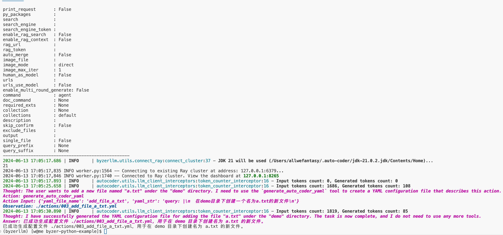
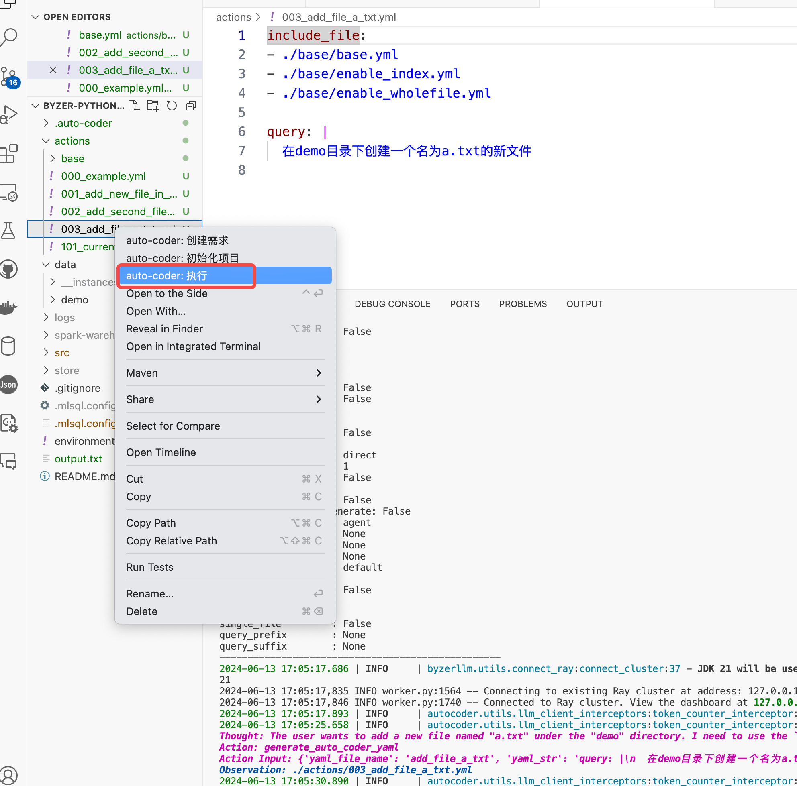

# 045_AutoCoder_VSCode插件篇

auto-coder 提供了一个 vscode的插件： [auto-coder-copilot](https://marketplace.visualstudio.com/items?itemName=allwefantasy.auto-coder-copilot)，帮助用户更方便的使用 auto-coder。

## 初始化项目

一旦你安装完插件后，你可以使用 vscode 打开一个项目，然后右键单击 Explorer(项目目录栏) 里任何一个位置，
会弹出两个新选项：


如果这个项目还没有使用 auto-coder 初始化过，那么可以选择 `auto-coder: 初始化项目` 这个菜单。此时会vscode自动帮你打开一个terminal, 然后运行 
auto-coder 初始化命令。

执行过程中，你很可能在终端看到这样的输出：


提示没有 auto-coder 命令，这个时候你需要用conda 或者pyenv 激活安装有 auto-coder 的环境。

然后再次重复上面的操作即可。


## 创建需求

如果你的项目已经初始化过，那么你可以选择 `auto-coder: 创建需求` 这个菜单，如果你的项目没有初始化过，右侧会弹出一个警告框：


你可以点击，立刻初始化，然后初始化完毕后，继续在 Explorer 里右键单击，选择 `auto-coder: 创建需求`,

此时上边会弹出一个输入框，你可以输入需求内容，然后回车，通常还会向你询问一个向量模型，你需要提前准备一个向量模型，然后回车：


为了避免每次输入向量模型名称，你可以在 actions/base/base.yml 里配置一个默认的向量模型：

```yaml
emb_model: "your_model_name"
```

此时在你的terminal 里会看到输出：



与此同时，自动给你创建好了对应的yaml文件。

## 执行需求

对于创建好了的需求（yaml文件）如果你觉得没啥要更改的了，你可以选择 `auto-coder: 执行` 这个菜单，然后进行执行：



系统也会自动在terminal 里执行对应的命令。

## 创建YAML文件

`创建需求` 菜单是通过agent来完成的，会比较慢以及可能会失败，你可以直接手动创建yaml 文件。


弹出一个需求输入框，实际上会作为文件名称的一部分，然后回车，此时会自动创建一个yaml文件，并且自动打开，你可以修改里面的query。


