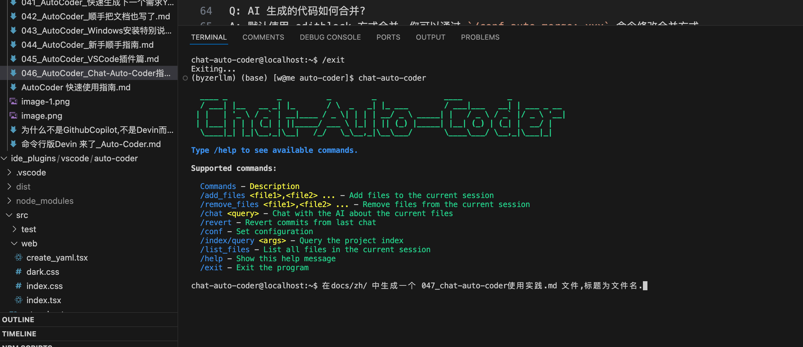
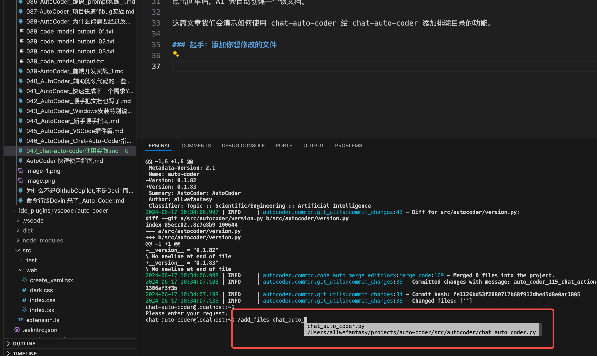
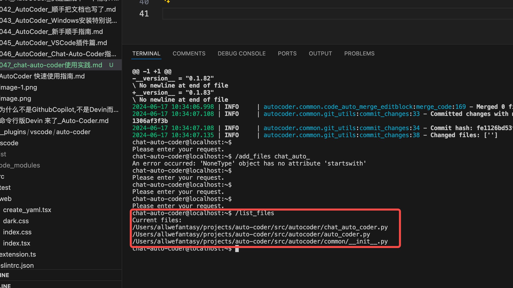
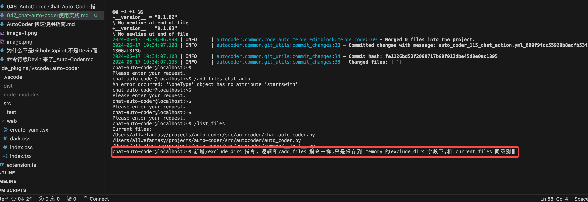
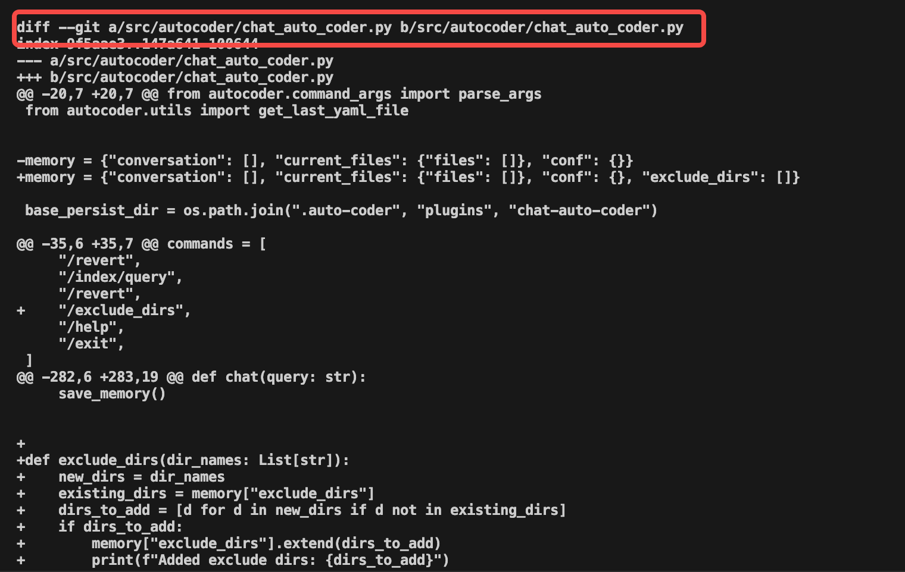
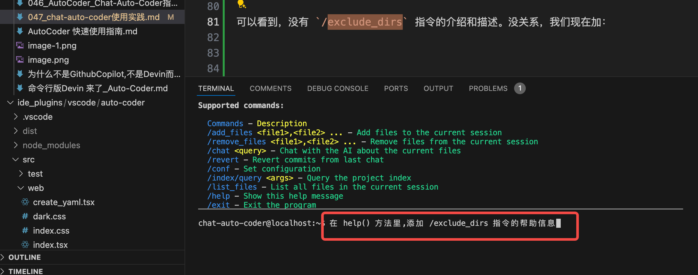
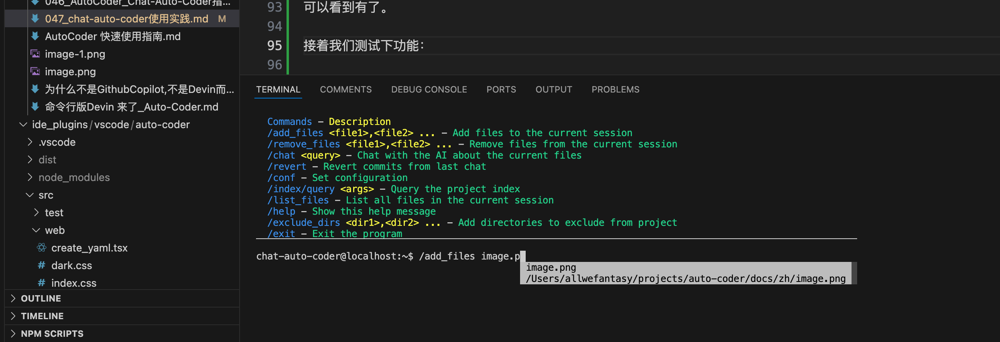
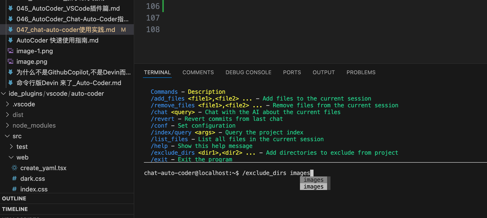
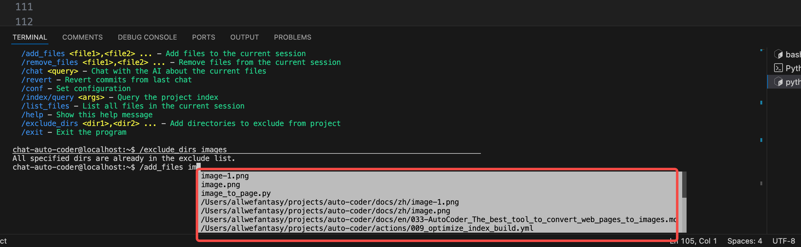

# 047_chat-auto-coder使用实践

Chat-Auto-Coder 是一个命令行聊天工具，可以让你以对话的方式与 AI 进行沟通，可以无需打开编辑器，就能完成代码的开发。

> 本文使用 Claude Opus 作为代码生成模型。
> 你可以通过 /conf code_model: opus_chat 来选择使用该模型。具体参看: [046_AutoCoder_Chat-Auto-Coder指南](./046_AutoCoder_Chat-Auto-Coder指南.md)

## 准备工作

首先，进入你的项目，并且初始化

```bash
auto-coder init --source_dir .
```

如果你想使用索引功能，你需要先构建索引

```bash
auto-coder index --file ./actions/base/base.yml
```

现在可以进入 Chat-Auto-Coder 了。

```bash
chat-auto-coder
```

## 实践

进去后，比如我想让他给我创建一个文件（当前我这个文档）：



点击回车后，AI 会自动创建一个该文档。

这篇文章我们会演示如何使用 chat-auto-coder 给 chat-auto-coder 添加排除目录的功能。

### 起手：添加你想修改的文件

我需要修改的文件是 chat_auto_coder.py，我通过 `/add_files` 指令进行添加，系统会自动补全命令和文件。



如果你不知道你的需求会修改哪些文件，可以用下列指令来找文件：

```bash
/index/query 查找所有调用了 request 库的文件
```

或者

```bash
/index/query 项目中命令行入口有哪些文件？
```

给出列表后，你接着可以用 `/add_files` 来添加你想修改的文件或者需要 chat-auto-coder 关注的文件。

注意该功能需要你先构建索引。

### 查看当前有多少活动文件

我通过 `/list_files` 指令查看当前有多少活动文件。



可以看到，我们成功的添加了 chat_auto_coder.py 文件。

### 对代码进行修改

我通过 `/chat` 指令对 chat_auto_coder.py 进行修改,我现在想新增一个 `/exclude_dirs` 指令，用于排除目录。

下面是我的需求描述：

```
新增/exclude_dirs 指令, 逻辑和/add_files 指令一样,
只是保存到 memory 的exclude_dirs 字段下,和 current_files 同级别
```



点击回车后，AI 会自动帮你修改代码。在终端你可以看到提交后diff 的内容：



此外，你还可以点击 vscode 右侧的 source_control 查看提交：


如果你对这次修改不满意，可以使用 

```bash
/revert
```    
进行回滚。

review 完代码后，我们发现，这次修改没有修改 help() 方法：


可以看到，没有 `/exclude_dirs` 指令的介绍和描述。没关系，我们现在加：



然后看下执行结果：


代码改好了，我们验证下：


可以看到有了。

接着我们测试下功能：



可以过滤出图片。

然后我们排除images目录：




接着可以看到， images 目录已经不会被提示了：




## 总结

通过这次实践，我们学会了如何使用 chat-auto-coder 给 chat-auto-coder 添加排除目录的功能。整个过程以对话形式完成，非常方便，真正实现了
在谈笑间完成代码的开发。


