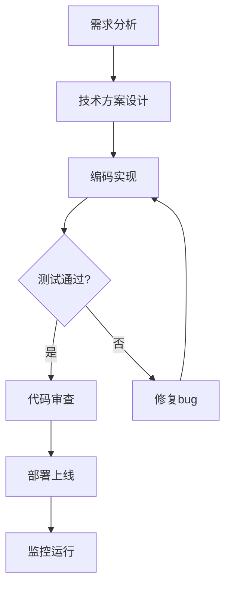

# Mermaid 流程图示例

```mermaid
graph TD
    A[需求分析] --> B[技术方案设计]
    B --> C[编码实现]
    C --> D{测试通过?}
    D -->|是| E[代码审查]
    D -->|否| F[修复bug]
    F --> C
    E --> G[部署上线]
    G --> H[监控运行]
```

这个流程图展示了：
1. 从需求分析开始
2. 到技术方案设计
3. 进行编码实现
4. 测试环节
5. 如果不通过则返回修复
6. 通过后进入代码审查
7. 最后部署和监控
