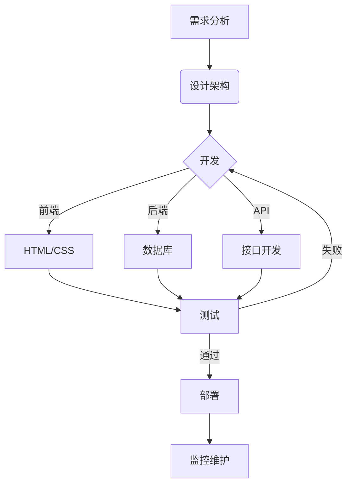

# 你好

以下是一个简单的mermaid流程图示例，展示开发工作流程：

```mermaid
graph TD
    A[需求分析] --> B(设计架构)
    B --> C{开发}
    C -->|前端| D[HTML/CSS]
    C -->|后端| E[数据库]
    C -->|API| F[接口开发]
    D --> G[测试]
    E --> G
    F --> G
    G -->|通过| H[部署]
    G -->|失败| C
    H --> I[监控维护]
```

流程说明：
1. 从需求分析开始
2. 进行系统设计
3. 分模块开发（前端、后端、API）
4. 测试环节
5. 部署上线
6. 持续监控维护
