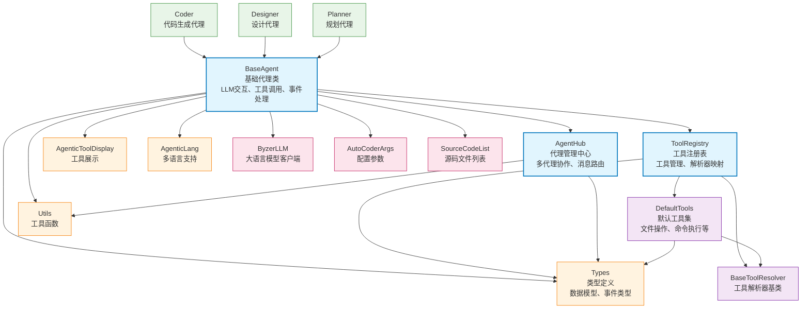

# Agent 模块

AutoCoder 的智能代理框架，提供基于 LLM 的自主代理系统，支持工具调用、多代理协作和流式交互。

## 目录结构

```
src/autocoder/agent/
├── __init__.py                           # 模块初始化文件
├── base_agentic/                         # 核心代理框架
│   ├── __init__.py                       # 框架初始化
│   ├── base_agent.py                     # 基础代理类，所有代理的父类
│   ├── agent_hub.py                      # 代理管理中心，支持多代理协作
│   ├── tool_registry.py                 # 工具注册表，管理所有可用工具
│   ├── types.py                          # 类型定义和数据模型
│   ├── utils.py                          # 工具函数和辅助类
│   ├── default_tools.py                 # 默认工具集注册和管理
│   ├── agentic_tool_display.py          # 工具展示和格式化
│   ├── agentic_lang.py                   # 多语言支持
│   ├── test_base_agent.py               # 基础代理单元测试
│   └── tools/                           # 工具解析器实现
│       ├── __init__.py                  # 工具模块初始化
│       ├── base_tool_resolver.py        # 工具解析器基类
│       ├── execute_command_tool_resolver.py    # 命令执行工具
│       ├── read_file_tool_resolver.py   # 文件读取工具
│       ├── write_to_file_tool_resolver.py      # 文件写入工具
│       ├── replace_in_file_tool_resolver.py    # 文件替换工具
│       ├── search_files_tool_resolver.py       # 文件搜索工具
│       ├── list_files_tool_resolver.py  # 文件列表工具
│       ├── ask_followup_question_tool_resolver.py  # 交互问答工具
│       ├── attempt_completion_tool_resolver.py     # 任务完成工具
│       ├── plan_mode_respond_tool_resolver.py      # 计划模式响应工具
│       ├── use_mcp_tool_resolver.py     # MCP 工具调用
│       ├── talk_to_tool_resolver.py     # 代理间私聊工具
│       ├── talk_to_group_tool_resolver.py       # 代理群组通信工具
│       └── example_tool_resolver.py     # 示例工具解析器
├── coder.py                             # 代码生成代理实现
├── designer.py                          # 设计代理实现
├── planner.py                           # 规划代理实现
├── project_reader.py                    # 项目读取代理
├── auto_tool.py                         # 自动工具生成
├── auto_learn.py                        # 自动学习功能
├── auto_learn_from_commit.py           # 从提交记录学习
├── auto_review_commit.py               # 自动代码审查
├── auto_demand_organizer.py            # 需求整理代理
├── auto_filegroup.py                   # 文件分组代理
├── auto_guess_query.py                 # 查询推测代理
├── agentic_filter.py                   # 代理过滤器
├── entry_command_agent/                # 命令行入口代理
│   ├── __init__.py                     # 入口模块初始化
│   ├── README.md                       # 入口代理说明文档
│   ├── auto_tool.py                    # 自动工具功能
│   ├── chat.py                         # 聊天交互功能
│   ├── designer.py                     # 设计功能
│   ├── generate_command.py             # 命令生成
│   ├── project_reader.py               # 项目读取
│   └── voice2text.py                   # 语音转文字
└── .ac.mod.md                          # 本文档
```

## 快速开始

### 基本使用方式

```python
# 导入必要的模块
from autocoder.agent.base_agentic import BaseAgent
from autocoder.agent.base_agentic.types import AgentRequest
from autocoder.common import AutoCoderArgs, SourceCodeList
import byzerllm

# 1. 初始化配置
args = AutoCoderArgs(
    source_dir="/path/to/project",
    model="gpt-4",
    # 其他配置参数...
)

# 2. 创建 LLM 实例
llm = byzerllm.ByzerLLM()

# 3. 创建代理实例
class MyAgent(BaseAgent):
    def __init__(self, name, llm, files, args):
        super().__init__(name, llm, files, args)
        # 自定义初始化逻辑

# 4. 实例化代理
files = SourceCodeList()  # 源码文件列表
agent = MyAgent(
    name="my_agent",
    llm=llm,
    files=files,
    args=args
)

# 5. 执行任务
request = AgentRequest(user_input="请帮我分析这个项目的结构")
for event in agent.agentic_run(request):
    print(f"事件类型: {type(event).__name__}")
    # 处理不同类型的事件
```

### 工具系统使用

```python
from autocoder.agent.base_agentic.tool_registry import ToolRegistry
from autocoder.agent.base_agentic.types import BaseTool, ToolDescription, ToolExample
from autocoder.agent.base_agentic.tools.base_tool_resolver import BaseToolResolver

# 1. 定义自定义工具
class CustomTool(BaseTool):
    parameter1: str
    parameter2: int

# 2. 定义工具解析器
class CustomToolResolver(BaseToolResolver):
    def resolve(self):
        # 实现工具逻辑
        return ToolResult(success=True, message="工具执行成功")

# 3. 注册工具
ToolRegistry.register_tool(
    tool_tag="custom_tool",
    tool_cls=CustomTool,
    resolver_cls=CustomToolResolver,
    description=ToolDescription(description="自定义工具描述"),
    example=ToolExample(title="示例", body="<custom_tool>...</custom_tool>")
)
```

### 多代理协作

```python
from autocoder.agent.base_agentic.agent_hub import AgentHub, Group

# 1. 创建多个代理
agent1 = MyAgent("agent1", llm, files, args)
agent2 = MyAgent("agent2", llm, files, args)

# 2. 创建群组
group = Group("research_team")

# 3. 加入群组
agent1.join_group(group)
agent2.join_group(group)

# 4. 群组通信
agent1.talk_to_group(group, "大家好，我们开始协作吧！")

# 5. 私聊
agent1.talk_to(agent2, "我们单独讨论一下这个问题")
```

## 核心组件详解

### 1. BaseAgent 基础代理类

**核心功能：**
- **LLM 交互管理**：处理与大语言模型的对话和流式响应
- **工具调用系统**：解析和执行各种工具命令
- **事件流处理**：管理代理执行过程中的各种事件
- **文件变更跟踪**：记录和管理文件修改历史
- **多代理通信**：支持代理间的私聊和群组通信

**主要方法：**
- `agentic_run(request)`: 执行代理任务的核心方法
- `run_in_terminal()`: 在终端中运行代理，提供丰富的交互界面
- `run_with_events()`: 以事件流方式运行代理
- `join_group(group)`: 加入代理群组
- `talk_to(agent, content)`: 与其他代理私聊
- `talk_to_group(group, content)`: 向群组发送消息

### 2. ToolRegistry 工具注册系统

**核心功能：**
- **工具注册管理**：注册、卸载和查询工具
- **解析器映射**：管理工具类与解析器的对应关系
- **工具描述和示例**：存储工具的使用说明和示例代码
- **默认工具集**：管理系统预置的标准工具

**主要方法：**
- `register_tool()`: 注册新工具
- `get_resolver_for_tool()`: 获取工具对应的解析器
- `get_all_tool_descriptions()`: 获取所有工具描述
- `reset_to_default_tools()`: 重置为默认工具集

### 3. AgentHub 代理管理中心

**核心功能：**
- **代理注册**：管理所有活跃的代理实例
- **群组管理**：创建和管理代理群组
- **消息路由**：处理代理间的消息传递
- **并发通信**：支持多线程安全的代理通信

**主要方法：**
- `register_agent(agent)`: 注册新代理
- `get_agent(name)`: 根据名称获取代理
- `list_agents()`: 列出所有代理
- `get_all_groups()`: 获取所有群组

### 4. 事件系统架构

代理系统使用事件驱动架构，支持以下事件类型：

- **LLMOutputEvent**: LLM 文本输出事件
- **LLMThinkingEvent**: LLM 思考过程事件  
- **ToolCallEvent**: 工具调用事件
- **ToolResultEvent**: 工具执行结果事件
- **CompletionEvent**: 任务完成事件
- **ErrorEvent**: 错误事件
- **TokenUsageEvent**: Token 使用统计事件

## Mermaid 文件依赖图



### 依赖关系说明

**核心依赖流：**
1. **BaseAgent** 作为核心基类，依赖 ToolRegistry 进行工具管理，依赖 AgentHub 进行多代理协作
2. **ToolRegistry** 管理所有工具的注册和解析器映射，是工具系统的核心
3. **AgentHub** 提供代理注册和群组通信功能，支持多代理协作场景

**工具系统依赖：**
- 所有具体工具解析器继承自 **BaseToolResolver**
- **DefaultTools** 注册系统预置的标准工具集
- 工具系统通过 **Types** 模块定义的数据模型进行类型约束

**外部系统集成：**
- **ByzerLLM** 提供大语言模型调用能力
- **AutoCoderArgs** 提供配置参数管理
- **SourceCodeList** 提供源码文件管理

## 使用示例

### 示例 1：创建自定义代理

```python
from autocoder.agent.base_agentic import BaseAgent
from autocoder.agent.base_agentic.types import AgentRequest

class CodeReviewAgent(BaseAgent):
    def __init__(self, name, llm, files, args):
        super().__init__(name, llm, files, args)
        # 设置代理角色
        self.who_am_i("我是一个专业的代码审查专家，擅长发现代码中的问题并提供改进建议")
    
    def review_code(self, file_path):
        """审查指定文件的代码"""
        request = AgentRequest(
            user_input=f"请审查文件 {file_path} 的代码质量，包括代码规范、性能优化和潜在问题"
        )
        
        # 执行审查任务
        for event in self.agentic_run(request):
            if isinstance(event, CompletionEvent):
                return event.completion.result
        
        return "审查失败"

# 使用示例
agent = CodeReviewAgent("reviewer", llm, files, args)
result = agent.review_code("src/main.py")
print(result)
```

### 示例 2：多代理协作开发

```python
from autocoder.agent.base_agentic.agent_hub import Group

# 创建开发团队
dev_team = Group("development_team")

# 创建不同角色的代理
architect = BaseAgent("architect", llm, files, args).who_am_i("系统架构师")
developer = BaseAgent("developer", llm, files, args).who_am_i("后端开发工程师")
tester = BaseAgent("tester", llm, files, args).who_am_i("测试工程师")

# 加入团队
architect.join_group(dev_team)
developer.join_group(dev_team)
tester.join_group(dev_team)

# 开始协作
architect.talk_to_group(dev_team, "我们需要设计一个用户管理系统，请大家提供意见")

# 私下讨论技术细节
architect.talk_to(developer, "关于数据库设计，我们使用 PostgreSQL 还是 MongoDB？")
```

### 示例 3：自定义工具开发

```python
from autocoder.agent.base_agentic.tool_registry import ToolRegistry
from autocoder.agent.base_agentic.types import BaseTool, ToolResult, ToolDescription, ToolExample
from autocoder.agent.base_agentic.tools.base_tool_resolver import BaseToolResolver

# 1. 定义代码格式化工具
class CodeFormatTool(BaseTool):
    file_path: str
    language: str = "python"

# 2. 实现工具解析器
class CodeFormatToolResolver(BaseToolResolver):
    def resolve(self) -> ToolResult:
        tool = self.tool
        try:
            # 读取文件内容
            with open(tool.file_path, 'r') as f:
                content = f.read()
            
            # 格式化代码（这里简化实现）
            if tool.language == "python":
                import autopep8
                formatted_content = autopep8.fix_code(content)
            else:
                formatted_content = content
            
            # 写回文件
            with open(tool.file_path, 'w') as f:
                f.write(formatted_content)
            
            return ToolResult(
                success=True,
                message=f"成功格式化文件 {tool.file_path}",
                content=formatted_content
            )
        except Exception as e:
            return ToolResult(
                success=False,
                message=f"格式化失败: {str(e)}"
            )

# 3. 注册工具
ToolRegistry.register_tool(
    tool_tag="code_format",
    tool_cls=CodeFormatTool,
    resolver_cls=CodeFormatToolResolver,
    description=ToolDescription(
        description="格式化指定文件的代码，支持多种编程语言"
    ),
    example=ToolExample(
        title="代码格式化示例",
        body="""<code_format>
<file_path>src/main.py</file_path>
<language>python</language>
</code_format>"""
    )
)
```

### 示例 4：流式交互处理

```python
from autocoder.agent.base_agentic.types import *

def handle_agent_events(agent, request):
    """处理代理事件流"""
    for event in agent.agentic_run(request):
        if isinstance(event, LLMThinkingEvent):
            print(f"🤔 思考中: {event.text}")
        
        elif isinstance(event, LLMOutputEvent):
            print(f"💬 输出: {event.text}")
        
        elif isinstance(event, ToolCallEvent):
            tool_name = type(event.tool).__name__
            print(f"🔧 调用工具: {tool_name}")
        
        elif isinstance(event, ToolResultEvent):
            status = "✅" if event.result.success else "❌"
            print(f"{status} 工具结果: {event.result.message}")
        
        elif isinstance(event, CompletionEvent):
            print(f"🎉 任务完成: {event.completion.result}")
            break
        
        elif isinstance(event, ErrorEvent):
            print(f"❌ 错误: {event.message}")
            break

# 使用示例
request = AgentRequest(user_input="请帮我创建一个简单的 Flask 应用")
handle_agent_events(agent, request)
```

## 最佳实践

### 1. 代理初始化顺序

遵循正确的初始化顺序以避免组件冲突：

```python
# 1. 首先初始化 FileMonitor
from autocoder.common.file_monitor.monitor import FileMonitor
monitor = FileMonitor(source_dir)
if not monitor.is_running():
    monitor.start()

# 2. 加载规则文件
from autocoder.common.rulefiles.autocoderrules_utils import get_rules
rules = get_rules(source_dir)

# 3. 加载 tokenizer
from autocoder.auto_coder_runner import load_tokenizer
load_tokenizer()

# 4. 最后创建代理实例
agent = BaseAgent(name, llm, files, args)
```

### 2. 工具开发规范

- 继承 `BaseTool` 定义工具参数
- 继承 `BaseToolResolver` 实现工具逻辑
- 提供清晰的工具描述和使用示例
- 处理异常情况并返回合适的 `ToolResult`

### 3. 多代理协作模式

- 为代理设置明确的角色定义
- 使用群组进行团队协作
- 合理使用私聊和广播消息
- 避免无意义的循环对话

### 4. 事件处理最佳实践

- 根据事件类型进行差异化处理
- 及时处理错误事件
- 合理展示思考过程和工具调用
- 保存重要的执行结果

### 5. 性能优化建议

- 合理配置 Token 使用限制
- 使用流式处理提升用户体验
- 避免频繁的文件 I/O 操作
- 合理使用缓存机制

