# Conversations

对话管理模块，提供完整的对话和消息持久化存储、缓存、搜索、备份和恢复功能，支持并发访问，具有高性能和可靠性。

## Directory Structure

```
src/autocoder/common/conversations/
├── __init__.py                      # 模块导出定义和核心组件集成
├── manager.py                       # 主对话管理器，集成所有子系统
├── config.py                        # 配置管理类，包含验证和序列化功能
├── models.py                        # 数据模型定义（Conversation, ConversationMessage）
├── get_conversation_manager.py      # 全局单例管理器获取方法
├── exceptions.py                    # 异常类定义
├── file_locker.py                   # 跨平台文件锁实现
├── storage/                         # 存储层实现
│   ├── __init__.py                  # 存储层导出
│   ├── base_storage.py              # 存储接口定义
│   ├── file_storage.py              # 文件系统存储实现
│   └── index_manager.py             # 索引管理和当前对话状态
├── cache/                           # 缓存层实现
│   ├── __init__.py                  # 缓存层导出
│   ├── base_cache.py                # 缓存接口定义
│   ├── memory_cache.py              # 内存缓存实现（LRU策略）
│   └── cache_manager.py             # 缓存管理器
├── search/                          # 搜索和过滤层
│   ├── __init__.py                  # 搜索层导出
│   ├── text_searcher.py             # 文本搜索实现
│   └── filter_manager.py            # 过滤管理器
├── backup/                          # 备份和恢复层
│   ├── __init__.py                  # 备份层导出
│   ├── backup_manager.py            # 备份管理器（全量/增量备份）
│   └── restore_manager.py           # 恢复管理器（时间点恢复）
└── .ac.mod.md                       # This document
```

## Quick Start

### Basic Usage

```python
# 推荐方式：使用全局获取方法
from autocoder.common.conversations.get_conversation_manager import get_conversation_manager

# 1. 获取管理器实例（使用默认配置）
manager = get_conversation_manager()

# 2. 创建对话
conversation_id = manager.create_conversation(
    name="AI助手对话",
    description="与AI助手的日常对话"
)

# 3. 添加消息
message_id = manager.append_message(
    conversation_id=conversation_id,
    role="user",
    content="请帮我写一个Python函数"
)

# 4. 设置当前对话并添加消息
manager.set_current_conversation(conversation_id)
manager.append_message_to_current(
    role="assistant",
    content="我来帮您写Python函数。请告诉我具体需求。"
)
```

### Helper Functions

模块提供多个便捷函数简化常用操作：

- `get_conversation_manager()`: 获取全局单例管理器实例
- `get_manager()`: get_conversation_manager的别名
- `reset_conversation_manager()`: 重置管理器实例（用于测试）
- `reset_manager()`: reset_conversation_manager的别名

### Configuration Management

```python
from autocoder.common.conversations import ConversationManagerConfig

# 创建自定义配置
config = ConversationManagerConfig(
    storage_path="./my_conversations",
    max_cache_size=200,
    cache_ttl=600.0,
    backup_enabled=True
)

# 使用自定义配置获取管理器
manager = get_conversation_manager(config)
```

## Core Components

### 1. PersistConversationManager 主管理器
**Core Features:**
- 对话和消息的完整生命周期管理：创建、读取、更新、删除
- 当前对话状态管理：设置、获取、清除当前活跃对话
- 高性能缓存系统：LRU策略的内存缓存，支持TTL过期
- 全文搜索功能：支持对话标题、描述和消息内容的模糊搜索
- 并发安全访问：跨平台文件锁，支持读写锁分离
- 统计和健康检查：提供系统运行状态和性能指标

**Main Methods:**
- `create_conversation()`: 创建新对话，支持初始消息和元数据
- `append_message()`: 向指定对话添加消息
- `append_message_to_current()`: 向当前对话添加消息
- `set_current_conversation()`: 设置当前活跃对话
- `search_conversations()`: 搜索对话内容
- `get_statistics()`: 获取系统统计信息

### 2. Storage Layer 存储层架构

存储层采用分层设计，提供灵活的数据持久化方案：

- **FileStorage**: 基于文件系统的存储实现，每个对话存储为独立JSON文件
- **IndexManager**: 管理对话索引和元数据，支持快速查询和当前对话状态持久化
- **BaseStorage**: 存储接口定义，支持扩展其他存储后端

### 3. Cache Layer 缓存层架构

多层缓存系统提供高性能数据访问：

- **MemoryCache**: LRU策略的内存缓存，支持TTL过期和大小限制
- **CacheManager**: 缓存管理器，协调多个缓存实例
- **BaseCache**: 缓存接口定义，支持扩展其他缓存策略

### 4. Search and Filter Layer 搜索过滤层

智能搜索和过滤系统：

- **TextSearcher**: 基于TF-IDF的文本搜索，支持相关性评分
- **FilterManager**: 复杂过滤条件处理，支持元数据和时间范围过滤

### 5. Backup and Restore Layer 备份恢复层

完整的数据保护方案：

- **BackupManager**: 支持全量和增量备份，自动备份调度
- **RestoreManager**: 支持时间点恢复和选择性恢复

## Mermaid File Dependency Graph
模块内部组件依赖关系，展示分层架构和数据流向

```mermaid
graph TB
    %% Core module definition
    Manager[PersistConversationManager<br/>主管理器：集成所有子系统]
    Config[ConversationManagerConfig<br/>配置管理：验证和序列化]
    Models[Models<br/>数据模型：Conversation, Message]
    
    %% Storage layer
    Storage[FileStorage<br/>文件存储：JSON格式持久化]
    Index[IndexManager<br/>索引管理：快速查询和状态管理]
    
    %% Cache layer  
    Cache[MemoryCache<br/>内存缓存：LRU策略和TTL过期]
    CacheManager[CacheManager<br/>缓存管理：多缓存协调]
    
    %% Search layer
    Search[TextSearcher<br/>文本搜索：TF-IDF相关性评分]
    Filter[FilterManager<br/>过滤管理：复杂条件处理]
    
    %% Backup layer
    Backup[BackupManager<br/>备份管理：全量/增量备份]
    Restore[RestoreManager<br/>恢复管理：时间点恢复]
    
    %% Global access
    Global[get_conversation_manager<br/>全局单例：线程安全访问]
    
    %% Dependencies
    Manager --> Storage
    Manager --> Index
    Manager --> Cache
    Manager --> CacheManager
    Manager --> Search
    Manager --> Filter
    Manager --> Config
    Manager --> Models
    
    Global --> Manager
    Global --> Config
    
    Backup --> Storage
    Restore --> Storage
    Restore --> Backup
    
    %% Style definitions
    classDef coreClass fill:#e1f5fe,stroke:#0277bd,stroke-width:2px
    classDef storageClass fill:#f3e5f5,stroke:#7b1fa2,stroke-width:1px
    classDef cacheClass fill:#e8f5e8,stroke:#2e7d32,stroke-width:1px
    classDef searchClass fill:#fff3e0,stroke:#ef6c00,stroke-width:1px
    classDef backupClass fill:#fce4ec,stroke:#c2185b,stroke-width:1px
    classDef globalClass fill:#f1f8e9,stroke:#558b2f,stroke-width:2px
    
    class Manager,Config,Models coreClass
    class Storage,Index storageClass
    class Cache,CacheManager cacheClass
    class Search,Filter searchClass
    class Backup,Restore backupClass
    class Global globalClass
```



## Dependency Relationships

无外部AC模块依赖，本模块为独立的对话管理解决方案。

## Commands to Verify Module Functionality

验证模块功能的可执行命令：

```bash
# 运行基础功能测试
python -m pytest src/autocoder/common/conversations/ -v

# 验证完整工作流
python -c "
from autocoder.common.conversations.get_conversation_manager import get_conversation_manager
manager = get_conversation_manager()

# 创建对话
conv_id = manager.create_conversation('测试对话', '功能验证')
print('对话创建成功:', conv_id)

# 添加消息
msg_id = manager.append_message(conv_id, 'user', '测试消息')
print('消息添加成功:', msg_id)

# 获取统计信息
stats = manager.get_statistics()
print('系统统计:', stats['total_conversations'], '个对话')
"
```
