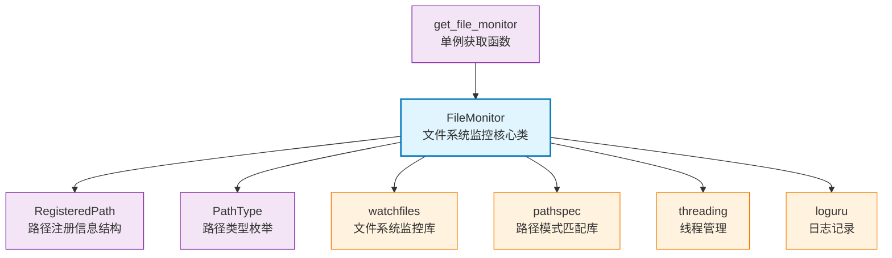

# File Monitor Module

基于 watchfiles 和 pathspec 的文件系统监控模块，提供单例模式的文件变化监控服务。

## Directory Structure

```
src/autocoder/common/file_monitor/
├── __init__.py                  # 模块导出接口，提供 FileMonitor 类
├── monitor.py                   # 核心监控实现，包含 FileMonitor 类和 get_file_monitor 函数
├── test_file_monitor.py         # 完整的功能测试，包含增删改查四个测试用例
└── .ac.mod.md                   # This document
```

## Quick Start

### Basic Usage

```python
# Import necessary modules
from autocoder.common.file_monitor import FileMonitor
from autocoder.common.file_monitor.monitor import get_file_monitor, Change

# 1. Initialize file monitor (singleton pattern)
monitor = get_file_monitor("/path/to/project/root")

# 2. Define callback function
def handle_file_change(change_type: Change, changed_path: str):
    if change_type == Change.added:
        print(f"New file added: {changed_path}")
    elif change_type == Change.modified:
        print(f"File modified: {changed_path}")
    elif change_type == Change.deleted:
        print(f"File deleted: {changed_path}")

# 3. Register paths and callbacks
monitor.register("config.yaml", handle_file_change)          # 监控特定文件
monitor.register("src/utils/", handle_file_change)           # 监控目录及其内容
monitor.register("**/*.py", handle_file_change)              # 监控所有Python文件

# 4. Start monitoring
if not monitor.is_running():
    monitor.start()

# 5. Stop monitoring when done
monitor.stop()
```

### Helper Functions

该模块提供了 `get_file_monitor(root_dir)` 辅助函数来获取 FileMonitor 的单例实例，简化了实例化过程。

### Configuration Management

监控配置通过注册路径和回调函数进行管理：
- 支持精确路径匹配（文件或目录）
- 支持 glob 模式匹配（如 `**/*.py`）
- 支持动态注册和取消注册回调函数

## Core Components

### 1. FileMonitor Main Class
**Core Features:**
- 单例模式：确保全局只有一个监控实例
- 多路径监控：支持同时监控多个文件、目录和模式
- 异步监控：使用后台线程进行文件系统监控
- 高效匹配：使用 pathspec 库实现高效的路径模式匹配

**Main Methods:**
- `register(path, callback)`: 注册文件路径或模式及其对应的回调函数
- `unregister(path, callback=None)`: 取消注册指定路径的回调函数
- `start()`: 启动文件监控后台线程
- `stop()`: 停止文件监控线程
- `is_running()`: 检查监控线程是否正在运行

### 2. Module Architecture

模块采用单例模式设计，确保在整个应用程序中只有一个 FileMonitor 实例。核心架构包括：

- **单例管理**：使用线程安全的单例模式，确保实例的唯一性
- **路径注册系统**：支持精确路径和模式路径的注册管理
- **异步监控循环**：基于 watchfiles 库的高效文件系统监控
- **回调管理**：线程安全的回调函数注册和执行机制

## Mermaid File Dependency Graph
模块内部依赖关系和外部库依赖



## Dependency Relationships
Dependencies on other modules with .ac.mod.md files, simply shown as a relative path list:

- ../pruner/.ac.mod.md

## Commands to Verify Module Functionality

运行完整的功能测试（推荐）:

```bash
# 运行包含增删改查四个测试用例的完整测试
python src/autocoder/common/file_monitor/test_file_monitor.py
```

快速功能验证:

```bash
# 创建测试脚本并运行
python -c "
from autocoder.common.file_monitor.monitor import get_file_monitor, Change
import time
import os

def test_callback(change_type, path):
    print(f'File change detected: {change_type.name} - {path}')

monitor = get_file_monitor('.')
monitor.register('**/*.txt', test_callback)
monitor.start()
print('Monitoring started. Create/modify/delete .txt files to see changes.')
time.sleep(10)
monitor.stop()
print('Monitoring stopped.')
"
```

运行单元测试:

```bash
pytest src/autocoder/common/file_monitor/ -v
```
