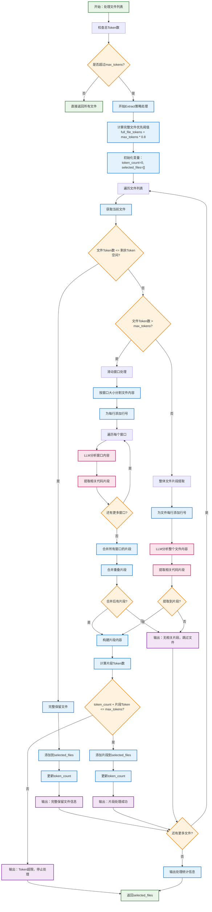
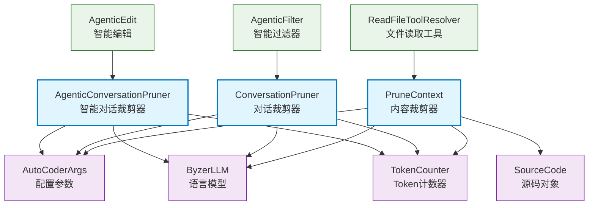

# Pruner 内容裁剪器

智能内容裁剪模块，提供多种策略来管理和优化Token使用，包括文件内容裁剪、对话历史管理和智能对话工具结果清理。

## 目录结构

```
src/autocoder/common/pruner/
├── context_pruner.py              # PruneContext类，智能文件内容裁剪
├── conversation_pruner.py         # ConversationPruner类，对话历史管理
├── agentic_conversation_pruner.py # AgenticConversationPruner类，智能对话工具结果清理
├── test_agentic_conversation_pruner.py # 智能对话裁剪器测试文件
├── README.md                      # 原始文档
└── .ac.mod.md                     # 本文档
```

## 快速开始

### 基本使用方式

```python
# 导入必要的模块
from autocoder.common.pruner.context_pruner import PruneContext
from autocoder.common.pruner.conversation_pruner import ConversationPruner
from autocoder.common.pruner.agentic_conversation_pruner import AgenticConversationPruner
from autocoder.common import AutoCoderArgs, SourceCode
from autocoder.sdk import get_llm,init_project_if_required
from autocoder.common.tokens import count_string_tokens

# 1. 初始化配置
args = AutoCoderArgs(
    source_dir=".",                            # 项目根目录
    context_prune=True,                        # 启用内容裁剪
    context_prune_strategy="extract",          # 裁剪策略 (extract/score/delete)
    context_prune_sliding_window_size=100,     # 滑动窗口大小  
    context_prune_sliding_window_overlap=20,   # 滑动窗口重叠行数
    conversation_prune_safe_zone_tokens=50000, # 对话安全区Token数
    conversation_prune_group_size=4,           # 对话分组大小
    query="用户的具体问题或需求"                 # 当前查询内容，用于相关性判断
)

# 2. 创建LLM实例
# 支持的模型：v3_chat, deepseek_chat, qwen_chat 等
# product_mode: "lite" | "pro" 控制成本和性能
llm = get_llm("v3_chat", product_mode="lite")

# 3. 内容裁剪器 - 处理文件内容
context_pruner = PruneContext(max_tokens=10000, args=args, llm=llm, verbose=True)
file_sources = [
    SourceCode(
        module_name="src/example.py",
        source_code="def hello(): pass",
        tokens=count_string_tokens("def hello(): pass")
    )
]
conversations = [{"role": "user", "content": "如何修改hello函数？"}]
pruned_files = context_pruner.handle_overflow(file_sources, conversations, strategy="extract")

# 4. 对话裁剪器 - 管理对话历史
conversation_pruner = ConversationPruner(args=args, llm=llm)
conversations = [{"role": "user", "content": "Hello"}, {"role": "assistant", "content": "Hi"}]
pruned_conversations = conversation_pruner.prune_conversations(conversations, strategy_name="summarize")

# 5. 智能对话裁剪器 - 清理工具结果
agentic_pruner = AgenticConversationPruner(args=args, llm=llm)
agentic_conversations = [...] # 包含工具执行结果的对话
cleaned_conversations = agentic_pruner.prune_conversations(agentic_conversations)
```

### PruneContext Extract策略完整示例

基于 `examples/prunner/context_prunner_example.py` 的完整使用示例：

```python
#!/usr/bin/env python3
"""
PruneContext Extract策略完整示例
演示如何使用extract策略处理超出token限制的源代码文件
"""

import tempfile
import shutil
import os
from autocoder.common.pruner.context_pruner import PruneContext
from autocoder.common import AutoCoderArgs, SourceCode
from autocoder.sdk import get_llm, init_project_if_required
from autocoder.common.tokens import count_string_tokens

def context_pruner_extract_example():
    """PruneContext Extract策略示例"""
    temp_dir = None
    original_cwd = os.getcwd()
    
    try:
        # 1. 创建临时测试环境
        temp_dir = tempfile.mkdtemp()
        os.chdir(temp_dir)
        
        # 2. 创建配置和LLM实例
        args = AutoCoderArgs(
            source_dir=".",
            context_prune=True,
            context_prune_strategy="extract",
            context_prune_sliding_window_size=10,  # 滑动窗口大小
            context_prune_sliding_window_overlap=2, # 滑动窗口重叠
            query="如何实现加法和减法运算？"
        )
        
        llm = get_llm("v3_chat", product_mode="lite")
        
        # 3. 创建PruneContext实例（设置较小token限制以触发裁剪）
        pruner = PruneContext(max_tokens=60, args=args, llm=llm, verbose=True)
        
        # 4. 创建示例项目结构
        src_dir = os.path.join(temp_dir, "src")
        utils_dir = os.path.join(src_dir, "utils")
        os.makedirs(utils_dir, exist_ok=True)
        
        # 创建数学工具模块（与用户查询相关）
        math_utils_content = '''def add(a, b):
    """加法函数"""
    return a + b

def subtract(a, b):
    """减法函数"""
    return a - b

def multiply(a, b):
    """乘法函数"""
    return a * b

def divide(a, b):
    """除法函数"""
    if b == 0:
        raise ValueError("Cannot divide by zero")
    return a / b
'''
        
        # 创建字符串工具模块（与用户查询无关）
        string_utils_content = '''def format_string(s):
    """格式化字符串"""
    return s.strip().lower()

def reverse_string(s):
    """反转字符串"""
    return s[::-1]

def count_characters(s):
    """计算字符数"""
    return len(s)
'''
        
        # 创建主程序文件
        main_content = '''from utils.math_utils import add, subtract
from utils.string_utils import format_string

def main():
    print("计算结果:", add(5, 3))
    print("格式化结果:", format_string("  Hello World  "))

if __name__ == "__main__":
    main()
'''
        
        # 写入文件
        with open(os.path.join(utils_dir, "math_utils.py"), "w") as f:
            f.write(math_utils_content)
        with open(os.path.join(utils_dir, "string_utils.py"), "w") as f:
            f.write(string_utils_content)
        with open(os.path.join(src_dir, "main.py"), "w") as f:
            f.write(main_content)
        
        # 初始化项目
        init_project_if_required(target_dir=temp_dir)
        
        # 5. 创建SourceCode对象列表
        file_sources = [
            SourceCode(
                module_name="src/utils/math_utils.py",
                source_code=math_utils_content,
                tokens=count_string_tokens(math_utils_content)  # 约84 tokens
            ),
            SourceCode(
                module_name="src/utils/string_utils.py", 
                source_code=string_utils_content,
                tokens=count_string_tokens(string_utils_content)  # 约50 tokens
            ),
            SourceCode(
                module_name="src/main.py",
                source_code=main_content,
                tokens=count_string_tokens(main_content)  # 约60 tokens
            )
        ]
        
        # 6. 创建对话上下文
        conversations = [
            {"role": "user", "content": "很好继续"},
            {"role": "assistant", "content": "好的，我明白了"},
            {"role": "user", "content": "项目如何实现加法和减法运算？"},
        ]
        
        # 7. 执行extract策略
        print("🚀 执行extract策略处理...")
        result = pruner.handle_overflow(
            file_sources=file_sources,
            conversations=conversations,
            strategy="extract"
        )
        
        # 8. 分析结果
        print(f"\n🎯 处理结果:")
        print(f"   • 输入文件数: {len(file_sources)} (总tokens: 194)")
        print(f"   • 输出文件数: {len(result)}")
        
        for processed_file in result:
            print(f"\n📄 文件: {processed_file.module_name}")
            print(f"   Token数: {processed_file.tokens}")
            if "Snippets:" in processed_file.source_code:
                print("   ✂️ 已提取代码片段")
                print(f"   内容预览: {processed_file.source_code[:100]}...")
            else:
                print("   📋 完整文件内容")
        
        # 预期结果：
        # - math_utils.py: 提取相关的add和subtract函数片段 (约51 tokens)
        # - string_utils.py: 无相关代码片段，被跳过
        # - main.py: 可能因token限制被跳过
        
        return result
        
    finally:
        # 9. 清理资源
        if original_cwd:
            os.chdir(original_cwd)
        if temp_dir and os.path.exists(temp_dir):
            shutil.rmtree(temp_dir)

if __name__ == "__main__":
    context_pruner_extract_example()
```    

## 核心组件详解

### 1. PruneContext 内容裁剪器

**核心功能：**
- **智能文件过滤**：根据相关性评分选择最重要的文件
- **代码片段提取**：从大文件中提取与对话相关的代码片段
- **滑动窗口处理**：处理超大文件，分块分析和提取
- **多种裁剪策略**：支持删除、提取、评分三种策略

**主要方法：**
- `handle_overflow(file_sources, conversations, strategy)`: 处理超出Token限制的文件
- `_score_and_filter_files()`: 基于相关性评分过滤文件
- `_extract_code_snippets()`: 提取关键代码片段
- `_delete_overflow_files()`: 直接删除超出限制的文件

**裁剪策略：**
- `score`: 基于LLM评分的智能过滤（推荐）
- `extract`: 提取相关代码片段
- `delete`: 简单删除超出部分

#### Extract策略详细流程图



**流程说明：**

1. **完整文件优先策略**：优先保留能完整放入的小文件
2. **智能滑动窗口**：对超大文件分块处理，避免丢失上下文
3. **LLM智能提取**：基于对话上下文提取相关代码片段
4. **重叠片段合并**：合并相邻或重叠的代码片段，减少冗余
5. **Token预算管理**：严格控制输出Token数量，避免超限
6. **空片段跳过优化**：自动跳过无相关内容的文件，避免生成空内容

**关键优化点：**
- 🎯 **相关性检测**：LLM判断代码片段与用户问题的相关性
- 🔄 **渐进式处理**：按Token预算优先级处理文件
- ⚡ **智能跳过**：自动跳过不相关文件，避免无用Token消耗
- 🧩 **片段合并**：优化代码片段布局，保持上下文连贯性

### 2. ConversationPruner 对话裁剪器

**核心功能：**
- **摘要式裁剪**：对早期对话进行分组摘要，保留关键信息
- **截断式裁剪**：直接删除早期对话组
- **混合策略**：先摘要，如仍超限则截断

**主要方法：**
- `prune_conversations(conversations, strategy_name)`: 根据策略修剪对话
- `_summarize_prune()`: 摘要式剪枝实现
- `_truncate_prune()`: 截断式剪枝实现

**策略选择：**
- `summarize`: 保留信息的摘要策略（推荐）
- `truncate`: 简单快速的截断策略
- `hybrid`: 自适应混合策略

### 3. AgenticConversationPruner 智能对话裁剪器

**核心功能：**
- **工具结果检测**：识别包含`<tool_result>`的消息
- **渐进式清理**：从最早的工具结果开始逐步清理
- **内容替换**：用占位符消息替换大型工具输出
- **上下文保持**：保留对话逻辑和工具调用历史

**主要方法：**
- `prune_conversations()`: 清理包含工具结果的对话
- `_tool_output_cleanup_prune()`: 工具输出清理实现
- `_extract_tool_name()`: 从工具结果中提取工具名称
- `get_cleanup_statistics()`: 获取清理统计信息

### 4. 文件相关性评估架构

模块使用LLM进行智能文件相关性评估，通过以下机制：

**评分机制：**
- 0-10分的相关性评分
- 基于对话上下文的智能判断
- 并行处理提高效率

**评估标准：**
- 是否需要依赖该文件提供上下文
- 是否需要修改该文件解决用户问题
- 文件内容与当前对话的相关程度

## Mermaid 文件依赖图



### 依赖关系说明

[无第三方AC模块依赖]


## 验证模块功能的命令/运行单元测试

```bash
pytest src/autocoder/common/pruner/test_context_pruner.py -v -s
```

