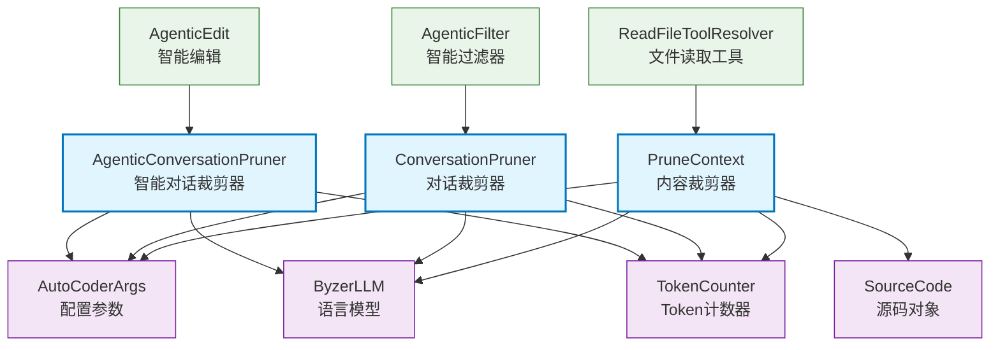

# Pruner 内容裁剪器

智能内容裁剪模块，提供多种策略来管理和优化Token使用，包括文件内容裁剪、对话历史管理和智能对话工具结果清理。

## 目录结构

```
src/autocoder/common/pruner/
├── context_pruner.py              # PruneContext类，智能文件内容裁剪
├── conversation_pruner.py         # ConversationPruner类，对话历史管理
├── agentic_conversation_pruner.py # AgenticConversationPruner类，智能对话工具结果清理
├── test_agentic_conversation_pruner.py # 智能对话裁剪器测试文件
├── README.md                      # 原始文档
└── .ac.mod.md                     # 本文档
```

## 快速开始

### 基本使用方式

```python
# 导入必要的模块
from autocoder.common.pruner.context_pruner import PruneContext
from autocoder.common.pruner.conversation_pruner import ConversationPruner
from autocoder.common.pruner.agentic_conversation_pruner import AgenticConversationPruner
from autocoder.common import AutoCoderArgs, SourceCode

# 1. 初始化配置
args = AutoCoderArgs(
    conversation_prune_safe_zone_tokens=50000,  # 对话安全区Token数
    conversation_prune_group_size=4,            # 对话分组大小
    context_prune_sliding_window_size=100,     # 滑动窗口大小
    context_prune_sliding_window_overlap=20    # 滑动窗口重叠
)

# 2. 创建LLM实例
llm = get_your_llm_instance()

# 3. 内容裁剪器 - 处理文件内容
context_pruner = PruneContext(max_tokens=10000, args=args, llm=llm)
file_sources = [SourceCode(module_name="test.py", source_code="...", tokens=5000)]
pruned_files = context_pruner.handle_overflow(file_sources, conversations, strategy="score")

# 4. 对话裁剪器 - 管理对话历史
conversation_pruner = ConversationPruner(args=args, llm=llm)
conversations = [{"role": "user", "content": "Hello"}, {"role": "assistant", "content": "Hi"}]
pruned_conversations = conversation_pruner.prune_conversations(conversations, strategy_name="summarize")

# 5. 智能对话裁剪器 - 清理工具结果
agentic_pruner = AgenticConversationPruner(args=args, llm=llm)
agentic_conversations = [...] # 包含工具执行结果的对话
cleaned_conversations = agentic_pruner.prune_conversations(agentic_conversations)
```

### 辅助函数说明

**Token计数和统计**
- `count_tokens()`: 计算文本的Token数量
- `get_cleanup_statistics()`: 获取清理过程的统计信息

**内容分割和合并**
- `_split_content_with_sliding_window()`: 使用滑动窗口分割大文件
- `_merge_overlapping_snippets()`: 合并重叠的代码片段

### 配置管理

**核心配置参数**
- `conversation_prune_safe_zone_tokens`: 对话安全区Token阈值（默认50K）
- `conversation_prune_group_size`: 对话分组处理大小（默认4）
- `context_prune_sliding_window_size`: 滑动窗口大小（默认100行）
- `context_prune_sliding_window_overlap`: 滑动窗口重叠行数（默认20行）

## 核心组件详解

### 1. PruneContext 内容裁剪器

**核心功能：**
- **智能文件过滤**：根据相关性评分选择最重要的文件
- **代码片段提取**：从大文件中提取与对话相关的代码片段
- **滑动窗口处理**：处理超大文件，分块分析和提取
- **多种裁剪策略**：支持删除、提取、评分三种策略

**主要方法：**
- `handle_overflow(file_sources, conversations, strategy)`: 处理超出Token限制的文件
- `_score_and_filter_files()`: 基于相关性评分过滤文件
- `_extract_code_snippets()`: 提取关键代码片段
- `_delete_overflow_files()`: 直接删除超出限制的文件

**裁剪策略：**
- `score`: 基于LLM评分的智能过滤（推荐）
- `extract`: 提取相关代码片段
- `delete`: 简单删除超出部分

### 2. ConversationPruner 对话裁剪器

**核心功能：**
- **摘要式裁剪**：对早期对话进行分组摘要，保留关键信息
- **截断式裁剪**：直接删除早期对话组
- **混合策略**：先摘要，如仍超限则截断

**主要方法：**
- `prune_conversations(conversations, strategy_name)`: 根据策略修剪对话
- `_summarize_prune()`: 摘要式剪枝实现
- `_truncate_prune()`: 截断式剪枝实现

**策略选择：**
- `summarize`: 保留信息的摘要策略（推荐）
- `truncate`: 简单快速的截断策略
- `hybrid`: 自适应混合策略

### 3. AgenticConversationPruner 智能对话裁剪器

**核心功能：**
- **工具结果检测**：识别包含`<tool_result>`的消息
- **渐进式清理**：从最早的工具结果开始逐步清理
- **内容替换**：用占位符消息替换大型工具输出
- **上下文保持**：保留对话逻辑和工具调用历史

**主要方法：**
- `prune_conversations()`: 清理包含工具结果的对话
- `_tool_output_cleanup_prune()`: 工具输出清理实现
- `_extract_tool_name()`: 从工具结果中提取工具名称
- `get_cleanup_statistics()`: 获取清理统计信息

### 4. 文件相关性评估架构

模块使用LLM进行智能文件相关性评估，通过以下机制：

**评分机制：**
- 0-10分的相关性评分
- 基于对话上下文的智能判断
- 并行处理提高效率

**评估标准：**
- 是否需要依赖该文件提供上下文
- 是否需要修改该文件解决用户问题
- 文件内容与当前对话的相关程度

## Mermaid 文件依赖图



### 依赖关系说明

**核心依赖：**
- `AutoCoderArgs`: 提供配置参数，如Token阈值、窗口大小等
- `ByzerLLM`: 提供LLM能力，用于智能评估和摘要生成
- `TokenCounter`: 提供Token计数功能，用于精确控制
- `SourceCode`: 源码对象，封装文件内容和Token信息

**使用场景：**
- `AgenticFilter`: 使用ConversationPruner管理对话历史
- `ReadFileToolResolver`: 使用PruneContext处理大文件内容
- `AgenticEdit`: 使用AgenticConversationPruner清理工具结果

**交互模式：**
- 所有裁剪器都支持策略模式，可根据需要选择不同策略
- 支持并行处理，提高大规模内容处理效率
- 提供详细的统计信息，便于监控和调试

## 使用示例

### 示例1：智能文件内容裁剪

```python
from autocoder.common.pruner.context_pruner import PruneContext
from autocoder.common import AutoCoderArgs, SourceCode

# 配置参数
args = AutoCoderArgs(
    context_prune_sliding_window_size=100,
    context_prune_sliding_window_overlap=20
)

# 创建裁剪器
pruner = PruneContext(max_tokens=10000, args=args, llm=llm)

# 准备文件源
file_sources = [
    SourceCode(module_name="large_file.py", source_code="...", tokens=15000),
    SourceCode(module_name="config.py", source_code="...", tokens=2000),
]

# 对话上下文
conversations = [
    {"role": "user", "content": "请帮我分析large_file.py中的main函数"},
    {"role": "assistant", "content": "我来分析这个文件..."}
]

# 执行裁剪 - 使用评分策略
pruned_files = pruner.handle_overflow(
    file_sources=file_sources,
    conversations=conversations,
    strategy="score"  # 智能评分策略
)

print(f"原始文件数: {len(file_sources)}, 裁剪后: {len(pruned_files)}")
```

### 示例2：对话历史管理

```python
from autocoder.common.pruner.conversation_pruner import ConversationPruner

# 创建对话裁剪器
pruner = ConversationPruner(args=args, llm=llm)

# 长对话历史
long_conversations = [
    {"role": "system", "content": "你是一个编程助手"},
    {"role": "user", "content": "请解释Python装饰器"},
    {"role": "assistant", "content": "装饰器是Python的一个重要特性..."},
    # ... 更多对话
]

# 使用摘要策略裁剪
pruned = pruner.prune_conversations(
    conversations=long_conversations,
    strategy_name="summarize"  # 摘要策略保留关键信息
)

# 查看可用策略
strategies = pruner.get_available_strategies()
print("可用策略:", [s['name'] for s in strategies])
```

### 示例3：智能对话工具结果清理

```python
from autocoder.common.pruner.agentic_conversation_pruner import AgenticConversationPruner

# 创建智能对话裁剪器
agentic_pruner = AgenticConversationPruner(args=args, llm=llm)

# 包含工具结果的对话
agentic_conversations = [
    {"role": "user", "content": "请读取config.json文件"},
    {"role": "assistant", "content": "我来读取文件\n\n<read_file>\n<path>config.json</path>\n</read_file>"},
    {
        "role": "user", 
        "content": "<tool_result tool_name='ReadFileTool' success='true'><message>文件读取成功</message><content>{'database': {'host': 'localhost', 'port': 5432}, 'api': {'key': 'very_long_api_key_content...'}}</content></tool_result>"
    },
    {"role": "assistant", "content": "我看到了配置文件的内容..."}
]

# 执行清理
cleaned_conversations = agentic_pruner.prune_conversations(agentic_conversations)

# 获取清理统计
stats = agentic_pruner.get_cleanup_statistics(agentic_conversations, cleaned_conversations)
print(f"Token节省: {stats['tokens_saved']}")
print(f"清理的工具结果数: {stats['tool_results_cleaned']}")
print(f"压缩比: {stats['compression_ratio']:.2%}")
```

## 外部系统集成

### 枚举值和常量

**裁剪策略枚举**
```python
# PruneContext 策略
CONTEXT_STRATEGIES = ["score", "extract", "delete"]

# ConversationPruner 策略  
CONVERSATION_STRATEGIES = ["summarize", "truncate", "hybrid"]

# AgenticConversationPruner 策略
AGENTIC_STRATEGIES = ["tool_output_cleanup"]
```

**配置常量**
```python
# 默认配置值
DEFAULT_SAFE_ZONE_TOKENS = 50000        # 默认安全区Token数
DEFAULT_GROUP_SIZE = 4                   # 默认对话分组大小
DEFAULT_SLIDING_WINDOW_SIZE = 100        # 默认滑动窗口大小
DEFAULT_SLIDING_WINDOW_OVERLAP = 20      # 默认滑动窗口重叠
```

### 事件和回调

**内容裁剪事件**
- `file_sliding_window_processing`: 大文件滑动窗口处理开始
- `file_snippet_processing`: 代码片段提取开始
- `file_snippet_procesed`: 代码片段提取完成
- `file_scored_message`: 文件评分完成

**对话裁剪事件**
- `context_pruning_reason`: 触发裁剪的原因
- `context_pruning_start`: 裁剪过程开始
- `sorted_files_message`: 文件排序信息

### 工具函数

**Token相关工具**
```python
from autocoder.rag.token_counter import count_tokens

# 计算文本Token数
token_count = count_tokens("your text here")

# 计算对话Token数
conversation_tokens = count_tokens(json.dumps(conversations, ensure_ascii=False))
```

**文件处理工具**
```python
from autocoder.common import SourceCode

# 创建源码对象
source = SourceCode(
    module_name="file.py",
    source_code="def hello(): pass",
    tokens=100
)
```

## 最佳实践

### 1. 策略选择指南

**内容裁剪策略选择：**
- 使用 `score` 策略：当需要保留最相关文件时（推荐）
- 使用 `extract` 策略：当文件很大但只需要部分内容时
- 使用 `delete` 策略：当需要快速简单裁剪时

**对话裁剪策略选择：**
- 使用 `summarize` 策略：保留对话信息，适合长期对话（推荐）
- 使用 `truncate` 策略：快速释放内存，适合临时对话
- 使用 `hybrid` 策略：自适应选择，平衡信息保留和性能

### 2. 性能优化建议

**并行处理优化：**
```python
# PruneContext 自动使用线程池进行文件评分
# 无需手动优化，但可以通过减少文件数量提高速度
file_sources = file_sources[:50]  # 限制文件数量
```

**内存使用优化：**
```python
# 及时清理大对象
pruned_files = context_pruner.handle_overflow(file_sources, conversations, "score")
del file_sources  # 释放原始文件内存
```

### 3. 错误处理模式

**异常处理示例：**
```python
try:
    pruned_files = context_pruner.handle_overflow(file_sources, conversations, "score")
except Exception as e:
    logger.error(f"内容裁剪失败: {e}")
    # 降级到简单删除策略
    pruned_files = context_pruner.handle_overflow(file_sources, conversations, "delete")
```

**容错机制：**
```python
# 检查裁剪结果
if not pruned_files:
    logger.warning("裁剪后没有文件剩余，使用原始文件的前几个")
    pruned_files = file_sources[:3]
```

### 4. 监控和调试

**统计信息收集：**
```python
# 对于智能对话裁剪器
stats = agentic_pruner.get_cleanup_statistics(original, pruned)
logger.info(f"裁剪统计: {stats}")

# 对于内容裁剪器
original_tokens = sum(f.tokens for f in file_sources)
pruned_tokens = sum(f.tokens for f in pruned_files)
logger.info(f"Token使用: {original_tokens} -> {pruned_tokens}")
```

**调试模式：**
```python
# 启用详细日志
import logging
logging.getLogger("autocoder.common.pruner").setLevel(logging.DEBUG)
```

### 5. 配置调优

**Token阈值调优：**
```python
# 根据模型上下文长度调整
# GPT-4: 128K tokens -> safe_zone: 100K
# GPT-3.5: 16K tokens -> safe_zone: 12K
args.conversation_prune_safe_zone_tokens = model_context_length * 0.8
```

**滑动窗口调优：**
```python
# 大文件使用更大窗口
args.context_prune_sliding_window_size = 200  # 适合大型文件
args.context_prune_sliding_window_overlap = 50  # 增加重叠保证连续性
```

## 故障排除

### 常见问题

**1. 裁剪后Token仍然超限**
```python
# 解决方案：降低安全区阈值或使用更激进的策略
args.conversation_prune_safe_zone_tokens = args.conversation_prune_safe_zone_tokens * 0.7
```

**2. 重要信息被错误裁剪**
```python
# 解决方案：调整评分策略或使用extract策略
pruned_files = context_pruner.handle_overflow(files, conversations, "extract")
```

**3. 裁剪速度过慢**
```python
# 解决方案：减少文件数量或使用delete策略
if len(file_sources) > 100:
    strategy = "delete"  # 大量文件时使用快速策略
```

**4. LLM评分不准确**
```python
# 解决方案：优化对话上下文或使用多轮评分
# 确保conversations包含足够的上下文信息
conversations = conversations[-10:]  # 只使用最近的对话
```

## 单元测试说明

### 测试文件结构

本模块包含完整的测试套件，支持多种测试方式：

```
src/autocoder/common/pruner/
├── test_agentic_conversation_pruner_pytest.py  # 标准pytest测试文件
```

### 运行测试

```bash
# 进入模块目录
cd src/autocoder/common/pruner

# 运行所有pytest测试
pytest test_agentic_conversation_pruner.py -v

# 运行特定测试类
pytest test_agentic_conversation_pruner.py::TestAgenticConversationPruner -v

# 运行特定测试方法
pytest test_agentic_conversation_pruner.py::TestAgenticConversationPruner::test_initialization -v

# 运行参数化测试
pytest test_agentic_conversation_pruner.py::TestParametrized -v
```

