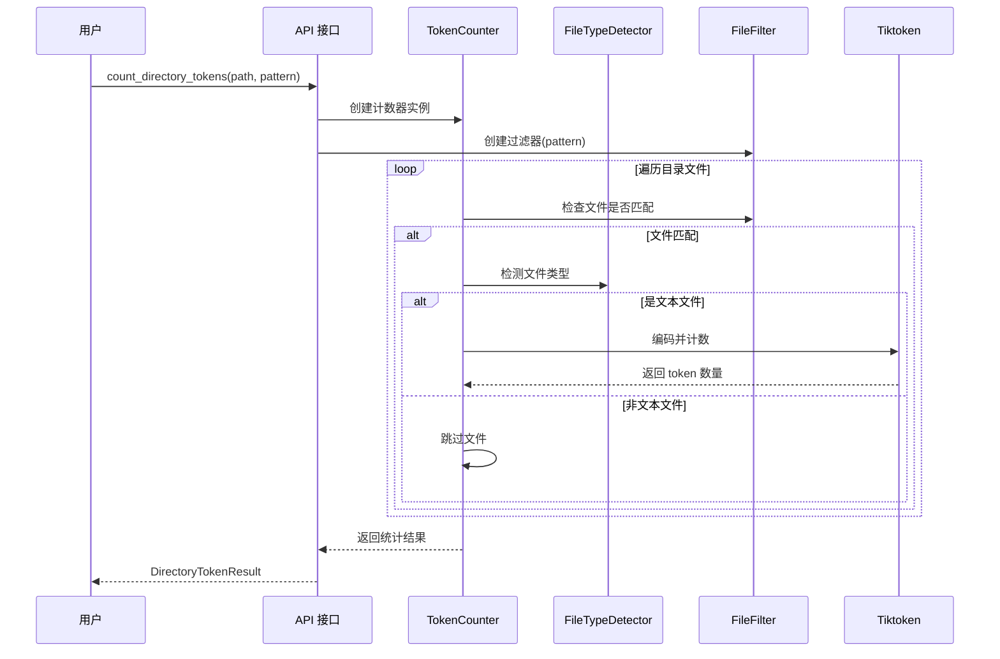

# Tokens 模块

高效统计文件和目录中的 token 数量，支持正则过滤和智能文件类型识别。

## 目录结构

```
src/autocoder/common/tokens/
├── __init__.py               # 模块入口，导出主要接口
├── counter.py                # 核心 token 计数器实现
├── file_detector.py          # 文件类型检测器
├── models.py                 # 数据模型定义
├── filters.py                # 文件过滤器实现
└── .ac.mod.md                # 本文档
```

## 快速开始

### 基本使用（设计示例）

```python
# 导入模块（设计示例）
from autocoder.common.tokens import TokenCounter, count_file_tokens, count_directory_tokens

# 1. 统计单个文件
result = count_file_tokens("path/to/file.py")
print(f"文件: {result.file_path}")
print(f"Token 数量: {result.token_count}")
print(f"字符数: {result.char_count}")
print(f"行数: {result.line_count}")

# 2. 统计整个目录
dir_result = count_directory_tokens(
    "path/to/directory",
    pattern=r".*\.py$"  # 只统计 Python 文件
)
print(f"总 Token 数: {dir_result.total_tokens}")
print(f"文件数量: {dir_result.file_count}")
print(f"跳过文件数: {dir_result.skipped_count}")

# 3. 使用 TokenCounter 类进行更多控制
counter = TokenCounter()

# 批量处理
files = ["file1.py", "file2.js", "file3.md"]
results = counter.count_files(files)
for result in results:
    if result.success:
        print(f"{result.file_path}: {result.token_count} tokens")
    else:
        print(f"{result.file_path}: 失败 - {result.error}")
```

### 配置选项

```python
# TokenCounter 配置（设计示例）
config = {           
    "timeout": 30,                   # 单文件处理超时时间（秒）
    "parallel": True,                # 是否并行处理
    "max_workers": 4,                # 最大工作线程数
}

counter = TokenCounter(**config)
```

## 核心组件

### 1. TokenCounter

**功能：**
- **文件统计**：统计单个文件的 token 数量
- **目录统计**：递归统计目录下所有文件
- **批量处理**：高效处理多个文件
- **内存优化**：支持大文件分块处理

**主要方法：**
- `count_file(file_path: str) -> TokenResult`: 统计单个文件
- `count_directory(dir_path: str, pattern: str = None) -> DirectoryTokenResult`: 统计目录
- `count_files(file_paths: List[str]) -> List[TokenResult]`: 批量统计
- `set_tokenizer(tokenizer_name: str)`: 更改 tokenizer

### 2. FileTypeDetector

**功能：**
- **MIME 类型检测**：基于文件内容判断类型
- **扩展名匹配**：基于文件扩展名快速判断
- **内容分析**：通过文件头部字节识别二进制文件
- **编码检测**：自动检测文本文件编码

**主要方法：**
- `is_text_file(file_path: str) -> bool`: 判断是否为文本文件
- `detect_encoding(file_path: str) -> str`: 检测文件编码
- `get_mime_type(file_path: str) -> str`: 获取 MIME 类型

### 3. FileFilter

**功能：**
- **正则过滤**：支持正则表达式匹配文件名
- **类型过滤**：按文件类型过滤（文本/二进制）
- **大小过滤**：按文件大小范围过滤
- **组合过滤**：支持多个过滤条件组合

**主要方法：**
- `matches(file_path: str) -> bool`: 检查文件是否匹配过滤条件
- `add_pattern(pattern: str)`: 添加正则表达式模式
- `set_size_range(min_size: int, max_size: int)`: 设置大小范围

## 架构设计

```mermaid
graph TB
    %% 用户接口层
    API[公共 API<br/>count_file_tokens()<br/>count_directory_tokens()]
    
    %% 核心层
    Counter[TokenCounter<br/>核心计数逻辑]
    Detector[FileTypeDetector<br/>文件类型检测]
    Filter[FileFilter<br/>文件过滤器]
    
    %% 数据模型层
    Models[数据模型<br/>TokenResult<br/>DirectoryTokenResult]
    
    %% 外部依赖
    Tiktoken[tiktoken<br/>Token 编码器]
    FileSystem[文件系统<br/>pathlib/os]
    
    %% 依赖关系
    API --> Counter
    Counter --> Detector
    Counter --> Filter
    Counter --> Models
    Counter --> Tiktoken
    Detector --> FileSystem
    Filter --> FileSystem
    
    %% 样式
    classDef coreClass fill:#e1f5fe,stroke:#0277bd,stroke-width:2px
    classDef modelClass fill:#f3e5f5,stroke:#7b1fa2,stroke-width:2px
    classDef externalClass fill:#fff3e0,stroke:#ef6c00,stroke-width:2px
    
    class Counter,Detector,Filter coreClass
    class Models modelClass
    class Tiktoken,FileSystem externalClass
```

### 数据流



### 依赖说明

**内部依赖：**
- `models.py` ← `counter.py` ← `__init__.py`
- `file_detector.py` ← `counter.py`
- `filters.py` ← `counter.py`

**外部依赖：**
- `tiktoken`: OpenAI 的 token 计数库
- `pathlib`: Python 标准库，用于路径操作
- `re`: Python 标准库，用于正则表达式
- `mimetypes`: Python 标准库，用于 MIME 类型检测
- `chardet` (可选): 用于更准确的编码检测

## 使用场景

### 1. 项目代码统计
```python
# 统计整个项目的 token 使用量（设计示例）
result = count_directory_tokens(
    "src/",
    pattern=r".*\.(py|js|ts|jsx|tsx)$"
)
print(f"项目总 Token 数: {result.total_tokens:,}")
print(f"平均每文件: {result.total_tokens / result.file_count:,.0f}")
```

### 2. API 成本估算
```python
# 估算 GPT API 调用成本（设计示例）
def estimate_api_cost(directory: str, cost_per_1k_tokens: float = 0.002):
    result = count_directory_tokens(directory)
    total_cost = (result.total_tokens / 1000) * cost_per_1k_tokens
    return {
        "total_tokens": result.total_tokens,
        "estimated_cost": f"${total_cost:.2f}",
        "file_count": result.file_count
    }
```

### 3. 文档长度控制
```python
# 检查文档是否超过 token 限制（设计示例）
def check_document_limits(file_path: str, max_tokens: int = 4000):
    result = count_file_tokens(file_path)
    if result.token_count > max_tokens:
        print(f"警告: 文件超过限制 ({result.token_count} > {max_tokens})")
        return False
    return True
```


