# Agentic Edit Agent

这是 AutoCoder 项目中的智能代码编辑代理模块，提供基于大语言模型的交互式代码编辑和项目管理功能。

## 目录结构

```
src/autocoder/common/v2/agent/
├── __init__.py                          # 模块初始化文件
├── agentic_edit.py                      # 核心代理类，负责与LLM交互和工具调度
├── agentic_edit_types.py                # 类型定义，包含工具模型和事件类型
├── agentic_tool_display.py             # 工具显示相关的国际化支持
├── agentic_edit_tools/                  # 工具解析器目录
│   ├── __init__.py                      # 工具模块初始化
│   ├── base_tool_resolver.py            # 工具解析器基类
│   ├── execute_command_tool_resolver.py # 命令执行工具解析器
│   ├── read_file_tool_resolver.py       # 文件读取工具解析器
│   ├── write_to_file_tool_resolver.py   # 文件写入工具解析器
│   ├── replace_in_file_tool_resolver.py # 文件替换工具解析器
│   ├── search_files_tool_resolver.py    # 文件搜索工具解析器
│   ├── list_files_tool_resolver.py      # 文件列表工具解析器
│   ├── list_code_definition_names_tool_resolver.py # 代码定义列表工具解析器
│   ├── list_package_info_tool_resolver.py # 包信息工具解析器
│   ├── ask_followup_question_tool_resolver.py # 用户交互工具解析器
│   ├── attempt_completion_tool_resolver.py # 任务完成工具解析器
│   ├── plan_mode_respond_tool_resolver.py # 计划模式响应工具解析器
│   ├── use_mcp_tool_resolver.py         # MCP工具解析器
│   ├── use_rag_tool_resolver.py         # RAG工具解析器
│   ├── dangerous_command_checker.py     # 危险命令检查器
│   └── test_*.py                        # 各种工具的测试文件
└── .meta.mod.md                            # 本文档
```

## 快速开始（对外API使用指南）

### 基本使用方式

参考 `auto_coder_runner.py` 中的使用方式：

```python
from autocoder.common.v2.agent.agentic_edit import AgenticEdit, AgenticEditRequest
from autocoder.common.v2.agent.agentic_edit_types import AgenticEditConversationConfig, MemoryConfig
from autocoder.common import SourceCodeList, SourceCode, AutoCoderArgs
from autocoder.utils.llms import get_single_llm

# 1. 获取 LLM 实例
# 方式一：从配置中获取模型
memory = get_memory()  # 获取内存配置
conf = memory.get("conf", {})
product_mode = conf.get("product_mode", "lite")
model_name = conf.get("model", "v3_chat")  # 默认模型
llm = get_single_llm(model_name, product_mode=product_mode)

# 方式二：直接指定模型（需要先配置好模型）
# llm = get_single_llm("v3_chat", product_mode="lite")

# 2. 获取 AutoCoderArgs 配置
# 方式一：使用 get_final_config() 函数（推荐）
args = get_final_config()

# 方式二：手动创建配置
# args = AutoCoderArgs(
#     source_dir=".",                          # 项目根目录
#     target_file="",                          # 目标文件（可选）
#     git_url="",                             # Git URL（可选）
#     project_type="py",                       # 项目类型
#     conversation_prune_safe_zone_tokens=0   # 对话剪枝安全区域token数
# )

# 3. 准备源代码文件列表
current_files = memory.get("current_files", {}).get("files", [])
sources = []
for file in current_files:
    try:
        with open(file, "r", encoding="utf-8") as f:
            sources.append(SourceCode(module_name=file, source_code=f.read()))
    except Exception as e:
        print(f"Failed to read file {file}: {e}")

# 4. 准备内存配置
memory_config = MemoryConfig(
    memory=memory,
    save_memory_func=save_memory
)

# 5. 初始化代理
agent = AgenticEdit(
    llm=llm,                                    # 大语言模型实例
    args=args,                                  # AutoCoderArgs配置
    files=SourceCodeList(sources=sources),     # 源代码文件列表
    conversation_history=[],                    # 对话历史（通常为空列表）
    memory_config=memory_config,                # 内存配置
    command_config=None,                        # 命令配置（可选）
    conversation_name="current",                # 对话名称
    conversation_config=AgenticEditConversationConfig(
        action="resume"                         # 对话动作：new/resume/list
    )
)

# 6. 终端模式运行
agent.run_in_terminal(AgenticEditRequest(user_input="你的任务描述"))

# 7. 事件模式运行（适用于Web界面）
agent.run_with_events(AgenticEditRequest(user_input="你的任务描述"))
```

### 辅助函数说明

```python
# 获取内存配置（包含项目配置信息）
def get_memory():
    """获取项目的内存配置，包含当前文件、配置等信息"""
    return load_memory()

# 获取最终配置
def get_final_config() -> AutoCoderArgs:
    """
    根据内存中的配置生成完整的 AutoCoderArgs 对象
    这是获取 args 的推荐方式
    """
    conf = memory.get("conf", {})
    yaml_config = {
        "include_file": ["./base/base.yml"],
        "auto_merge": conf.get("auto_merge", "editblock"),
        "human_as_model": conf.get("human_as_model", "false") == "true",
        "skip_build_index": conf.get("skip_build_index", "true") == "true",
        "skip_confirm": conf.get("skip_confirm", "true") == "true",
        "silence": conf.get("silence", "true") == "true",
        "include_project_structure": conf.get("include_project_structure", "true") == "true",
        "exclude_files": memory.get("exclude_files", []),
    }
    for key, value in conf.items():
        converted_value = convert_config_value(key, value)
        if converted_value is not None:
            yaml_config[key] = converted_value

    # 通过临时 YAML 文件转换为 AutoCoderArgs
    temp_yaml = os.path.join("actions", f"{uuid.uuid4()}.yml")
    try:
        with open(temp_yaml, "w", encoding="utf-8") as f:
            f.write(convert_yaml_config_to_str(yaml_config=yaml_config))
        args = convert_yaml_to_config(temp_yaml)
    finally:
        if os.path.exists(temp_yaml):
            os.remove(temp_yaml)
    return args

# 保存内存配置
def save_memory():
    """保存内存配置到文件"""
    # 实现保存逻辑
    pass
```

### 对话管理

```python
# 创建新对话
conversation_config = AgenticEditConversationConfig(
    action="new",
    query="新对话的描述"
)

# 继续现有对话
conversation_config = AgenticEditConversationConfig(
    action="resume",
    conversation_id="conversation_id_here"
)

# 列出所有对话
conversation_config = AgenticEditConversationConfig(
    action="list"
)
```

### 文件变更跟踪

```python
# 获取所有文件变更
changes = agent.get_all_file_changes()

# 获取可用检查点
checkpoints = agent.get_available_checkpoints()

# 回滚到指定检查点
success = agent.rollback_to_checkpoint(checkpoint_id)
```

## 核心组件详解

### 1. AgenticEdit 主类

**核心功能：**
- LLM交互管理：处理与大语言模型的流式对话
- 工具调度：解析LLM输出中的工具调用并执行
- 事件流处理：将交互过程转换为结构化事件流
- 文件变更跟踪：记录和管理代码文件的修改历史
- 对话状态管理：支持多轮对话的上下文保持

**主要方法：**
- `analyze()`: 核心分析方法，处理用户输入并生成事件流
- `run_in_terminal()`: 终端模式运行，适用于命令行交互
- `run_with_events()`: 事件模式运行，适用于Web界面集成
- `stream_and_parse_llm_response()`: 流式解析LLM响应

### 2. 工具系统架构

**设计模式：**
- 采用策略模式，每个工具都有对应的解析器
- 基于Pydantic模型进行类型安全的参数验证
- 统一的ToolResult返回格式

#### 2.1 工具类型定义

**文件操作工具：**

- **`read_file`**: 文件读取工具
  - **类型**: `ReadFileTool`
  - **参数**: `path: str` - 要读取的文件路径（相对于项目根目录）
  - **功能**: 读取指定文件的完整内容
  - **返回**: 文件内容字符串，支持自动检测编码
  - **用途**: 查看现有文件内容、分析代码结构、获取配置信息
  - **示例**: `<read_file><path>src/main.py</path></read_file>`

- **`write_to_file`**: 文件写入工具
  - **类型**: `WriteToFileTool`
  - **参数**: 
    - `path: str` - 目标文件路径
    - `content: str` - 要写入的完整文件内容
  - **功能**: 创建新文件或完全覆盖现有文件内容
  - **返回**: 写入操作的成功状态和消息
  - **用途**: 创建新文件、重写整个文件、生成配置文件
  - **注意**: 会自动创建必要的目录结构

- **`replace_in_file`**: 文件内容替换工具
  - **类型**: `ReplaceInFileTool`
  - **参数**:
    - `path: str` - 目标文件路径
    - `diff: str` - SEARCH/REPLACE格式的差异内容
  - **功能**: 对文件进行精确的部分内容替换
  - **返回**: 替换操作的结果和修改详情
  - **用途**: 修改函数实现、更新配置项、重构代码
  - **格式**: 使用`<<<<<<< SEARCH`和`>>>>>>> REPLACE`标记

**搜索和探索工具：**

- **`search_files`**: 文件内容搜索工具
  - **类型**: `SearchFilesTool`
  - **参数**:
    - `path: str` - 搜索目录路径
    - `regex: str` - 正则表达式搜索模式
    - `file_pattern: Optional[str]` - 文件名过滤模式（如`*.py`）
  - **功能**: 在指定目录中递归搜索匹配的文件内容
  - **返回**: 匹配结果列表，包含文件路径、行号和上下文
  - **用途**: 查找函数定义、搜索特定模式、代码审查

- **`list_files`**: 文件列表工具
  - **类型**: `ListFilesTool`
  - **参数**:
    - `path: str` - 目录路径
    - `recursive: Optional[bool]` - 是否递归列出子目录（默认false）
  - **功能**: 列出指定目录中的文件和子目录
  - **返回**: 文件和目录的结构化列表
  - **用途**: 探索项目结构、了解目录组织、查找特定文件

- **`list_code_definition_names`**: 代码定义列表工具
  - **类型**: `ListCodeDefinitionNamesTool`
  - **参数**: `path: str` - 源代码目录路径
  - **功能**: 提取指定目录中所有源代码文件的顶级定义
  - **返回**: 类、函数、方法等定义的名称列表
  - **用途**: 快速了解代码库结构、查找API接口、分析依赖关系

- **`list_package_info`**: 包信息工具
  - **类型**: `ListPackageInfoTool`
  - **参数**: `path: str` - 源码包目录路径
  - **功能**: 获取源代码包的详细信息，包括最近变更和文档摘要
  - **返回**: 包的元信息、重要文件列表、变更历史
  - **用途**: 理解包的作用、查看最近修改、获取使用指南

**系统操作工具：**

- **`execute_command`**: 命令执行工具
  - **类型**: `ExecuteCommandTool`
  - **参数**:
    - `command: str` - 要执行的CLI命令
    - `requires_approval: bool` - 是否需要用户批准（危险操作设为true）
  - **功能**: 在系统中执行命令行指令
  - **返回**: 命令执行结果、输出内容、退出状态
  - **用途**: 运行构建脚本、安装依赖、执行测试、系统操作
  - **安全**: 内置危险命令检查机制

**交互控制工具：**

- **`ask_followup_question`**: 用户交互工具
  - **类型**: `AskFollowupQuestionTool`
  - **参数**:
    - `question: str` - 要询问用户的问题
    - `options: Optional[List[str]]` - 可选的预设答案列表
  - **功能**: 向用户请求额外信息或确认
  - **返回**: 用户的响应内容
  - **用途**: 获取缺失参数、确认操作、收集需求细节

- **`attempt_completion`**: 任务完成工具
  - **类型**: `AttemptCompletionTool`
  - **参数**:
    - `result: str` - 任务完成的结果描述
    - `command: Optional[str]` - 可选的演示命令
  - **功能**: 标记任务完成并提供最终结果
  - **返回**: 任务完成状态
  - **用途**: 结束工作流程、提供总结、建议后续操作
  - **注意**: 调用此工具会终止当前会话

- **`plan_mode_respond`**: 计划模式响应工具
  - **类型**: `PlanModeRespondTool`
  - **参数**:
    - `response: str` - 计划模式下的响应内容
    - `options: Optional[List[str]]` - 可选的后续选项
  - **功能**: 在计划模式下提供分析和建议而不执行实际操作
  - **返回**: 计划和建议内容
  - **用途**: 需求分析、方案设计、风险评估

**扩展集成工具：**

- **`use_mcp_tool`**: MCP工具调用
  - **类型**: `UseMcpTool`
  - **参数**:
    - `server_name: str` - MCP服务器名称
    - `tool_name: str` - 具体工具名称
    - `query: str` - 传递给工具的查询内容
  - **功能**: 通过Model Context Protocol调用外部工具
  - **返回**: 外部工具的执行结果
  - **用途**: 集成第三方服务、扩展功能边界、访问专业工具
  - **示例**: GitHub操作、数据库查询、API调用

- **`use_rag_tool`**: RAG检索工具
  - **类型**: `UseRAGTool`
  - **参数**:
    - `server_name: str` - RAG服务器URL或名称
    - `query: str` - 检索查询内容
  - **功能**: 通过检索增强生成系统获取相关信息
  - **返回**: 检索到的相关文档和信息
  - **用途**: 知识库查询、文档检索、上下文增强

#### 2.2 工具解析流程

**XML解析机制：**
```python
# 工具调用格式示例
<read_file>
<path>src/main.py</path>
</read_file>

<write_to_file>
<path>config/settings.json</path>
<content>
{
  "version": "1.0.0",
  "debug": true
}
</content>
</write_to_file>
```

**解析执行流程：**
1. **XML识别**: `stream_and_parse_llm_response()` 识别工具XML标签
2. **参数提取**: 解析XML内容，提取工具参数
3. **模型验证**: 使用Pydantic模型验证参数类型和格式
4. **解析器查找**: 根据工具类型查找对应的解析器类
5. **工具执行**: 解析器执行具体的工具逻辑
6. **结果封装**: 将执行结果封装为ToolResult对象
7. **XML响应**: 将结果转换为XML格式返回给LLM

**统一结果格式：**
```python
class ToolResult(BaseModel):
    success: bool      # 执行是否成功
    message: str       # 结果描述信息
    content: Any       # 具体的结果内容（可选）
```

**错误处理机制：**
- **参数验证错误**: 返回详细的参数格式说明
- **权限错误**: 提示权限不足并建议解决方案
- **文件操作错误**: 提供具体的文件路径和错误原因
- **命令执行错误**: 返回命令输出和退出码
- **网络错误**: 提供连接状态和重试建议
=======

### 3. 事件系统

事件系统是 AgenticEdit 的核心组件，负责将整个交互过程转换为结构化的事件流，支持实时流式输出和多种输出格式。

#### 3.1 核心事件类型

**LLM 交互事件：**

- **`LLMOutputEvent`**: LLM的普通文本输出
  - **用途**: 承载LLM生成的正常文本内容
  - **触发时机**: LLM流式输出过程中，非思考和工具调用的文本片段
  - **数据结构**: `{ text: str }`
  - **示例**: 当LLM回答问题或提供解释时的文本内容

- **`LLMThinkingEvent`**: LLM的思考过程
  - **用途**: 承载LLM在`<thinking>`标签内的思考内容
  - **触发时机**: 解析到`<thinking>...</thinking>`标签时
  - **数据结构**: `{ text: str }`
  - **示例**: LLM分析问题、制定计划时的内部思考过程

**工具系统事件：**

- **`ToolCallEvent`**: 工具调用事件
  - **用途**: 记录LLM决定调用某个工具的行为
  - **触发时机**: 解析到工具XML标签（如`<read_file>`, `<write_to_file>`等）时
  - **数据结构**: `{ tool: BaseTool, tool_xml: str }`
  - **示例**: LLM决定读取文件、执行命令或写入文件时

- **`ToolResultEvent`**: 工具执行结果事件
  - **用途**: 记录工具执行的结果和状态
  - **触发时机**: 工具执行完成后
  - **数据结构**: `{ tool_name: str, result: ToolResult }`
  - **ToolResult结构**: `{ success: bool, message: str, content: Any }`
  - **示例**: 文件读取成功/失败、命令执行结果等

**任务控制事件：**

- **`CompletionEvent`**: 任务完成事件
  - **用途**: 标记整个任务的完成
  - **触发时机**: LLM调用`attempt_completion`工具时
  - **数据结构**: `{ completion: AttemptCompletionTool, completion_xml: str }`
  - **示例**: LLM认为任务已完成并提供最终结果

- **`PlanModeRespondEvent`**: 计划模式响应事件
  - **用途**: 在计划模式下的响应
  - **触发时机**: LLM调用`plan_mode_respond`工具时
  - **数据结构**: `{ completion: PlanModeRespondTool, completion_xml: str }`
  - **示例**: 在计划模式下提供分析和建议

**系统监控事件：**

- **`ErrorEvent`**: 错误事件
  - **用途**: 记录系统运行过程中的错误
  - **触发时机**: 工具执行失败、解析错误、系统异常等
  - **数据结构**: `{ message: str }`
  - **示例**: 文件不存在、权限不足、网络错误等

- **`TokenUsageEvent`**: Token使用统计事件
  - **用途**: 记录LLM调用的Token消耗和成本
  - **触发时机**: LLM流式响应结束时
  - **数据结构**: `{ usage: SingleOutputMeta }`
  - **包含信息**: 输入/输出Token数量、成本计算、模型信息等

- **`WindowLengthChangeEvent`**: 对话窗口长度变化事件
  - **用途**: 跟踪当前对话的Token使用情况
  - **触发时机**: 对话历史更新时（添加用户消息、助手回复、工具结果等）
  - **数据结构**: `{ tokens_used: int }`
  - **示例**: 用于监控对话长度，触发上下文剪枝

**会话管理事件：**

- **`ConversationIdEvent`**: 对话ID事件
  - **用途**: 提供当前对话的唯一标识符
  - **触发时机**: 对话开始时或恢复对话时
  - **数据结构**: `{ conversation_id: str }`
  - **示例**: 用于前端界面显示当前对话ID

#### 3.2 事件流处理机制

**流式解析架构：**
```python
def stream_and_parse_llm_response(self, generator) -> Generator[Event, None, None]:
    """
    核心流式解析方法，将LLM的原始输出转换为结构化事件
    
    解析流程：
    1. 缓冲区管理：维护文本缓冲区，处理不完整的标签
    2. 状态机：跟踪当前解析状态（普通文本/思考/工具调用）
    3. XML解析：识别和解析工具调用的XML标签
    4. 事件生成：将解析结果转换为对应的事件对象
    """
```

**事件生成时序：**
1. **对话开始**: `ConversationIdEvent` → `WindowLengthChangeEvent`
2. **LLM响应**: `LLMThinkingEvent` → `LLMOutputEvent` → `ToolCallEvent`
3. **工具执行**: `ToolResultEvent` → `WindowLengthChangeEvent`
4. **任务完成**: `CompletionEvent` → `TokenUsageEvent`
5. **错误处理**: `ErrorEvent`（可在任何阶段触发）

**事件转换适配：**
- **终端模式**: 事件直接渲染为Rich格式的终端输出
- **Web模式**: 事件转换为标准事件系统格式，通过EventManager发布
- **API模式**: 事件序列化为JSON格式，支持WebSocket或HTTP推送

#### 3.3 事件系统集成

**与标准事件系统的桥接：**
```python
def run_with_events(self, request: AgenticEditRequest):
    """
    将AgenticEdit的内部事件转换为标准事件系统格式
    
    转换映射：
    - LLMOutputEvent → StreamContent (content类型)
    - LLMThinkingEvent → StreamContent (thinking类型)  
    - ToolCallEvent → ResultContent (工具调用信息)
    - ToolResultEvent → ResultContent (工具结果信息)
    - CompletionEvent → CompletionContent (任务完成)
    - ErrorEvent → ErrorContent (错误信息)
    """
```

**事件路径规范：**
- `/agent/edit/thinking`: 思考过程事件
- `/agent/edit/output`: 正常输出事件
- `/agent/edit/tool/call`: 工具调用事件
- `/agent/edit/tool/result`: 工具结果事件
- `/agent/edit/completion`: 任务完成事件
- `/agent/edit/error`: 错误事件
- `/agent/edit/token_usage`: Token使用事件
- `/agent/edit/window_length_change`: 窗口长度变化事件
- `/agent/edit/conversation_id`: 对话ID事件

#### 3.4 事件处理最佳实践

**事件监听模式：**
```python
# 终端模式 - 直接处理事件
for event in agent.analyze(request):
    if isinstance(event, LLMOutputEvent):
        console.print(event.text, end="")
    elif isinstance(event, ToolCallEvent):
        display_tool_call(event.tool)
    elif isinstance(event, CompletionEvent):
        display_completion(event.completion)

# Web模式 - 通过事件管理器
event_manager = get_event_manager()
agent.run_with_events(request)  # 自动发布事件
```

**错误恢复机制：**
- **解析错误**: 继续处理后续内容，记录错误但不中断流程
- **工具错误**: 将错误信息作为工具结果返回给LLM
- **系统错误**: 发布ErrorEvent，可选择中断或继续

**性能优化：**
- **批量处理**: 小的文本片段会被合并以减少事件数量
- **缓冲管理**: 智能缓冲区管理避免内存泄漏
- **异步处理**: 支持异步事件处理，不阻塞主流程

**调试支持：**
- **事件日志**: 所有事件都会被记录到日志系统
- **事件重放**: 支持保存和重放事件序列用于调试
- **状态检查**: 提供事件流状态检查工具
=======

### 4. 文件管理系统

**影子文件系统（可选）：**
- 在临时目录中创建项目文件的副本
- 所有修改先在影子文件中进行，确保原项目安全
- 支持批量应用变更到原项目

**检查点系统：**
- 自动创建文件变更的检查点
- 支持回滚到任意检查点
- 同时保存文件状态和对话状态

**变更跟踪：**
- 记录每个文件的修改类型（新增/修改）
- 保存详细的diff信息
- 支持变更预览和确认

### 5. 上下文管理

**对话管理：**
- 支持多轮对话的上下文保持
- 自动管理对话历史的Token消耗
- 支持对话的创建、恢复和列表查看

**内容剪枝：**
- 当对话长度超过限制时自动剪枝
- 保留重要信息，移除冗余内容
- 支持多种剪枝策略

**第三方库文档集成：**
- 自动加载项目中使用的第三方库文档
- 在对话中提供库的API参考
- 支持智能推荐库函数的使用

## Mermaid 文件依赖图

```mermaid
graph TB
    %% 核心模块
    AgenticEdit[agentic_edit.py<br/>核心代理类]
    Types[agentic_edit_types.py<br/>类型定义]
    Display[agentic_tool_display.py<br/>工具显示]
    
    %% 工具解析器
    BaseResolver[base_tool_resolver.py<br/>解析器基类]
    ExecuteCmd[execute_command_tool_resolver.py]
    ReadFile[read_file_tool_resolver.py]
    WriteFile[write_to_file_tool_resolver.py]
    ReplaceFile[replace_in_file_tool_resolver.py]
    SearchFiles[search_files_tool_resolver.py]
    ListFiles[list_files_tool_resolver.py]
    ListCode[list_code_definition_names_tool_resolver.py]
    ListPackage[list_package_info_tool_resolver.py]
    AskQuestion[ask_followup_question_tool_resolver.py]
    AttemptComplete[attempt_completion_tool_resolver.py]
    PlanRespond[plan_mode_respond_tool_resolver.py]
    UseMcp[use_mcp_tool_resolver.py]
    UseRag[use_rag_tool_resolver.py]
    DangerCheck[dangerous_command_checker.py]
    
    %% 外部依赖
    AutoCoderArgs[AutoCoderArgs<br/>配置类]
    SourceCodeList[SourceCodeList<br/>源码列表]
    LLM[ByzerLLM<br/>大语言模型]
    EventManager[EventManager<br/>事件管理器]
    ConversationManager[ConversationManager<br/>对话管理器]
    CheckpointManager[CheckpointManager<br/>检查点管理器]
    ShadowManager[ShadowManager<br/>影子文件管理器]
    
    %% 主要依赖关系
    AgenticEdit --> Types
    AgenticEdit --> Display
    AgenticEdit --> AutoCoderArgs
    AgenticEdit --> SourceCodeList
    AgenticEdit --> LLM
    AgenticEdit --> EventManager
    AgenticEdit --> ConversationManager
    AgenticEdit --> CheckpointManager
    AgenticEdit --> ShadowManager
    
    %% 工具解析器依赖
    ExecuteCmd --> BaseResolver
    ReadFile --> BaseResolver
    WriteFile --> BaseResolver
    ReplaceFile --> BaseResolver
    SearchFiles --> BaseResolver
    ListFiles --> BaseResolver
    ListCode --> BaseResolver
    ListPackage --> BaseResolver
    AskQuestion --> BaseResolver
    AttemptComplete --> BaseResolver
    PlanRespond --> BaseResolver
    UseMcp --> BaseResolver
    UseRag --> BaseResolver
    
    BaseResolver --> Types
    BaseResolver --> AutoCoderArgs
    
    %% 特殊依赖
    ExecuteCmd --> DangerCheck
    AgenticEdit --> ExecuteCmd
    AgenticEdit --> ReadFile
    AgenticEdit --> WriteFile
    AgenticEdit --> ReplaceFile
    AgenticEdit --> SearchFiles
    AgenticEdit --> ListFiles
    AgenticEdit --> ListCode
    AgenticEdit --> ListPackage
    AgenticEdit --> AskQuestion
    AgenticEdit --> AttemptComplete
    AgenticEdit --> PlanRespond
    AgenticEdit --> UseMcp
    AgenticEdit --> UseRag
    
    %% 数据流
    Types -.-> AgenticEdit
    Display -.-> AgenticEdit
    
    %% 样式定义
    classDef coreClass fill:#e1f5fe,stroke:#0277bd,stroke-width:2px
    classDef toolClass fill:#f3e5f5,stroke:#7b1fa2,stroke-width:1px
    classDef externalClass fill:#fff3e0,stroke:#f57c00,stroke-width:1px
    
    class AgenticEdit,Types,Display coreClass
    class ExecuteCmd,ReadFile,WriteFile,ReplaceFile,SearchFiles,ListFiles,ListCode,ListPackage,AskQuestion,AttemptComplete,PlanRespond,UseMcp,UseRag,BaseResolver,DangerCheck toolClass
    class AutoCoderArgs,SourceCodeList,LLM,EventManager,ConversationManager,CheckpointManager,ShadowManager externalClass
```



### 依赖关系说明

1. **核心依赖流**：
   - `AgenticEdit` 是整个模块的核心，依赖所有其他组件
   - `Types` 定义了所有数据模型和事件类型
   - `Display` 提供工具显示的国际化支持

2. **工具解析器层次**：
   - 所有具体工具解析器都继承自 `BaseResolver`
   - 每个解析器负责处理特定类型的工具调用
   - `DangerCheck` 为命令执行提供安全检查

3. **外部系统集成**：
   - `LLM`: 提供大语言模型能力
   - `EventManager`: 处理事件的发布和订阅
   - `ConversationManager`: 管理对话状态
   - `CheckpointManager`: 管理文件变更检查点
   - `ShadowManager`: 管理影子文件系统

4. **数据模型**：
   - `AutoCoderArgs`: 全局配置参数
   - `SourceCodeList`: 源代码文件集合
   - 各种事件类型和工具模型定义在 `Types` 中

这个架构设计确保了模块的高内聚、低耦合，同时提供了良好的扩展性和可维护性。
