# Agentic Edit Agent

这是 AutoCoder 项目中的智能代码编辑代理模块，提供基于大语言模型的交互式代码编辑和项目管理功能。

## 目录结构

```
src/autocoder/common/v2/agent/
├── __init__.py                          # 模块初始化文件
├── agentic_edit.py                      # 核心代理类，负责与LLM交互和工具调度
├── agentic_edit_types.py                # 类型定义，包含工具模型和事件类型
├── agentic_tool_display.py             # 工具显示相关的国际化支持
├── agentic_edit_tools/                  # 工具解析器目录
│   ├── __init__.py                      # 工具模块初始化
│   ├── base_tool_resolver.py            # 工具解析器基类
│   ├── execute_command_tool_resolver.py # 命令执行工具解析器
│   ├── read_file_tool_resolver.py       # 文件读取工具解析器
│   ├── write_to_file_tool_resolver.py   # 文件写入工具解析器
│   ├── replace_in_file_tool_resolver.py # 文件替换工具解析器
│   ├── search_files_tool_resolver.py    # 文件搜索工具解析器
│   ├── list_files_tool_resolver.py      # 文件列表工具解析器
│   ├── list_code_definition_names_tool_resolver.py # 代码定义列表工具解析器
│   ├── list_package_info_tool_resolver.py # 包信息工具解析器
│   ├── ask_followup_question_tool_resolver.py # 用户交互工具解析器
│   ├── attempt_completion_tool_resolver.py # 任务完成工具解析器
│   ├── plan_mode_respond_tool_resolver.py # 计划模式响应工具解析器
│   ├── use_mcp_tool_resolver.py         # MCP工具解析器
│   ├── use_rag_tool_resolver.py         # RAG工具解析器
│   ├── dangerous_command_checker.py     # 危险命令检查器
│   └── test_*.py                        # 各种工具的测试文件
└── README.md                            # 本文档
```

## 快速开始（对外API使用指南）

### 基本使用方式

参考 `auto_coder_runner.py` 中的使用方式：

```python
from autocoder.common.v2.agent.agentic_edit import AgenticEdit, AgenticEditRequest
from autocoder.common.v2.agent.agentic_edit_types import AgenticEditConversationConfig, MemoryConfig
from autocoder.common import SourceCodeList, SourceCode, AutoCoderArgs
from autocoder.utils.llms import get_single_llm

# 1. 获取 LLM 实例
# 方式一：从配置中获取模型
memory = get_memory()  # 获取内存配置
conf = memory.get("conf", {})
product_mode = conf.get("product_mode", "lite")
model_name = conf.get("model", "v3_chat")  # 默认模型
llm = get_single_llm(model_name, product_mode=product_mode)

# 方式二：直接指定模型（需要先配置好模型）
# llm = get_single_llm("v3_chat", product_mode="lite")

# 2. 获取 AutoCoderArgs 配置
# 方式一：使用 get_final_config() 函数（推荐）
args = get_final_config()

# 方式二：手动创建配置
# args = AutoCoderArgs(
#     source_dir=".",                          # 项目根目录
#     target_file="",                          # 目标文件（可选）
#     git_url="",                             # Git URL（可选）
#     project_type="py",                       # 项目类型
#     conversation_prune_safe_zone_tokens=0   # 对话剪枝安全区域token数
# )

# 3. 准备源代码文件列表
current_files = memory.get("current_files", {}).get("files", [])
sources = []
for file in current_files:
    try:
        with open(file, "r", encoding="utf-8") as f:
            sources.append(SourceCode(module_name=file, source_code=f.read()))
    except Exception as e:
        print(f"Failed to read file {file}: {e}")

# 4. 准备内存配置
memory_config = MemoryConfig(
    memory=memory,
    save_memory_func=save_memory
)

# 5. 初始化代理
agent = AgenticEdit(
    llm=llm,                                    # 大语言模型实例
    args=args,                                  # AutoCoderArgs配置
    files=SourceCodeList(sources=sources),     # 源代码文件列表
    conversation_history=[],                    # 对话历史（通常为空列表）
    memory_config=memory_config,                # 内存配置
    command_config=None,                        # 命令配置（可选）
    conversation_name="current",                # 对话名称
    conversation_config=AgenticEditConversationConfig(
        action="resume"                         # 对话动作：new/resume/list
    )
)

# 6. 终端模式运行
agent.run_in_terminal(AgenticEditRequest(user_input="你的任务描述"))

# 7. 事件模式运行（适用于Web界面）
agent.run_with_events(AgenticEditRequest(user_input="你的任务描述"))
```

### 辅助函数说明

```python
# 获取内存配置（包含项目配置信息）
def get_memory():
    """获取项目的内存配置，包含当前文件、配置等信息"""
    return load_memory()

# 获取最终配置
def get_final_config() -> AutoCoderArgs:
    """
    根据内存中的配置生成完整的 AutoCoderArgs 对象
    这是获取 args 的推荐方式
    """
    conf = memory.get("conf", {})
    yaml_config = {
        "include_file": ["./base/base.yml"],
        "auto_merge": conf.get("auto_merge", "editblock"),
        "human_as_model": conf.get("human_as_model", "false") == "true",
        "skip_build_index": conf.get("skip_build_index", "true") == "true",
        "skip_confirm": conf.get("skip_confirm", "true") == "true",
        "silence": conf.get("silence", "true") == "true",
        "include_project_structure": conf.get("include_project_structure", "true") == "true",
        "exclude_files": memory.get("exclude_files", []),
    }
    for key, value in conf.items():
        converted_value = convert_config_value(key, value)
        if converted_value is not None:
            yaml_config[key] = converted_value

    # 通过临时 YAML 文件转换为 AutoCoderArgs
    temp_yaml = os.path.join("actions", f"{uuid.uuid4()}.yml")
    try:
        with open(temp_yaml, "w", encoding="utf-8") as f:
            f.write(convert_yaml_config_to_str(yaml_config=yaml_config))
        args = convert_yaml_to_config(temp_yaml)
    finally:
        if os.path.exists(temp_yaml):
            os.remove(temp_yaml)
    return args

# 保存内存配置
def save_memory():
    """保存内存配置到文件"""
    # 实现保存逻辑
    pass
```

### 对话管理

```python
# 创建新对话
conversation_config = AgenticEditConversationConfig(
    action="new",
    query="新对话的描述"
)

# 继续现有对话
conversation_config = AgenticEditConversationConfig(
    action="resume",
    conversation_id="conversation_id_here"
)

# 列出所有对话
conversation_config = AgenticEditConversationConfig(
    action="list"
)
```

### 文件变更跟踪

```python
# 获取所有文件变更
changes = agent.get_all_file_changes()

# 获取可用检查点
checkpoints = agent.get_available_checkpoints()

# 回滚到指定检查点
success = agent.rollback_to_checkpoint(checkpoint_id)
```

## 核心组件详解

### 1. AgenticEdit 主类

**核心功能：**
- LLM交互管理：处理与大语言模型的流式对话
- 工具调度：解析LLM输出中的工具调用并执行
- 事件流处理：将交互过程转换为结构化事件流
- 文件变更跟踪：记录和管理代码文件的修改历史
- 对话状态管理：支持多轮对话的上下文保持

**主要方法：**
- `analyze()`: 核心分析方法，处理用户输入并生成事件流
- `run_in_terminal()`: 终端模式运行，适用于命令行交互
- `run_with_events()`: 事件模式运行，适用于Web界面集成
- `stream_and_parse_llm_response()`: 流式解析LLM响应

### 2. 工具系统架构

**设计模式：**
- 采用策略模式，每个工具都有对应的解析器
- 基于Pydantic模型进行类型安全的参数验证
- 统一的ToolResult返回格式

**工具类型：**
- **文件操作工具**: `read_file`, `write_to_file`, `replace_in_file`
- **搜索工具**: `search_files`, `list_files`, `list_code_definition_names`
- **系统工具**: `execute_command`, `list_package_info`
- **交互工具**: `ask_followup_question`, `attempt_completion`
- **扩展工具**: `use_mcp_tool`, `use_rag_tool`

**工具解析流程：**
1. LLM输出XML格式的工具调用
2. `stream_and_parse_llm_response()` 解析XML并创建工具对象
3. 根据工具类型查找对应的解析器
4. 解析器执行具体逻辑并返回ToolResult
5. 结果转换为XML格式继续对话

### 3. 事件系统

**事件类型：**
- `LLMOutputEvent`: LLM的普通文本输出
- `LLMThinkingEvent`: LLM的思考过程（`<thinking>`标签内容）
- `ToolCallEvent`: 工具调用事件
- `ToolResultEvent`: 工具执行结果事件
- `CompletionEvent`: 任务完成事件
- `ErrorEvent`: 错误事件
- `TokenUsageEvent`: Token使用统计事件
- `WindowLengthChangeEvent`: 对话窗口长度变化事件

**事件流处理：**
- 支持实时流式输出，提供良好的用户体验
- 事件可以转换为不同的输出格式（终端显示、Web事件等）
- 统一的错误处理和异常捕获机制

### 4. 文件管理系统

**影子文件系统（可选）：**
- 在临时目录中创建项目文件的副本
- 所有修改先在影子文件中进行，确保原项目安全
- 支持批量应用变更到原项目

**检查点系统：**
- 自动创建文件变更的检查点
- 支持回滚到任意检查点
- 同时保存文件状态和对话状态

**变更跟踪：**
- 记录每个文件的修改类型（新增/修改）
- 保存详细的diff信息
- 支持变更预览和确认

### 5. 上下文管理

**对话管理：**
- 支持多轮对话的上下文保持
- 自动管理对话历史的Token消耗
- 支持对话的创建、恢复和列表查看

**内容剪枝：**
- 当对话长度超过限制时自动剪枝
- 保留重要信息，移除冗余内容
- 支持多种剪枝策略

**第三方库文档集成：**
- 自动加载项目中使用的第三方库文档
- 在对话中提供库的API参考
- 支持智能推荐库函数的使用

## Mermaid 文件依赖图

```mermaid
graph TB
    %% 核心模块
    AgenticEdit[agentic_edit.py<br/>核心代理类]
    Types[agentic_edit_types.py<br/>类型定义]
    Display[agentic_tool_display.py<br/>工具显示]
    
    %% 工具解析器
    BaseResolver[base_tool_resolver.py<br/>解析器基类]
    ExecuteCmd[execute_command_tool_resolver.py]
    ReadFile[read_file_tool_resolver.py]
    WriteFile[write_to_file_tool_resolver.py]
    ReplaceFile[replace_in_file_tool_resolver.py]
    SearchFiles[search_files_tool_resolver.py]
    ListFiles[list_files_tool_resolver.py]
    ListCode[list_code_definition_names_tool_resolver.py]
    ListPackage[list_package_info_tool_resolver.py]
    AskQuestion[ask_followup_question_tool_resolver.py]
    AttemptComplete[attempt_completion_tool_resolver.py]
    PlanRespond[plan_mode_respond_tool_resolver.py]
    UseMcp[use_mcp_tool_resolver.py]
    UseRag[use_rag_tool_resolver.py]
    DangerCheck[dangerous_command_checker.py]
    
    %% 外部依赖
    AutoCoderArgs[AutoCoderArgs<br/>配置类]
    SourceCodeList[SourceCodeList<br/>源码列表]
    LLM[ByzerLLM<br/>大语言模型]
    EventManager[EventManager<br/>事件管理器]
    ConversationManager[ConversationManager<br/>对话管理器]
    CheckpointManager[CheckpointManager<br/>检查点管理器]
    ShadowManager[ShadowManager<br/>影子文件管理器]
    
    %% 主要依赖关系
    AgenticEdit --> Types
    AgenticEdit --> Display
    AgenticEdit --> AutoCoderArgs
    AgenticEdit --> SourceCodeList
    AgenticEdit --> LLM
    AgenticEdit --> EventManager
    AgenticEdit --> ConversationManager
    AgenticEdit --> CheckpointManager
    AgenticEdit --> ShadowManager
    
    %% 工具解析器依赖
    ExecuteCmd --> BaseResolver
    ReadFile --> BaseResolver
    WriteFile --> BaseResolver
    ReplaceFile --> BaseResolver
    SearchFiles --> BaseResolver
    ListFiles --> BaseResolver
    ListCode --> BaseResolver
    ListPackage --> BaseResolver
    AskQuestion --> BaseResolver
    AttemptComplete --> BaseResolver
    PlanRespond --> BaseResolver
    UseMcp --> BaseResolver
    UseRag --> BaseResolver
    
    BaseResolver --> Types
    BaseResolver --> AutoCoderArgs
    
    %% 特殊依赖
    ExecuteCmd --> DangerCheck
    AgenticEdit --> ExecuteCmd
    AgenticEdit --> ReadFile
    AgenticEdit --> WriteFile
    AgenticEdit --> ReplaceFile
    AgenticEdit --> SearchFiles
    AgenticEdit --> ListFiles
    AgenticEdit --> ListCode
    AgenticEdit --> ListPackage
    AgenticEdit --> AskQuestion
    AgenticEdit --> AttemptComplete
    AgenticEdit --> PlanRespond
    AgenticEdit --> UseMcp
    AgenticEdit --> UseRag
    
    %% 数据流
    Types -.-> AgenticEdit
    Display -.-> AgenticEdit
    
    %% 样式定义
    classDef coreClass fill:#e1f5fe,stroke:#0277bd,stroke-width:2px
    classDef toolClass fill:#f3e5f5,stroke:#7b1fa2,stroke-width:1px
    classDef externalClass fill:#fff3e0,stroke:#f57c00,stroke-width:1px
    
    class AgenticEdit,Types,Display coreClass
    class ExecuteCmd,ReadFile,WriteFile,ReplaceFile,SearchFiles,ListFiles,ListCode,ListPackage,AskQuestion,AttemptComplete,PlanRespond,UseMcp,UseRag,BaseResolver,DangerCheck toolClass
    class AutoCoderArgs,SourceCodeList,LLM,EventManager,ConversationManager,CheckpointManager,ShadowManager externalClass
```



### 依赖关系说明

1. **核心依赖流**：
   - `AgenticEdit` 是整个模块的核心，依赖所有其他组件
   - `Types` 定义了所有数据模型和事件类型
   - `Display` 提供工具显示的国际化支持

2. **工具解析器层次**：
   - 所有具体工具解析器都继承自 `BaseResolver`
   - 每个解析器负责处理特定类型的工具调用
   - `DangerCheck` 为命令执行提供安全检查

3. **外部系统集成**：
   - `LLM`: 提供大语言模型能力
   - `EventManager`: 处理事件的发布和订阅
   - `ConversationManager`: 管理对话状态
   - `CheckpointManager`: 管理文件变更检查点
   - `ShadowManager`: 管理影子文件系统

4. **数据模型**：
   - `AutoCoderArgs`: 全局配置参数
   - `SourceCodeList`: 源代码文件集合
   - 各种事件类型和工具模型定义在 `Types` 中

这个架构设计确保了模块的高内聚、低耦合，同时提供了良好的扩展性和可维护性。
