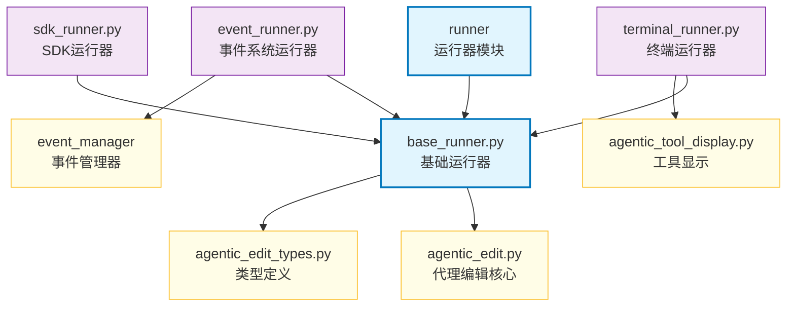

# runner

runner 模块提供了多种运行模式，用于在不同环境下执行 AgenticEdit 代理，包括命令行终端、SDK 环境以及标准事件系统。

## 目录结构

```
src/autocoder/common/v2/agent/runner/
├── __init__.py                 # 模块初始化文件，导出主要接口
├── base_runner.py              # 定义基础运行器抽象类
├── terminal_runner.py          # 终端运行模式实现
├── event_runner.py             # 事件系统运行模式实现
├── sdk_runner.py               # SDK 运行模式实现
└── .ac.mod.md                  # 本文档
```

## 快速开始

### 基本使用方式

```python
# 导入必要的模块
from autocoder.common.v2.agent.runner import TerminalRunner, EventRunner, SdkRunner
from autocoder.common.v2.agent.agentic_edit_types import AgenticEditRequest
from autocoder.common import AutoCoderArgs

# 1. 初始化配置
args = AutoCoderArgs(source_dir="/path/to/project", file="action.yml")
llm = get_single_llm(args)  # 获取LLM实例
conversation_history = []   # 对话历史
files = SourceCodeList()    # 源代码列表
memory_config = MemoryConfig(memory={}, save_memory_func=lambda x: None)

# 2. 创建运行器实例 - 选择一种运行模式
# 终端运行模式
terminal_runner = TerminalRunner(
    llm=llm,
    conversation_history=conversation_history,
    files=files,
    args=args,
    memory_config=memory_config
)

# 事件系统运行模式
event_runner = EventRunner(
    llm=llm,
    conversation_history=conversation_history,
    files=files,
    args=args,
    memory_config=memory_config
)

# SDK运行模式
sdk_runner = SdkRunner(
    llm=llm,
    conversation_history=conversation_history,
    files=files,
    args=args,
    memory_config=memory_config
)

# 3. 执行代理
request = AgenticEditRequest(user_input="请帮我实现一个简单的HTTP服务器")

# 使用终端运行模式
terminal_runner.run(request)

# 使用事件系统运行模式
event_runner.run(request)

# 使用SDK运行模式
for event in sdk_runner.run(request):
    # 处理事件
    if isinstance(event, CompletionEvent):
        print(f"任务完成: {event.completion.result}")
    elif isinstance(event, ToolCallEvent):
        print(f"调用工具: {type(event.tool).__name__}")
```

### 配置管理

runner 模块支持以下配置选项：

```python
# 创建会话配置
conversation_config = AgenticEditConversationConfig(
    conversation_name="my_conversation",  # 会话名称
    conversation_id=None,                 # 会话ID（可选）
    action="new",                         # 动作类型：new, list
    query=None,                           # 查询内容
    pull_request=False                    # 是否创建PR
)

# 创建命令配置
command_config = CommandConfig(
    coding=lambda x: None,
    chat=lambda x: None,
    # ... 其他命令处理函数
)

# 使用配置创建运行器
runner = TerminalRunner(
    llm=llm,
    conversation_history=conversation_history,
    files=files,
    args=args,
    memory_config=memory_config,
    command_config=command_config,
    conversation_name="current",
    conversation_config=conversation_config
)
```

## 核心组件详解

### 1. BaseRunner 基础运行器

**核心功能：**
- 提供统一的运行器接口
- 管理代理执行的生命周期
- 处理事件流和异常

**主要方法：**
- `run(request: AgenticEditRequest)`: 执行代理，处理请求
- `apply_pre_changes()`: 应用预处理变更
- `apply_changes()`: 应用代理执行后的变更
- `analyze(request: AgenticEditRequest)`: 分析请求并生成事件流

### 2. TerminalRunner 终端运行器

**核心功能：**
- 在终端环境中运行代理
- 使用Rich库提供格式化输出
- 支持交互式显示工具调用和结果

**主要方法：**
- `run(request: AgenticEditRequest)`: 在终端中执行代理
- `_format_content(content)`: 格式化输出内容

### 3. EventRunner 事件系统运行器

**核心功能：**
- 将代理事件转换为标准事件系统格式
- 通过事件管理器写入事件
- 支持事件流式处理

**主要方法：**
- `run(request: AgenticEditRequest)`: 执行代理并将事件写入事件系统
- `_convert_event(event, event_manager)`: 转换代理事件为标准事件

### 4. SdkRunner SDK运行器

**核心功能：**
- 提供生成器接口，适用于SDK环境
- 支持事件流迭代处理
- 允许外部代码处理代理事件

**主要方法：**
- `run(request: AgenticEditRequest)`: 返回事件生成器
- `handle_completion_event(event)`: 处理完成事件

## Mermaid 文件依赖图



### 依赖关系说明

1. **基础依赖**
   - `base_runner.py` 依赖于 `agentic_edit.py` 中的核心功能
   - 所有运行器都依赖于 `agentic_edit_types.py` 中定义的事件类型

2. **终端运行器依赖**
   - `terminal_runner.py` 依赖于 `agentic_tool_display.py` 来格式化工具显示
   - 使用 Rich 库进行终端格式化输出

3. **事件系统运行器依赖**
   - `event_runner.py` 依赖于 `event_manager` 来写入标准事件
   - 使用 `EventContentCreator` 创建事件内容

4. **SDK运行器依赖**
   - `sdk_runner.py` 提供最简单的接口，主要依赖基础运行器
   - 生成事件流供外部代码处理

## 事件类型

runner 模块处理以下事件类型：

1. **LLMOutputEvent**: 表示LLM的普通文本输出
2. **LLMThinkingEvent**: 表示LLM的思考过程
3. **ToolCallEvent**: 表示LLM调用工具的请求
4. **ToolResultEvent**: 表示工具执行的结果
5. **CompletionEvent**: 表示任务完成事件
6. **TokenUsageEvent**: 表示Token使用情况
7. **ErrorEvent**: 表示错误事件
8. **WindowLengthChangeEvent**: 表示对话窗口长度变化
9. **ConversationIdEvent**: 表示会话ID事件
10. **PlanModeRespondEvent**: 表示计划模式响应事件
